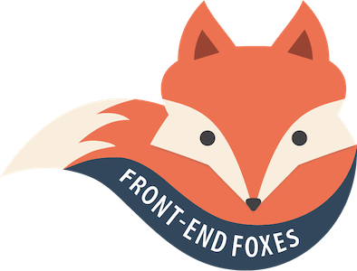

# Front-End Foxes Workshops

> Hello, Hacktoberfest folks! We are currently looking to upgrade these workshops to Vue 3+. Start with the Minis and let's see how the look. I'm looking for clean, documented code that we can run in Code Sandbox to help the legacy of Front-End Foxes live on. 

# About Our Workshops

Front-End Foxes, formerly known as Vue Vixens, were initiatives created by Jen Looper, currently Head of Academic Advocacy at AWS. Our mission was to create workshops to teach Vue.js in a cool and fun way to 'foxy people who identify as women'. We had chapters worldwide before closing the nonprofit in 2022. Front-End Foxes workshops are called 'skulks' because a group of foxes is called a 'skulk'.

These self-driven workshops have helped hundreds of women get better acquainted with front-end technologies for both web and mobile development. Our teaching methodology is explained in [this article](https://dev.to/frontendfoxes/the-way-of-the-fox-the-vue-vixens-curriculum-290).

> Our inaugural Skulk at Vue.US Conference in New Orleans in March, 2018

## FAQ

**What's the difference between a Chapter, a 'Mini', and a 'Nano'?**

This content is presented as various types, divided by length. The first five chapters comprise the full-day workshop. Other chapters are listed as 'mini-workshops' or 'half-day workshops' and can be done ad hoc with groups for breakfasts, lunch'n'learn sessions, or meetups. Nanos are ten to thirty-minute warm-up icebreaker coding exercises used by our Chapters.

**Why are the chapters broken up into parts?**

All the online codelabs are designed to be completed in groups in a self-study mode in a workshop format during meetups, conferences, and brown-bag lunches. For the all-day workshops, it is best to break up the day into parts and regroup users periodically so that 'no developer is left behind'. If an attendee gets lost, she can 'reboot' by downloading the ending point for each previous chapter into a new Code Sandbox.

**I'm a guy. Can I participate?**

The goal of the program is to familiarize women and those who identify as such with concepts of programming for web and mobile in a supportive and inclusive environment. Experienced developers, however, are very welcome to join in our efforts to organize events, support our scholarship fund, mentor a skulk, and provide content. We are grateful for all kinds of help!

**Want to contribute? Please make sure to check out our [Code of Conduct](workshops/CODE_OF_CONDUCT.md) as well as our [Contributing instructions](contributing.md).**
