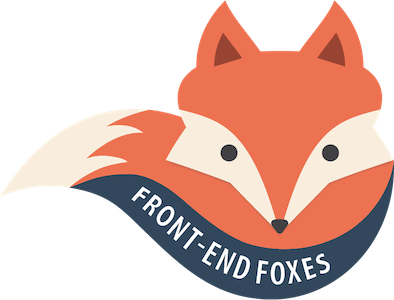
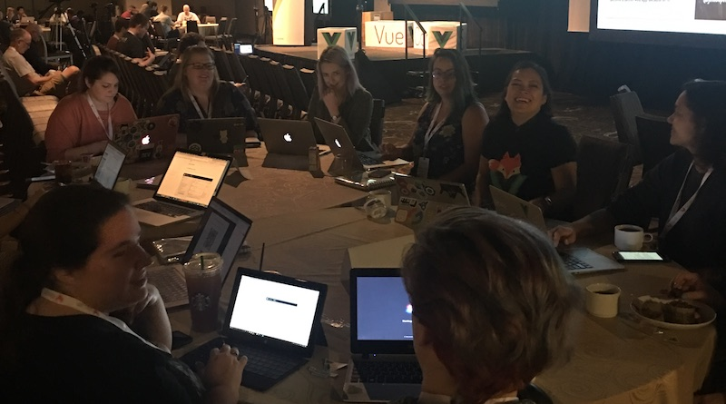

# Sobre nuestros talleres

Front-End Foxes y su subgrupo, Vue Vixens, son iniciativas creadas por Jen Looper, desarrolladora lider y defensora de Cloud en [Microsoft](http://www.microsoft.com). Nuestra mision es crear talleres para enseñar Vue en una forma actual y divertida a personas astutas quienes se identifican como mujeres. Tenemos capítulos por todo el mundo; encuentranos en [FrontEndFoxes.org](https://frontendfoxes.org). Los eventos de talleres de Front-End Foxes son llamados 'manadas' porque un grupo de zorros es llamado  'manada'.

Esos talleres autoguiados son diseñados para ayudar a las personas a familiarizarse con tecnologias front-end para desarrollo web y mobile. Nuestra metodologia de enseñanza es explicada en  [este artículo](https://dev.to/vuevixens/the-way-of-the-fox-the-vue-vixens-curriculum-290).

> Nuestra manada inaugural en la conoferencia Vue.US en New Orleans en March, 2018

## FAQ

**Cual es la diferencia entreun Capítulo, un 'Mini' y un 'Nano' ?**

Este contenido es presentado en varios tipos, divididos por tamaño. Los primeros cinco capítulos comprenden el taller de dia completo. Otros capítulos están listados como 'mini-talleres' o 'talleres de medio-dia' y pueden ser hechos con este proposito en grupos en desayunos, sesiones de 'almuerza y aprende' , o meetups. Nanos son ejercicios rompehielo de calentamiento de codificación con una duración de diez a treinta minutos usados por nuestras lideres de capítulos.

**Porque estan los capítulos dividos en partes?**

Todos los codelabs en línea están diseñados para completarse en grupos en un modo de autoaprendizaje en un formato de taller durante meetups, conferencias y almuerzos informales. Para los talleres de todo el día, es mejor dividir el día en partes y reagrupar a los usuarios periódicamente para que "ningún desarrollador se quede atrás". Si un asistente se pierde, puede "reiniciar" descargando el punto final de cada capítulo anterior en un nuevo Código Sandbox.

**Donde me puedo registrar para una manada?**

Los asistentes al taller y los mentores pueden registrarse para eventos en [FrontEndFoxes.org] (https://www.frontendfoxes.org). Esté atento a nuestros feeds de Twitter @vuevixens y @frontendfoxes para anuncios de próximos eventos. Los talleres de Front-End Foxes son gratuitos, pero dependen del presupuesto de las conferencias y meetups para proporcionar almuerzo, desayuno o refrigerios, y un espacio con wifi.

**Yo soy hombre. Puedo participar?**

El objetivo del programa es familiarizar a las mujeres y a quienes se identifican como tales con los conceptos de programación para web y dispositivos móviles en un entorno de apoyo e inclusivo. Sin embargo, los desarrolladores experimentados son muy bienvenidos a unirse a nuestros esfuerzos para organizar eventos, apoyar nuestro fondo de becas, asesorar una manada y proporcionar contenido. ¡Estamos agradecidas por todo tipo de ayuda!
