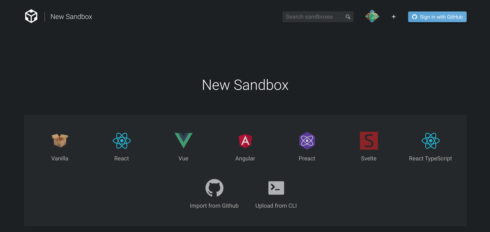
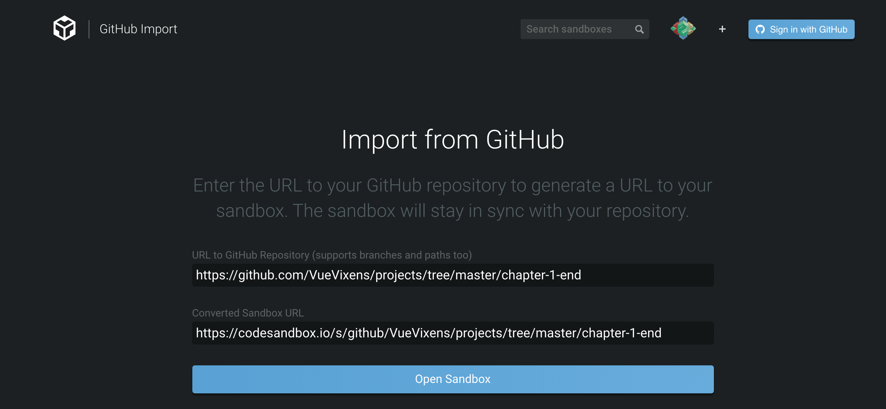
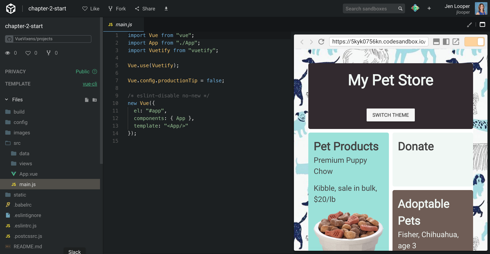

# 🤷 Apéndice 1: Perdida? Confundida? Deseas empezar de cero?

No te preocupes! Al principio de cada capítulo, tendras un enlace para empezar de cero con un nuevo sandbox . En la parte inferior están las instrucciones de como crear un nuevo sandbox. Posterior encontrarás las instrucciones de como crear un nuevo sandbox su respectivo enlace al repo en Github.

Todos los enlace de los capítulos están guardados guardados [aqui](https://github.com/FrontEndFoxes/projects) - Escoge tu capítulo guardando su URL. Por ejemplo, el enlace descargable del Capítulo 1 is [https://github.com/FrontEndFoxes/projects/tree/main/chapter-1-end](https://github.com/FrontEndFoxes/projects/tree/main/chapter-1-end).

::: tip 💡
Asegúrate de estar registrada en CodeSandbox.io asi podras guardar tus sandboxes en tu cuenta.
:::

Paso 1: Primero, crea un nuevo Sandbox en CodeSandbox.io presionando 'Create New Sandbox' en la página inicial y luego da click en el enlace 'import from Github' en la parte inferior izquierda.

Paso 2: Luego, pega la URL del repo de Github escogido de la carpeta de Proyectos de Vue Vixens en el campo superior.

Paso 3: Tu sandbox estará con toda la estructura y listo para usar!

