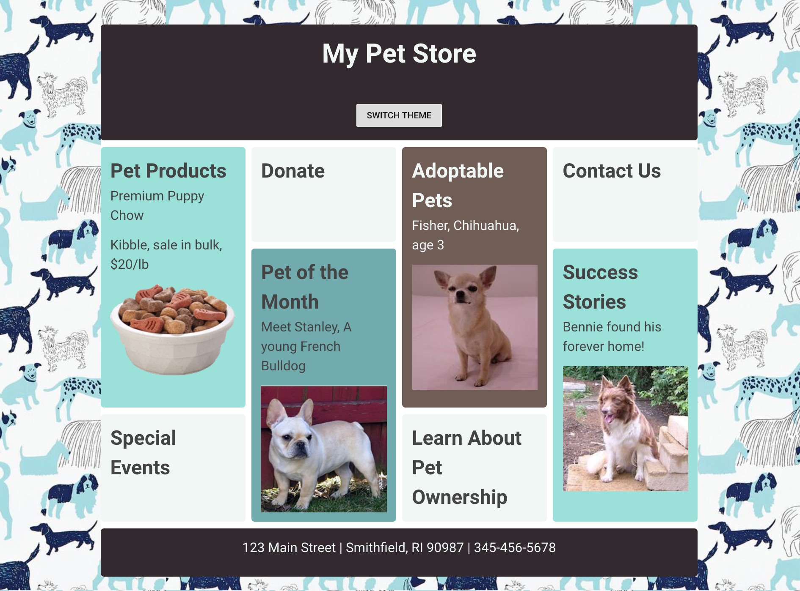

# 📋 Capítulo 1: Presentando la App Mi Tienda de Mascotas

| **Meta del Proyecto**            | Iniciar creando una app web estatica de una Tienda de Mascotas con Vue.js                                                                             |
| --------------------------- | ----------------------------------------------------------------------------------------------------------------------------------------- |
| **Que aprenderás**       | A configurar la aplicación en Vue, CSS Grid, Estilos in Vue, preparación de la estructura de código para avanzar.                                      |
| **Herramientas que necesitaras**       | Un navegador moderno como Chrome. Una [GitHub](https://github.com) cuenta que pueda ser usada para ingresar a [CodeSandbox](https://codesandbox.io). |
| **Tiempo necesario para su realizacion** | 30 minutos                                                                                                                                  |

## Que construiras


## Instrucciones

Como este es el primer proyecto web en Vue.js que nosotras vamos a hacer, empezaremos desde cero en [Code Sandbox](http://codesandbox.io). Crea una cuenta en Code Sandbox e ingresa inicialmente a una plantilla de Vue.js esta ya vendra con toda la estructura necesaria, dando click [aqui](https://codesandbox.io/s/vue).

Vamos a construir un escaparate para una tienda de mascotas ficticia que se verá así



Además, vamos a crear un interruptor que cambiará el aspecto de la tienda para que se parezca a esto:


Echa un vistazo al código que fue desarrollado por Code Sandbox para una aplicación básica de Vue.js. El primer archivo que veras está abierto de forma predeterminada: `main.js`. Este es el punto de partida principal de una aplicación Vue.js. Ten en cuenta que en este archivo importas Vue desde su paquete npm: `import Vue from" vue ";`. Code Sandbox importa todas las dependencias necesarias de npm para construir la aplicación; cuando quieras consultar la raíz `package.json` para averiguar qué dependencias son necesarias.

`main.js` también inicializa la aplicación como una nueva aplicación Vue.js y establece el div en el que se inyectará el código de la aplicación, el div con id `app`. También define qué componente se utilizará como punto de partida, en este caso, `App`:

```js
new Vue({
	render: (h) => h(App),
}).$mount('#app');
```

Abre `App.vue`. En este archivo, se construye el componente 'home'. Contiene las tres partes principales de un componente de archivo único (SFC) de Vue.js: un bloque `<template>`, un bloque `<script>` y un bloque `<style>`.

Ten en cuenta que el primer div en el bloque de plantilla tiene el id `app`; este es el div donde se inyectará el código de la aplicación. También hay un componente `<HelloWorld>` incluido debajo de la imagen del logotipo. Este es un ejemplo de un SFC incluido en "App.vue".

Abre `components / HelloWorld.vue` y encontrarás la fuente de la lista de enlaces que aparece incrustada en` App.vue`. Este archivo también incluye un bloque de script con una variable `msg` y algunos estilos más en un bloque` <style> `.

## Construyendo los estilos

Iniciemos en `App.vue`, ya queno tenemos que hacer ningun cambio en `main.js`. Añade el siguiente bloque al final del archivo, reemplazando el bloque actual de `<style>` :

```scss
	<style lang="scss">
	@import url("https://fonts.googleapis.com/css?family=Roboto");

	/*brown and mint*/
	/*dark brown 32292F
	light mint 99E1D9
	bisque F0F7F4
	dark mint 70ABAF
	light brown 705D56*/

	*,
	*:before,
	*:after {
	  box-sizing: border-box;
	}

	body {
	  margin: 0;
	  padding: 0;
	}

	main {
	  padding: 40px;
	  font-family: "Roboto", "sans-serif";
	  background: #fff top center repeat;
	  color: #444;
	  background-image: url("https://raw.githubusercontent.com/FrontEndFoxes/projects/main/petshop/images/bg.jpg");
	}

	h1,
	p {
	  margin: 0 0 1em 0;
	}

	img {
	  max-width: 100%;
	  display: block;
	  margin: 0 auto;
	}

	.app-container {
	  max-width: 940px;
	  margin: 0 auto;
	  background-color: #fff;
	}

	.app-container > * {
	  border-radius: 5px;
	  font-size: 150%;
	  margin-bottom: 10px;
	}

	.wrapper {
	  display: grid;
	  grid-gap: 10px;
	  grid-template-columns: repeat(auto-fill, minmax(200px, 1fr));
	  grid-auto-rows: minmax(150px, auto);
	}

	.wrapper > * {
	  padding: 15px;
	  border-radius: 5px;
	}

	.light-mint {
	  background-color: #99e1d9;
	}

	.dark-mint {
	  background-color: #70abaf;
	}

	.light-brown {
	  background-color: #705d56;
	  color: #f0f7f4;
	}

	.dark-brown {
	  background-color: #32292f;
	  color: #f0f7f4;
	}

	.bisque {
	  background-color: #f0f7f4;
	}

	/*orange and green*/
	/*
	dark orange 771100
	orange CC6633
	light orange FF9900
	dark green 689980
	light green 86a193s
	*/

	.orange-green {
	  background-image: url("https://raw.githubusercontent.com/FrontEndFoxes/projects/main/petshop/images/bg2.jpg");
	  .light-mint {
	    background-color: #86a193;
	  }

	  .dark-mint {
	    background-color: #689980;
	  }

	  .light-brown {
	    background-color: #cc6633;
	  }

	  .dark-brown {
	    background-color: #771100;
	  }

	  .bisque {
	    background-color: #ff9900;
	  }
	}

	.panel {
	  /* Se necesita para el diseño flex*/
	  margin-left: 5px;
	  margin-right: 5px;
	  flex: 1 1 200px;
	}

	.tall-panel {
	  grid-row-end: span 2;
	}

	.app-header,
	.app-footer {
	  flex: 0 1 100%;
	  padding: 15px;
	  text-align: center;
	}

	/* Necesitamos establecer el margen utilizado en elementos flex en 0 ya que tenemos espacios en la grids */
	@supports (display: grid) {
	  .wrapper > * {
	    margin: 0;
	  }
	}
	</style>
```

::: tip 💡
Observa que no usamos el atributo `scoped` en el bloque `<style> `. La palabra clave `scoped` asegura que sus estilos seguirán siendo válidos solo para el SFC actual, y vamos a hacer que estos estilos sean universales. Sin embargo, especificamos que estamos usando Sass agregando `lang =" scss "`, que es un método para hacer que su CSS sea más fácil de administrar. Aprende más [aqui](http://www.sass-lang.com).
:::

Este bloque de estilo incluye algunas cosas sorprendentes:

- 	Utiliza rutas a imágenes externas alojadas en Github, en lugar de rutas relativas. Esto se debe a que Code Sandbox no aloja imágenes; normalmente solo agregará una imagen en una ruta relativa como `/images/myImage.png`.
- 	Existen algunas cosas divertidas sobre cuadriculas (grid). Esta hoja de estilo y la plantilla que crearemos hacen uso de CSS Grid, una nueva forma de hacer diseños de "mampostería" flexibles y receptivos como este con 'bloques' de contenido apilados. Obtenga más información sobre CSS Grid [aqui](https://css-tricks.com/snippets/css/complete-guide-grid/).
- 	¡Hay dos hojas de estilo! O al menos dos patrones de estilo. Uno tiene un tema verde, el otro es naranja. Haremos uso de esto pronto.

Agregar la hoja de estilo no hizo mucho por nuestra plantilla, excepto que el grupo `<li>` luciera extraño. ¡Arreglemos la plantilla!

## Instalar Vuetify

Antes de editar la plantilla, instalaremos Vuetify. Vuetify es una biblioteca genial que le da un estilo de Material Design a tus aplicaciones Vue. En este capítulo, solo lo usaremos para crear un conmutador (switch), pero lo usaremos más en capítulos futuros.

::: tip 💡
Vuetify es un framework de componentes semánticos para Vue. Su objetivo es proporcionar componentes limpios, semánticos y reutilizables para construir su aplicación. Puede encontrar la guía de instalación predeterminada y la documentación 
correspondiente [aqui](https://vuetifyjs.com/en/getting-started/quick-start#default-installation).
:::

Instálalo haciendo clic en el botón `Add Dependency` en el área desplegable Dependencia a la izquierda en Code Sandbox (si está cerrado, debe abrir la barra lateral` Sandbox Info` y tal vez tenga que desplazarse). Busca `Vuetify` e instálalo.

Verifique si la dependencia está instalada abriendo `package.json` y verificando el objeto `dependencies`. Debe tener un aspecto como este:

```json
"dependencies": {
	"vue": "^2.5.22",
	"vuetify": "^2.0.19"
},
```
A continuación, crea un directorio `plugins` dentro de tu directorio` src`. Escribirás un archivo que inicializará Vuetify en el nuevo directorio `plugins`.

Una vez que hayas creado `src / plugins`, crea un nuevo archivo en el directorio` plugins` llamado `vuetify.js`. Dentro de este nuevo archivo, agrega este código:

```js
// src/plugins/vuetify.js

import Vue from 'vue';
import Vuetify from 'vuetify';
import 'vuetify/dist/vuetify.min.css';
Vue.use(Vuetify);

export default new Vuetify();
```
Este archivo es un archivo inicializador para el plugin Vuetify. Lo que realmente hacemos en este código es importar el estilo predeterminado de Vue, Vuetify y Vuetify. Al llamar a `Vue.use (Vuetify);` le informamos a Vue que debe usar el complemento Vuetify que estamos importando. Con la línea `export default new Vuetify();` estamos exportando una instancia de Vuetify.

En este archivo inicializador, podrás importar temas, componentes y CSS de Vuetify con solo dos menciones en tu archivo `main.js`. Con este archivo, la configuración de Vuetify se centraliza en un archivo para la totalidad de tu proyecto.

Abre tu archivo `main.js` y agrega este código:

```js
import vuetify from '@/plugins/vuetify';
```
a la tercera línea del archivo.

Ahora deberías tener 3 declaraciones `import` en la parte superior de tu archivo `main.js`, que se veran así:

```js
import Vue from 'vue';
import App from './App';
import vuetify from '@/plugins/vuetify';
```

A continuación, mientras aún existe en tu archivo `main.js`, busca este bloque de funciones:

```js
new Vue({
	render: (h) => h(App),
}).$mount('#app');
```

Dado que esto inicializa la instancia de Vue en tu aplicación, debes agregar `vuetify` aquí para pasar todos los productos de diseño de tu archivo de plugin de Vuetify.

Agrega el nombre de la variable `vuetify` en la declaración` import` al bloque inicializador de Vue, justo antes de la función `render`. Tu bloque inicializador ahora debería verse así:

```js
new Vue({
	vuetify,
	render: (h) => h(App),
}).$mount('#app');
```

Para tener buenos íconos en nuestra aplicación, también necesitamos agregar íconos de Material a nuestro archivo `index.html`. Abre `public / index.html` y agrega esta cadena al final de tu etiqueta `<head></head>`:

```html
<link href="https://fonts.googleapis.com/css?family=Roboto:300,400,500,700|Material+Icons" rel="stylesheet" />
```

Luego, sobrescribe el bloque actual `<template>` en `App.vue` con este markup:

```html
<template>
	<v-app>
		<main>
			<div class="app-container">
				<header class="app-header dark-brown">
					<h1>My Pet Store</h1>
				</header>
				<div class="wrapper">
					<div class="panel tall-panel light-mint">
						<h2>Pet Products</h2>
						<p>Premium Puppy Chow</p>
						<p>Kibble, sale in bulk, $20/lb</p>
						
					</div>
					<div class="panel bisque">
						<h2>Donate</h2>
					</div>
					<div class="panel tall-panel light-brown">
						<h2>Adoptable Pets</h2>
						<p>Fisher, Chihuahua, age 3</p>
						
					</div>

					<div class="panel bisque">
						<h2>Contact Us</h2>
					</div>
					<div class="panel tall-panel dark-mint">
						<h2>Pet of the Month</h2>
						<p>Meet Stanley, A young French Bulldog</p>
						
					</div>
					<div class="panel tall-panel light-mint">
						<h2>Success Stories</h2>
						<p>Bennie found his forever home!</p>
						
					</div>

					<div class="panel bisque">
						<h2>Special Events</h2>
					</div>

					<div class="panel bisque">
						<h2>Learn About Pet Ownership</h2>
					</div>
				</div>
				<footer class="app-footer dark-brown">
					<p>123 Main Street | Smithfield, RI 90987 | 345-456-5678</p>
				</footer>
			</div>
		</main>
	</v-app>
</template>
```

¡Wow, eso hizo un gran cambio! De repente, ¡tienes la fachada de una tienda!

::: tip 💡
Ten en cuenta el uso de `<v-app>`: este es un requisito de Vuetify y es una señal segura de que tendrás una aplicación con el tema de Vuetify.
:::

Ahora vamos a usar ese tema de Vuetify creando un interruptor. Al presionar este interruptor (switch), se activará un cambio de tema, por lo que usarás el tema 'naranja' que viste en los estilos.

- 	Es posible que veas la clase `naranja-verde` en la hoja de estilo. Vamos a agregarlo al elemento `<main>` en el bloque `<template>` de `App.vue` y observa cómo se cambian todos los colores y el fondo:
    ```html
    <main class="orange-green"></main>
    ```
- 	Ahora intentemos cambiar la clase usando la clase binding (enlace) de Vue. Podemos usar la directiva `v-bind` o su atajo `: `. Reemplace esa clase simple en `<main>` con una clase binding (de enlace) dinámica:

```html
<main :class="{'orange-green': false}"></main>
```

Intenta cambiar falso `false` por verdadero `true` y viceversa. Puedes ver cómo se aplica la clase en las herramientas de desarrollo de Chrome ( Chrome dev tools ) y cómo está cambiando el tema del color de la página.

-   ¡Que emoción! Es hora de crear tu primera variable en Vue. Primero, debes agregar `data()` a tu componente Vue. Esta función debería devolver un objeto de nuestras variables Vue. Creemos uno en el bloque `<script>`. Sobrescribe el bloque actual `<script>`:

```js
<script>
export default {
  name: "App",
  data() {
    return {
      themeSwitched: false
    };
  }
};
</script>
```

::: tip 💡
En este punto, puedes eliminar el componente HelloWorld.vue de la carpeta `components` ya que no lo necesitaremos.
:::

Entonces, ahora tienes una variable llamada `themeSwitched` y su valor predeterminado es` false`.

- 	En la etiqueta `<main>`, reemplaza `false` en la clase binding (enlace) con nuestra variable recién creada:

```html
<main :class="{'orange-green': themeSwitched}"></main>
```

- 	Cambia el valor de `themeSwitched` dentro de `data` de `false` a `true`. Nuevamente, puedes ver el efecto de cambio de color.

- 	Ahora solo necesitamos un interruptor para cambiar un tema. Primero crearemos un botón. Estamos usando Vuetify, por lo que será un componente de botón de Vuetify. Creamos un botón de Vuetify con el texto 'Cambiar tema' con: `<v-btn> ​​Cambiar tema </v-btn>`. Pongámoslo en el `header` justo después de la etiqueta` h1`:

```html
<header class="app-header dark-brown">
	<h1>My Pet Store</h1>
	<v-btn>Switch theme</v-btn>
</header>
```

- 	Ahora agrega un controlador de eventos de clic a nuestro botón. Podemos usar la directiva `v-on` o su atajo `@`. Este controlador cambiará el valor de `themeSwitched` a su valor opuesto, alternando la clase de cambio de color.


    ```html
    <v-btn @click="themeSwitched = !themeSwitched">Switch theme</v-btn>
    ```

Prueba tu aplicación haciendo clic en el botón. Se ve bien, ¿verdad?

**¡Felicidades! ¡Acabas de terminar el Capítulo 1!**

## Resultado final


