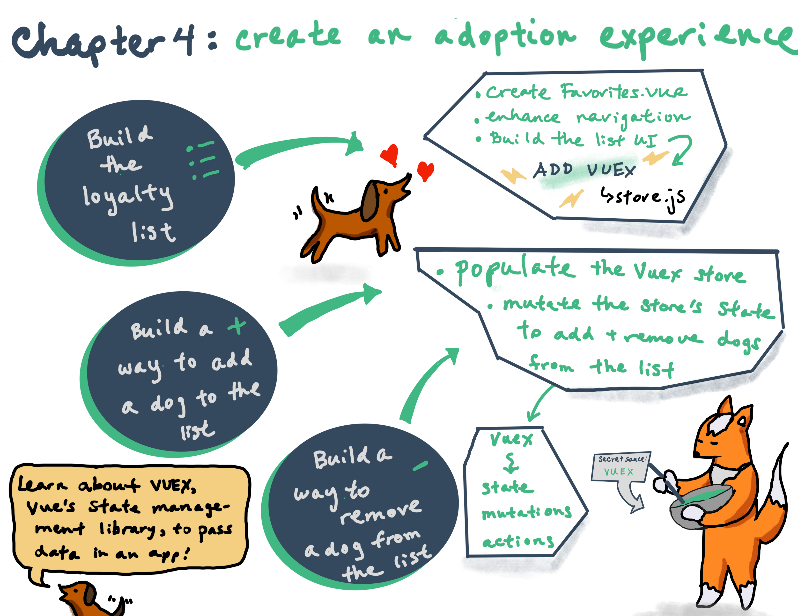
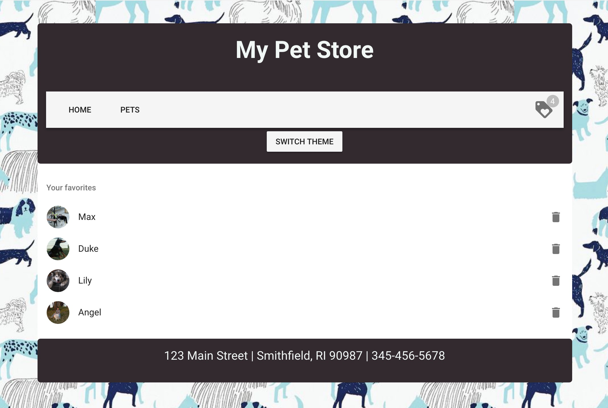

# 📋 Chapter 4: 犬の里親体験アプリの作成

| **プロジェクトのゴール** | お店のタグ付けシステムを作成して、「ロイヤルティ」リストに犬を追加したり削除したりできるようにします。 |
| -- | -- |
| **このワークショップで学ぶこと** | Vuex による Vue アプリケーションの状態管理 |
| **必要なツール** | Chromeのような最新のブラウザ。CodeSandbox.io のアカウント。もし迷ったら、このチャプターのスタート地点を[ここ](https://github.com/VueVixens/projects/tree/main/chapter-3-end)にインポートします。この方法についての説明は [Appendix 1](appendix_1.md) にあります。 |
| **かかる時間**     | 1.5時間 |

## 今回構築するもの



## 手順

もしプロジェクトを作り直す必要がある場合は、メインページの左下にある **GitHub からインポート**リンクをクリックし、フィールドにリポジトリの URL を貼り付けて、[このリポジトリ](https://github.com/VueVixens/projects/tree/main/chapter-3-end)を Code Sandbox に複製します。[チャプター 3](ch3.md)で作成したプロジェクトを続行することもできます。

このチャプターでは、ショッピングカートのように、里親用の「ロイヤルティリスト」を作成して、私たちが特に好きでお迎えしたい犬のリストを表示します。はじめに、 `views` フォルダ内に新しい空のファイルを作成し、 `Favorites.vue` という名前をつけます。

## ロイヤルティリストの作成

この新しいコンポーネントで最初に必要なのはテンプレートです。この新しいファイル内に `<template></template>` タグを追加します。

テンプレートタグの中に `<div></div>` タグを作成し、シンプルなテキスト「My Favorites」を追加します。

```html
<template>
  <div>
    My Favorites
  </div>
</template>
```

次に、新しく作成したコンポーネントをルーターに接続し、対応するルートに正しく表示されているかどうかを確認します。

`main.js` ファイルに移動します。上部にある `Home` と `Pets` コンポーネントをインポートしたあと、インポート文をもう一つ追加します：

```js
import Favorites from "./views/Favorites";
```

そのあと、 `routes` にもうひとつのルートを追加します：

```js
{ path: "/favorites", component: Favorites }
```

ブラウザのアドレスバーから `/favorites` （ホームページの URL に `/favorites` を追加するだけ）に移動してみてください。ヘッダーとフッターの間に「My Favorites」というテキストが表示されているはずです。

ナビバー内のリストにリンクを追加してみましょう。あとで、選択したアイテムの金額も表示しますが、今のところはリンクのついた単なるアイコンです。 `App.vue` ファイルに移動し、 `v-toolbar-items` の閉じタグの直後に以下のコードを追加します：

```html
<v-spacer></v-spacer>
<router-link to="/favorites">
  <v-icon large>loyalty</v-icon>
</router-link>
```

::: 💡
`v-spacer` は他のコンポーネント間の空きスペースを埋めるための Vuetify のコンポーネントです。 `v-icon` は[マテリアルアイコン](https://material.io/icons/)を表示するコンポーネントです。
:::

これで、お気に入りアイコンをクリックすると `/favorites` ルートに移動します。

Favorites コンポーネントのマークアップを作成しましょう。Vuetify のリストコンポーネントを使用して、犬を表示します。 `<div></div>` タグからプレースホルダーテキストを削除して、 `<v-list></v-list>` タグで置き換えましょう。テンプレートは次のようになります：

```html
<div>
  <v-list> </v-list>
</div>
```

このリストの名前が必要です。Vuetify はこの目的のために `v-subheader` コンポーネントを使用しているので、追加してみましょう：

```html
<div>
  <v-list>
    <v-subheader>My Favorites</v-subheader>
  </v-list>
</div>
```

次に、モックデータを含むリスト要素を追加しましょう。犬の画像とその名前、削除アイコンです。リスト項目には `v-list-item` コンポーネントが必要です。
犬の画像は `v-list-item-avatar` 、名前は `v-list-item-content` 、削除ボタンは `v-list-item-action` と `v-icon` です。

::: 💡
リストの詳細については、[Vuetify リストコンポーネントのドキュメント](https://vuetifyjs.com/en/components/lists)をご覧ください。
:::

ここまでのテンプレート：

```html
<div>
  <v-list>
    <v-subheader>My Favorites</v-subheader>
    <v-list-item @click="{}">
      <v-list-item-avatar>
        
      </v-list-item-avatar>
      <v-list-item-content>Fluffy</v-list-item-content>
      <v-list-item-action>
        <v-icon>delete</v-icon>
      </v-list-item-action>
    </v-list-item>
  </v-list>
</div>
```

## Vuex でリストの状態を管理する

この時点で、UI が統合されているのがわかります。リストの中に実際のデータを表示する時が来ましたが、このままでは問題があります。選択した犬を保存して `Pets` コンポーネントから `Favorites` コンポーネントに犬を渡すにはどうすればよいのでしょうか？これらの2つのコンポーネントには「親子」関係がないため、props を使用することはできません... そのような場合に、 _状態管理_ ライブラリが必要であり、Vue には Vuex というライブラリがあります。

::: 💡
Vuex は、Vue.js アプリケーションの状態管理パターンおよびライブラリです。これは、アプリケーション内のすべてのコンポーネントのための一元化されたストアとして機能し、ステートが予測可能な方法でのみ変更できるようにルールが保証されています。これにより、アプリケーション内のコンポーネントと共有できるデータを保持することができます。詳細は[こちら](http://vuex.vuejs.org/en/)をご覧ください。
:::

この一元化されたストアで作業を開始するには、Vuex をアプリケーションに追加する必要があります。まず、 `Explorer` タブで下にスクロールして `Dependencies` ドロップダウンを開きます。 `Add dependency` ボタンをクリックして `vuex` を探します。依存関係をインストールします。Vuex が `package.json` に追加されます。

では、 `/src` の中に `store` フォルダを作成してみましょう。この新しいフォルダの中に `store.js` ファイルを追加します。これは、アプリケーションのすべてのデータを保存する場所です。

`store.js` を開き、Vuex をインポートします：

```js
import Vue from "vue";
import Vuex from "vuex";

Vue.use(Vuex);
```

次に、実際のストアを作成してエクスポートします：

```js
export default new Vuex.Store({});
```

実際にアプリケーションのステートで保存したいものは何でしょうか？それは、選択された犬を含むお気に入りのリストです。初期状態の `state` オブジェクトに `favorites` 配列を中括弧で囲んで追加してみましょう：

```js
export default new Vuex.Store({
  state: {
    favorites: []
  }
});
```

次に、このストアを Vue インスタンスに追加する必要があります。これを行うには、 `main.js` ファイルに移動し、残りのインポートの下にインポートします：

```js
import store from "./store/store";
```

そして、 `main.js` の Vue インスタンスのプロパティに `store` を追加します：

```js
new Vue({
  router,
  store,
  vuetify,
  render: h => h(App)
}).$mount("#app");
```

これで、アプリケーション内のすべてのコンポーネントは、任意のコンポーネントの computed プロパティの中に `this.$store.state` と書けば、これを通してステートにアクセスできるようになりました。では、`Favorites` コンポーネントからアクセスしてみましょう。

::: 💡
Computed プロパティを使用して、ビューに表示されるプロパティをすばやく計算できます。これらの計算はキャッシュされ、依存関係が変更されたときにのみ更新されます。
:::

`Favorites.vue` の内部の、 `<template>` ブロックの下に `<script>` ブロックを追加し、 `export default` 文を追加します：

```js
<script>export default {};</script>
```

...そして、 `<script>` ブロックを編集して `computed` プロパティをコンポーネントに追加します：

```js
<script>
  export default {
    computed: {
      favorites() {
        return this.$store.state.favorites;
      }
    }
  };
</script>
```

`favorites()` はステートに保存されている `favorites` 配列の値を返す関数であることがわかり、これをコンポーネントで使用することができます。

## お気に入りを登録

モックデータを `favorites` のコンテンツに置き換えましょう。

まず、 `state.favorites` に一時的にコンテンツを追加してみましょう。 `data/dogs.js` ファイルから最初の3つの犬をコピーして、 `store.js` の `favorites` 配列に貼り付けます：

```js
state: {
  favorites: [
    {
      name: "Max",
      breed: "husky",
      img: "https://images.dog.ceo/breeds/husky/n02110185_1469.jpg"
    },
    {
      name: "Rusty",
      breed: "shiba",
      img: "https://images.dog.ceo/breeds/shiba/shiba-13.jpg"
    },
    {
      name: "Rocco",
      breed: "boxer",
      img: "https://images.dog.ceo/breeds/boxer/n02108089_14112.jpg"
    },
  ]
},
```

`Favorites.vue` コンポーネントの内部では、おなじみの `v-for` ディレクティブを使って `favorites` の配列を繰り返し処理します。 `<template>` `<div>` をこのようなマークアップに変更します：

```html
<div>
  <v-list>
    <v-subheader>My Favorites</v-subheader>
    <v-list-item v-for="(dog, index) in favorites" :key="index" @click="{}">
      <v-list-item-avatar>
        
      </v-list-item-avatar>
      <v-list-item-content>{{dog.name}}</v-list-item-content>
      <v-list-item-action>
        <v-icon>delete</v-icon>
      </v-list-item-action>
    </v-list-item>
  </v-list>
</div>
```

::: 💡
何が変わったのでしょうか？ `src` 属性が `:src` に変更されたことに注目してください。また、中括弧内の `Fluffy` を `dog.name` に変更することで、名前が動的に変わることを確認しました。
:::

::: 💡
また、`v-list-item` のオープニングタグで `v-for` の隣に `:key` を追加したことに注意してください。これは、Vue が `v-for` を使用する際にキーを提供することを望んでいるためです。 `v-for` で `(dog, index) in favorites` を使うことで、犬ごとに配列のインデックスを取得することができます。マックスの場合はインデックス0、ラスティの場合はインデックス1などを取得します。これをキーとして使うことができます。より詳しい情報は[こちら](https://vuejs.org/guide/list.html#Maintaining-State)を参照してください。
:::

これで `/favorites` ルートにモックデータが表示されるようになりました。ページの見た目を良くするために、もう少し UI を微調整してみましょう。

## UI の微調整

まず、リストが空の場合に表示するプレースホルダを追加する必要があります。

::: 💡
注意： `v-if` ディレクティブは、式の値が真か偽かという「真実性」に基づいて条件付きで要素をレンダリングします。 `v-else` ディレクティブは `v-if` の「else」ブロックとして機能し、「else」条件を提供します。
:::

リストの内容全体をラッパー div でラップし、お気に入りリストに項目がある場合にのみ表示します。テンプレートを変更してみましょう：

```html
<template>
  <v-list>
    <v-subheader v-if="!favorites.length"
      >Your favorites list is empty</v-subheader
    >
    <div v-else>
      <v-subheader>Your favorites</v-subheader>
      <v-list-item v-for="(dog, index) in favorites" :key="index" @click="{}">
        <v-list-item-avatar>
          
        </v-list-item-avatar>
        <v-list-item-content>{{dog.name}}</v-list-item-content>
        <v-list-item-action>
          <v-icon>delete</v-icon>
        </v-list-item-action>
      </v-list-item>
    </div>
  </v-list>
</template>
```

::: 💡
ここで何が起こっているのでしょうか？ まず、アプリケーションは _length_ で `favorites` 配列の長さをチェックします（つまり、配列の中にいくつかの項目があるかどうかをチェックします。空の配列の長さは0に等しくなります）。長さが0の場合、アプリケーションは `Your favorites list is empty` というテキストを表示し、 `v-else` ブロックを無視します。配列が空でない場合、アプリケーションは `v-else` ブロックにジャンプしてそれをレンダリングします。
:::

また、ツールバーのタグアイコンの上に選択された犬の数を表示してみましょう。 `App.vue` に移動して、 `favorites` のプロパティを追加します（先ほど追加したコンポーネントの `Favorites` に似ています）。これは `name` プロパティの下に配置することができます：

```js
computed: {
  favorites() {
    return this.$store.state.favorites;
  }
},
```

お気に入りのアイコンを Vuetifyの `v-badge` コンポーネントでラップし、その中にあるアイテムの数を表示してみましょう。 `App.vue` を編集し、お気に入り用の `<router-link>` ブロックを以下のマークアップで変更します：

```html
<router-link to="/favorites">
  <v-badge color="grey lighten-1" overlap right v-model="favorites.length">
    <span slot="badge">{{favorites.length}}</span>
    <v-icon large>loyalty</v-icon>
  </v-badge>
</router-link>
```

::: 💡
ここでの `v-model` ディレクティブはバッジの可視性を定義します。つまり、リストが空の場合、バッジは非表示になります。モックデータには3つの項目があるので、バッジの中に `3` という数字が表示されています。これは Vuetify バッジコンポーネントで定義されている動作で、ドキュメントは [こちら](https://vuetifyjs.com/en/components/badges) にあります。
:::

## 犬の追加と削除

また、このお気に入りリストに犬を追加したり、悲しいことに犬を削除したりする方法を構築する必要があります。言い換えれば、 _状態を変更_ しなければならないということです。Vuex ストアで実際に状態を変更する唯一の方法は、_mutation_ をコミットすることです。Vuex の mutation はイベントと非常に似ています。各 mutation には文字列 **タイプ** と **ハンドラー** を持ちます。タイプは mutation が何をするかを示すもので、名前を指定することができます。ここでは犬をお気に入りに追加するための mutation を作成しているので、`addToFavorites` を選択します。ハンドラー関数は実際に状態を変更するところであり、第一引数として state を受け取ります。最初の mutation を作成してみましょう。 `store.js` の内部で `favorites` の配列を初期化し、`state` プロパティのあとに `mutations` を追加します：

```js
export default new Vuex.Store({
  state: {
    favorites: []
  },
  mutations: {}
});
```

このオブジェクトの中に `addToFavorites` の mutation を作成します：

```js
export default new Vuex.Store({
  state: {
    favorites: []
  },
  mutations: {
    addToFavorites(state, payload) {
      state.favorites.push(payload);
    }
  }
});
```

この mutation には2つのパラメータがあります。1つ目は上記のように `state` で、2つ目は `state.favorites` に追加する `data` または `payload` です。 `addToFavorites` mutation はペイロードを `state.favorites` 配列に追加します。

::: 💡
mutation ハンドラを直接呼び出すことはできません。それを呼び出すには、store.commit をそのタイプで呼び出す必要があります。 `store.commit('addToFavorites')` を呼び出して、ペイロードを追加する必要があります。
:::

::: 💡
通常、Vuex では mutation は _actions_ でコミットされます。アクションは mutation に似ていますが、非同期操作（API コールのような）を含むことができます。
:::

`addToFavorites` の mutation をコミットするアクションを登録してみましょう。ストアオブジェクトに `actions` プロパティを追加し、このプロパティに `addToFavorites` アクションを追加します：

```js
export default new Vuex.Store({
  state: {
    favorites: []
  },
  mutations: {
    addToFavorites(state, payload) {
      state.favorites.push(payload);
    }
  },
  actions: {
    addToFavorites({ commit }, payload) {
      commit("addToFavorites", payload);
    }
  }
});
```

::: 💡
アクションハンドラはストアインスタンスと同じメソッド/プロパティのセットを公開するコンテキストオブジェクトを受け取るので、 `context.commit` を呼び出して mutation をコミットすることができます。ES6 の[分割代入](https://github.com/lukehoban/es6features#destructuring) を使って `context` の `commit` メソッドを使用していますが、これが第一引数に `context` を持たずに `{ commit }` を第一引数に持つ理由です。もし第一引数に `context` を持つのであれば、`commit(....)` を直接呼び出すのではなく、 `context.commit(....)` を呼び出さなければなりません。
:::

::: 💡
ここにある `payload` は、状態を変更するためにコンポーネントから mutation に渡したいデータと同じものが入ります。
:::

## UI を構築する

`Pets.vue` コンポーネントの中からアクションを呼び出してみましょう。まず、特定の犬をお気に入りリストに追加するためのボタンのようなものが必要です。 `Dog.vue` コンポーネントに移動し、ボタンを `v-card-title` 閉じタグのすぐ下に追加しますが、これはまだ `v-card` タグの中にあります：

```html
<v-btn @click="$emit('addToFavorites', dog)">Add to Favorites</v-btn>
```

`$emit` を使うことで、親コンポーネント（この場合は `Pets.vue`）にこんなメッセージを送信しています。「Hey、ここで何かが起きています！このメッセージを読んで反応してください」

メッセージには2つ目のパラメータも含まれています：お気に入りリストに追加しようとしている `dog` です。

::: 💡
そこで `$emit('addToFavorites', dog)` を呼び出すことで、`addToFavorites` タイプのイベントを送信し、ユーザがお気に入りに追加したい犬のデータを送信します。基本的にはカスタムイベントを作成しており、その詳細については[こちらをご覧ください](https://vuejs.org/v2/guide/components-custom-events.html)。
:::

では、`Pets.vue` を開き、現在の `<app-dog>` タグを以下のスニペットで上書きして、`addToFavorites` というイベントに _listener_ を追加してみましょう：

```html
<app-dog :dog="pet" @addToFavorites=""></app-dog>
```

今のところ、このリスナーは何もしていませんが、このイベントに対してアクションを呼び出したいと思います。そのためには、アクションをコンポーネントにマッピングしなければなりません。

::: 💡
アクションをコンポーネントにディスパッチするには `this.$store.dispatch('xxx')` を使うか、コンポーネントのメソッドを store.dispatch 呼び出しにマップする `mapActions` ヘルパーを使います。
:::

後者の方法を使います。まず、 `Pets.vue` に `mapActions` ヘルパーをインポートします：

```js
import { mapActions } from "vuex";
```

そして、[ES6 のスプレッド演算子](https://developer.mozilla.org/en-US/docs/Web/JavaScript/Reference/Operators/Spread_syntax)を使って `methods` ブロックを作成し、コンポーネントに追加します：

```js
methods: {
  ...mapActions(["addToFavorites"])
},
```

::: 💡
パラメータをひとつ指定して `mapActions` を呼び出すことで、ストアから取得したいアクションを定義しています。今のところ、この配列には `addToFavorites` だけがありますが、将来的にはストアの成長に合わせてアクションを追加することができます。ストアのすべてのアクションを一つのコンポーネントにまとめておく必要はありません。そのため、この配列を `mapActions` に渡すことで、このコンポーネントに必要なものだけを取得できるようにします。詳細な情報は [こちら](https://vuex.vuejs.org/guide/actions.html#dispatching-actions-in-components) をご覧ください。
:::

これで、単純なコンポーネントメソッドのように `addToFavorites` をディスパッチできるようになりました。

このメソッドを `app-dog` の `addToFavorites` イベントで呼び出してみましょう。 `Pets.vue` の `<app-dog>` タグを編集します：

```html
<app-dog :dog="pet" @addToFavorites="addToFavorites"></app-dog>
```

`Add to Favorites` ボタンをクリックしてみてください。アイコンバッジの数が増える様子を確認したり、このアイコンをクリックしてお気に入りリストを開き、そこにある犬の数を確認することができます。

## ロジックを強化する

今のところ、任意の犬を複数回追加することができますが、マックス（犬）は5匹もいません！ `store.js` の mutation の中にあるペイロードをチェックして、リストにない場合にのみ犬を追加するようにしてみましょう：

```js
addToFavorites(state, payload) {
  if (!state.favorites.includes(payload)) {
      state.favorites.push(payload);
    }
},
```

ここではまず `payload` 要素が `state.favorites` に含まれているかどうかを確認します。まだ配列に含まれていない場合にのみ要素を追加しています。

## リストから削除

あとは、お気に入りリストから犬を削除する仕組みが必要です。もしかしたら誰かに里親に出されたのかもしれません！そのためのアクションと mutation を作ってみましょう。

`store.js` で `mutations` オブジェクトに `removeFromFavorites` の mutation を追加します：

```js
removeFromFavorites(state, payload) {
  state.favorites.splice(state.favorites.indexOf(payload), 1);
}
```

::: 💡
ここで splice() メソッドは、既存の要素を削除することで配列の内容を変更します。第一引数には開始したい要素のインデックス、第二引数には削除したい要素の数を指定します。
:::

そのため、まず `state.favorites` 配列内の `payload` アイテムのインデックスを見つけ、このインデックスから始まるアイテムを削除します（つまり、削除するのは `payload` アイテムそのものだけです）

mutation `removeFromFavorites` をコミットするアクションを追加します：

```js
removeFromFavorites({ commit }, payload) {
  commit("removeFromFavorites", payload);
}
```

ここでは、ユーザーが削除アイコンをクリックしたときにこのアクションをディスパッチする必要があります。ファイル `Favorites.vue` に移動してください。覚えていると思いますが、まずアクションをコンポーネントメソッドにマッピングする必要があります。 `<script>` タグの先頭にある `mapActions` ヘルパーをインポートしてください：

```js
import { mapActions } from "vuex";
```

そして `computed` ブロックの下のコンポーネント `methods` に追加します：

```js
methods: {
  ...mapActions(["removeFromFavorites"])
}
```

最後にクリックリスナーを削除アイコンに追加します：

```html
<v-icon @click="removeFromFavorites(dog)">delete</v-icon>
```

これで、お気に入りリストに犬を追加したり削除したりできるようになりました。

**ふぅ！Chapter 4 が終わりました！**

## 最終結果


