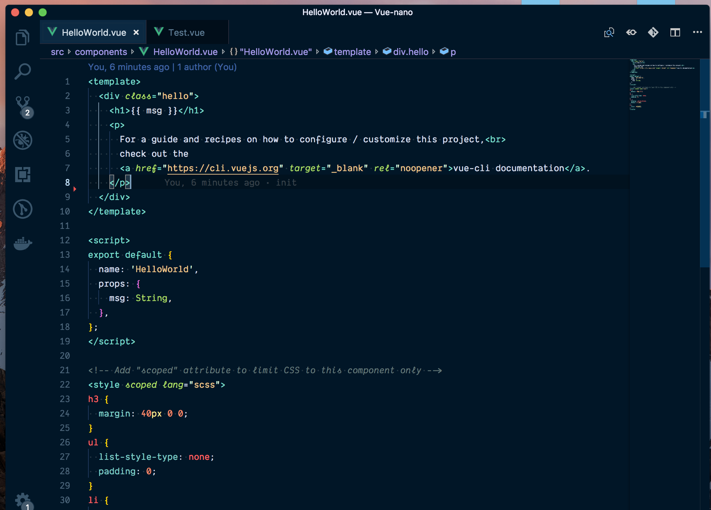

# 🏠 3: Visual Studio CodeにVueのための最適な設定をしよう （初級）

| **プロジェクトのゴール**       | このnanoプロジェクトの目標は、Vue開発に最適なVSCodeの設定方法を学ぶことです。                                                      |
| --------------------------- | ---------------------------------------------------------------------------------------------------------------------- |
| **あなたが学べること**         | Vueを使った開発のための、VSCodeの設定方法を学びます。                                                                           |
| **必要なツール**              | ChromeやFirefoxなどの最新のブラウザと、[Visual Studio Code Editor](https://code.visualstudio.com/download) へのアクセス     |
| **かかる時間**       | 15分                                                                                                                    |

# Vueを使った開発に最適なVSCodeの設定方法を学びます。

このアクティビティでは、Vueでの開発に適した [VSCode](https://code.visualstudio.com/) の設定方法を説明します。Vueを使う開発者として、生産性を向上させるために開発環境を設定することはとても重要です。そうすれば、ほとんどの作業を行ってくれるツールを使えるので、それについて心配する必要しなくてよくなります。

## はじめに

Vueアプリケーションの開発を始めるためには、まずワークスペースやコードエディタを設定する必要があります。
そして、このnanoプロジェクトは、VueのためのVSCodeのセットアップ方法に焦点を当てています。

## Vetur のインストール

まず、Visual Studio マーケットプレイスから [Vetur](https://marketplace.visualstudio.com/items?itemName=octref.vetur) という拡張機能をインストールする必要があります。このプラグインは、Vueでの開発を容易にする多くの機能を備えています。これには以下の機能が含まれています。

- シンタックスハイライト
- スニペット
- Emmet
- リンティング／エラーチェック
- フォーマット
- インテリセンス

マーケットプレイスから直接インストールボタンをクリックすると、インストールすることができます。


::: ヒント 💡
この拡張機能をインストールするもう一つの方法は、VSCodeの拡張機能タブ（extension tab）をクリックして、「Vetur」を検索することです。そうすると、VSCodeに直接インストールできます。:::


## シンタックスハイライト

Veturは以下の言語のシンタックスハイライトをサポートしています。



## スニペット

Veturでは、VSCodeでコンポーネント内でスニペットを使用する機能を提供しています。

`scaffold`

```html
<template>
	...
</template>

<script>
	export default {
	...
	}
</script>

<style>
	...;
</style>
```

`template with HTML`

```html
<template>
	...
</template>
```

`style with SCSS`

```html
<style lang="scss">
	...
</style>
```

## Emmet

Veturは、以下の言語のEmmetをサポートしています: html, css, scss, less, and stylus。


## リンティング/エラーチェック

Veturは、リンティングとエラーチェックを提供し、eslintプラグインを利用するように設定することができます。


## フォーマット

Veturは、Prettierのようなフォーマッタの助けを借りて、html, css, scss, less,postcss, stylus, js, ts のフォーマットをサポートしています。

オートフォーマット（自動のフォーマット）は `save` コマンドで行うこともできますし、ワークフローの最後にドキュメント全体をフォーマットするオプションもあります。


## インテリセンス

Veturは、デフォルトで.vueファイルにインテリセンス（IntelliSense）を提供しています。


## 最後に

ここでは、Vueを使った開発のための開発環境の素晴らしい設定方法をご紹介しました。これらのツールをすべてVSCode上で設定しておけば、開発作業がすっきりして楽になるので安心です。

## バッジ

おめでとう！バッジを獲得しました。


## 著者

Made with ❤️ by Gift Egwuenu