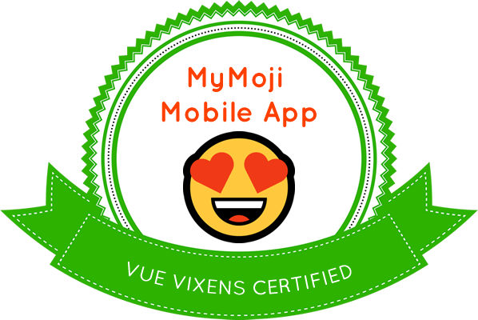

# 😻 6: 愛の絵文字を拡散するモバイルアプリを作ろう （初級）

| **プロジェクトのゴール**           | このnanoプロジェクトでは、絵文字を表示したり友達に送ったりする可愛いモバイルアプリの作り方を学びます。                                                                                                                                                                                                                                                                                                                                                                                                                                                                                                                                                                                                                                                               |
| --------------------------- | --------------------------------------------------------------------------------------------------------------------------------------------------------------------------------------------------------------------------------------------------------------------------------------------------------------------------------------------------------------------------------------------------------------------------------------------------------------------------------------------------------------------------------------------------------------------------------------------------------------------------------------------------------------------------------------------------------------------------------------------------------------- |
| **あなたが学べること**       | Playground内でNativeScript-Vue アプリを構築します。また、「ソーシャルシェアプラグインを通した送信」ができるリストを作成します。                                                                                                                                                                                                                                                                                                                                                                                                                                                                                                                                                                                                                                     |
| **必要なツール**       | グーグルChromeなどのWebブラウザと、モバイルデバイス(iOS または Android)が必要です。[NativeScript Playground](http://play.nativescript.org) にアクセスしてください。 - 作ったものを残せるように、Playground内でアカウントを作ることを検討してください。 「NativeScript Playground」アプリと「NativeScript Preview」がインストールされたスマートフォン(iOS または Android)を用意してください。<br><br>Android版: [NativeScript Playground](https://play.google.com/store/apps/details?id=org.nativescript.play) と[NativeScript Preview](https://play.google.com/store/apps/details?id=org.nativescript.preview).<br><br>iOS版: [NativeScript Playground](https://itunes.apple.com/us/app/nativescript-playground/id1263543946) と [NativeScript Preview](https://itunes.apple.com/us/app/nativescript-preview/id1264484702) |
| **かかる時間** | 10 分                                                                                                                                                                                                                                                                                                                                                                                                                                                                                                                                                                                                                                                                                                                                                      |

# 絵文字をシェアするモバイルアプリを作ります。

NativeScript-Vueを使って、モバイルアプリのビルド方法とVue.jsの実装について学びましょう。Vue.jsを使うことで、iOS と Android版のネイティブなモバイルアプリを作ることができます。今回はリストを作ったり、外部のソーシャルシェアリングプラグインを使ったりして、絵文字を友達に送れるようにしてみます。

## アプリケーション基盤の構築

[NativeScript Playground](http://play.nativescript.org) を開いて、ざっと中身を見てみてください。初めて開いた際、アカウントを作る前に、説明用のモーダルが出てきます。モーダルにはPlaygroundを使うときに必要になる、上記２つのモバイルアプリのダウンロード方法が書かれているはずです。

メインエディタが表示されますが、そこにはアプリ作成用のいくつかのファイルが既に存在している状態です。デフォルトでは最初のプレイグラウンド用アプリはAngularで書かれています。上部にある'new'をクリックし、'NS + Vue.js' テンプレートを選択しましょう。これが最初のNativeScript-Vueアプリの基盤構築方法です！

When you click the `QR Code` ボタンをクリックした時、QRコードが出てきます。このQRコードを、スマホのNativeScript Playgroundアプリでスキャンしてください。これで、コードを変更した際に、あなたのスマホ上で自動でリフレッシュできるようになります。 リフレッシュされ、デフォルトのアプリが表示されることが確認できると思います。


::: 開発のヒント 💡
もしスマホ上でアプリを完全にリフレッシュしたい場合は、QRコードを再作成し、もう一度NativeScript Playgroundアプリでスキャンしてみてください。
:::

## スタイルの追加

モバイルアプリの見た目を良くしてみましょう。NativeScript-Vue は複数のテーマを最初の段階で既に持っており、アプリはそれらのクラス名が正しく使えるように構築されています。`app.css` ファイル上でテーマのスタイルシートを参照している行があるので、他のスタイルシートが使えるように変更しましょう:

```css
@import '~nativescript-theme-core/css/orange.css';
```

`sky` や `forest` や `ruby`などの他のテーマに変更して遊んでみましょう。クリエイティブに！

アプリの名前を変えるため、ActionBar内のタイトルを変更してみてください:

```xml
<ActionBar title="MyMojis" class="action-bar" />
```

`HelloWorld.vue`の下にある `<style>` ブロック内のローカルのスタイルはもう必要ないので、削除してしまいましょう。

## リストデータの追加

これから絵文字で可愛く装飾したリストを作っていきます。 There's a treasure trove of emoji, sorted into a JSON object and labeled, 
この [レポジトリ](https://github.com/shanraisshan/EmojiCodeSheet)　内に、絵文字の一覧があります。JSONオブジェクトで作ってあり、ラベルも付けられています。このレポジトリJSON/stringフォルダ内に入って、[人間カテゴリの絵文字](https://github.com/shanraisshan/EmojiCodeSheet/blob/master/json/string/People.json)　をみてみましょう。

アプリに表示するデータを作るため、このJSONをいくつか使いましょう。`HelloWorld.vue` の`data`オブジェクトを絵文字で上書きします。下記のコードを使うか、または、上のレポジトリから他のJSONを借りてくるのもいいですね。:

```JavaScript
data() {
            return {
                people: [{
                        key: "grinning_face",
                        value: "😀"
                    },
                    {
                        key: "grimacing_face",
                        value: "😬"
                    },
                    {
                        key: "grimacing_face_with_smile_eyes",
                        value: "😁"
                    },
                    {
                        key: "face_with_tear_of_joy",
                        value: "😂"
                    },
                    {
                        key: "smiling_face_with_open_mouth",
                        value: "😃"
                    },
                    {
                        key: "smiling_face_with_open_mouth_eyes",
                        value: "😄"
                    },
                    {
                        key: "vue_vixen",
                        value: "🦊"
                    },
                ]
            };
        }
```

## ビルドと作成したリストの確認

ここで、データを表示する場所が必要になってきます。NativeScript-Vue は NativeScript モジュールを使って、アプリ用にネイティブ要素をビルドします。なので、`<li>` や `<ul>`などのHTML要素を使う代わりに、 `<ListView>`　要素を使っていきましょう。 `<ActionBar>` と　`</Page>` タグの間のマークアップを全て削除します。

その後、下記を追加します:

```XML
<ListView class="list-group" for="person in people" style="height:1250px">
    <v-template>
        <FlexboxLayout flexDirection="row" class="list-group-item"
            >
                <Label :text="person.value" />
                <Label :text="person.key" />
        </FlexboxLayout>
    </v-template>
</ListView>
```

これで、アプリがリフレッシュしたら、ラベル付きの絵文字リストが表示されると思います。さらに分かりやすいリストにするために、絵文字をもっとリストに追加したり、ラベルを変更したりしてみるといいかもしれませんね。

## リストをインタラクティブ(クリックしたら動くよう)に実装

リストがただ表示されるだけではなく、もっと何かできるようにしたいと思います。クリックしたら絵文字を送信できるように実装してみましょう。

最初に、Social Share pluginを導入して、Twitter や WhatsAppなど、あなたのスマホ上のSNSにアクセスできるようにします。

`<script>`　タグの下に下記のコードを追加してください:

```JavaScript
import * as SocialShare from "nativescript-social-share";
```

Social Share plugin はビルドされて、Playgroundアプリに使用されます。なので、アプリからアクセスするために、もう何もする必要はありません。

次に, `methods` ブロックを　`export default {`　の下に追加します。:

```JavaScript
methods: {
    share: function(person) {
        SocialShare.shareText(person.value + "I just created an amazing mobile app with a Vue Vixens Nano! Check us out @VueVixens!");
    }
},
```

Social Share pluginをユーザーが使うためのメソッドが定義できました。

最後に, FlexBoxLayoutに`@tap` イベントを追加します。こんな感じになるはずです。:

```XML
<FlexboxLayout flexDirection="row" class="list-group-item" @tap="share(person)">
```

現時点で、アプリを保存してリストの要素をクリックした際に、SNSのリストが表示されると思います。（表示されるSNSは、どんなSNSがあなたのスマホにインストールされているかによって変わります。）リスト内のSNSを一つ選択してタップするだけで、絵文字が送れます！

それでは早速、今作ったアプリで、ツイートしてみましょう！

## 最終確認

アプリのコード全体 (`HelloWorld.vue`内の全てのコード) はこんな感じになっているはずです:

```XML
<template>
    <Page class="page">
        <ActionBar title="MyMojis" class="action-bar" />
        <ListView class="list-group" for="person in people" style="height:1250px">
            <v-template>
                <FlexboxLayout flexDirection="row" class="list-group-item"
                    @tap="share(person)">
                    <Label :text="person.value" />
                    <Label :text="person.key" />
                </FlexboxLayout>
            </v-template>
        </ListView>
    </Page>
</template>

<script>
    import * as SocialShare from "nativescript-social-share";
    export default {
        methods: {
            share: function(person) {
                SocialShare.shareText(person.value + "I just created an amazing mobile app with a Vue Vixens Nano! Check us out @VueVixens! #EveryDayWeSkulking");
            }
        },

        data() {
            return {
                people: [{
                        key: "grinning_face",
                        value: "😀"
                    },
                    {
                        key: "grimacing_face",
                        value: "😬"
                    },
                    {
                        key: "grimacing_face_with_smile_eyes",
                        value: "😁"
                    },
                    {
                        key: "face_with_tear_of_joy",
                        value: "😂"
                    },
                    {
                        key: "smiling_face_with_open_mouth",
                        value: "😃"
                    },
                    {
                        key: "smiling_face_with_open_mouth_eyes",
                        value: "😄"
                    },
                    {
                        key: "vue_vixen",
                        value: "🦊"
                    }
                ]
            };
        }
    };
</script>

```


## まとめとチャレンジ

これで、NativeScript-Vueを使ったネイティブモバイルアプリの作り方がわかったと思います。好きなようにカスタマイズできます。

🎨 スタイルを変えたり、リストを変更してみましょう。そうすることで、もっと面白いラベルが絵文字の横に表示されるようになると思います。

😍 もっと絵文字を増やしてみましょう！

❤️ 実装したSocial Shareの機能を使って、あなたの作ったアプリを是非、周りの人にシェアしてくださいね！Have fun！

## バッジ

おめでとう！バッジを獲得しました。



## 著者

Made with ❤️ by Jen Looper
