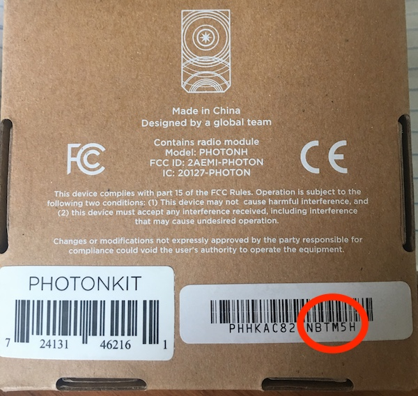
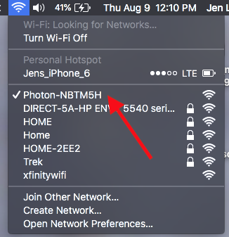
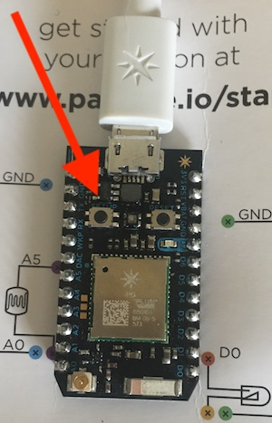
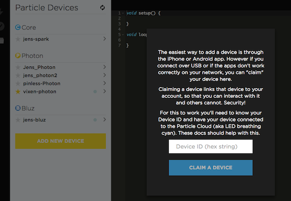
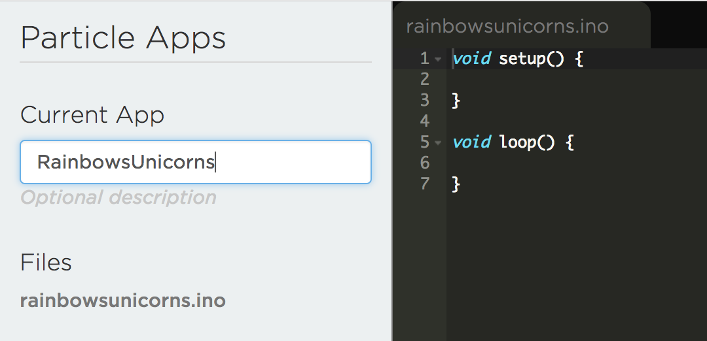
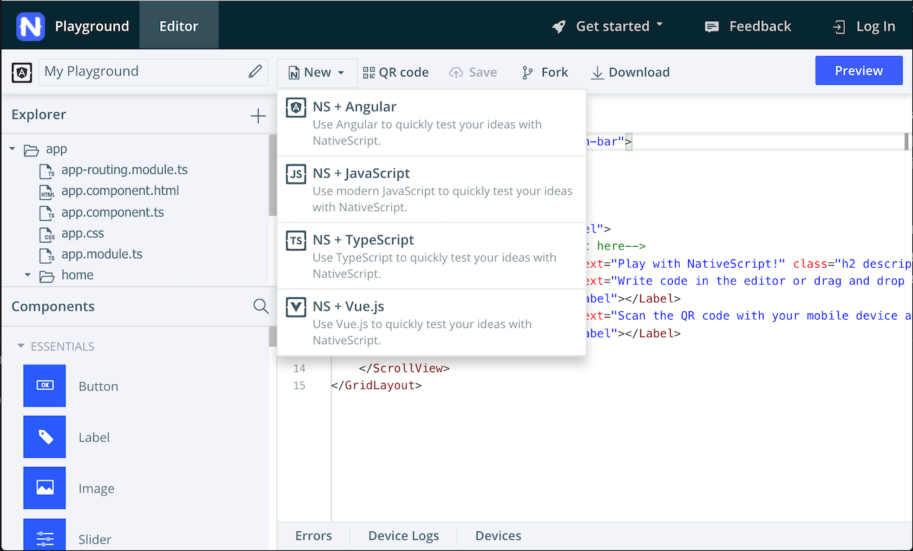
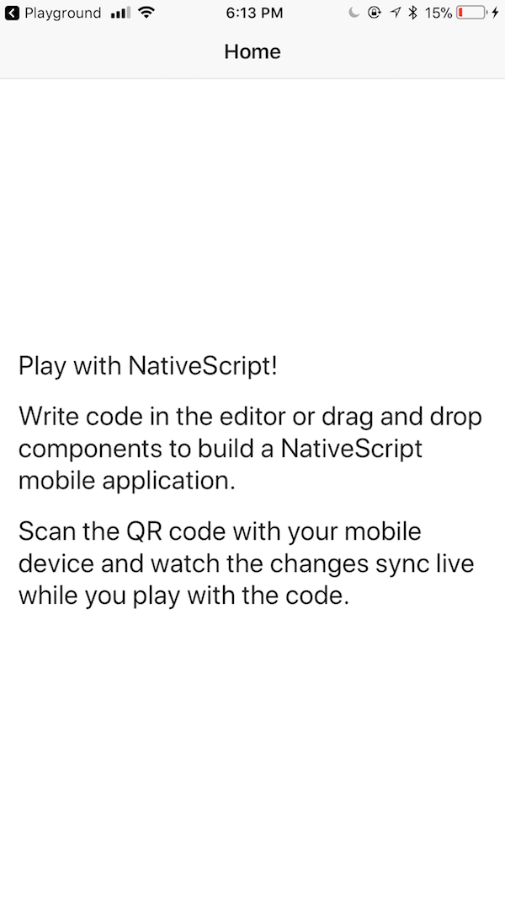
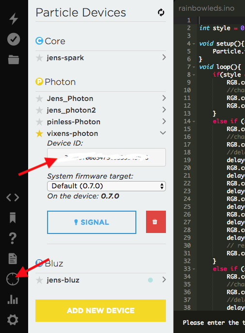
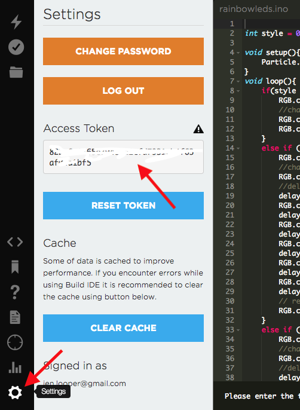

# 🌈🦄 Mini Workshop 3: Particle Photon デバイスをライトアップする Rainbow/Unicorn なモバイルアプリを作成する

| **プロジェクトのゴール**                   | NativeScript-Vue を作成して、Photon の組み込み LED がユーザーの選択に基づいて異なる色で点滅するようにします。                                                                                                                                                                                                                                                                                                                                                                                                                                                                                                                                                                                                                                                                                                                                                                                                      |
| ------------------------------------------ | ------------------------------------------------------------------------------------------------------------------------------------------------------------------------------------------------------------------------------------------------------------------------------------------------------------------------------------------------------------------------------------------------------------------------------------------------------------------------------------------------------------------------------------------------------------------------------------------------------------------------------------------------------------------------------------------------------------------------------------------------------------------------------------------------------------------------------------------------------------------------------------------------------------------ |
| **このワークショップで学ぶこと**           | NativeScript と Vue.js でのモバイルアプリの作り方、Particle Photon をセットアップして構成する方法、そして 2 つを繋げてアプリがデバイスを制御する方法                                                                                                                                                                                                                                                                                                                                                                                                                                                                                                                                                                                                                                                                                                                                                               |
| **必要なツール**                           | Wi-Fi へのアクセス<br><br>Chrome のようなモダンブラウザ<br><br>[NativeScript Playground](https://play.nativescript.org) へのアクセス —バージョン管理のためアカウント作成を推奨します。iOS または Android のスマートフォンと NativeScript Playground、Preview アプリのインストール<br><br>プレイグラウンド用の 2 つの NativeScript コンパニオンアプリ（NativeScript Viewer と NativeScript Playground）Android の場合： [NativeScript Playground](https://play.google.com/store/apps/details?id=org.nativescript.play) と [NativeScript Preview](https://play.google.com/store/apps/details?id=org.nativescript.preview)。iOS の場合： [NativeScript Playground](https://itunes.apple.com/us/app/nativescript-playground/id1263543946) と [NativeScript Preview](https://itunes.apple.com/us/app/nativescript-preview/id1264484702)<br><br>[Particle Photon device](https://store.particle.io/collections/photon)。 |
| **かかる時間**                             | 1 時間                                                                                                                                                                                                                                                                                                                                                                                                                                                                                                                                                                                                                                                                                                                                                                                                                                                                                                             |
| **アプリケーションを試してみたいですか？** | [Playground アプリでこのリンクを開きます](https://play.nativescript.org/?template=play-vue&id=E9hBGf&v=21)                                                                                                                                                                                                                                                                                                                                                                                                                                                                                                                                                                                                                                                                                                                                                                                                         |

# イントロダクション

## Photon をセットアップする

### 1. Photon を Wi-Fi に接続します：

このワークショップに付属のキットを開梱するか、用意しているあなたのデバイスを使用して、mini-USB コードを Photon とコンピューターの USB ポートまたは USB 対応の充電器に接続して、デバイスに電力を供給します。

- [Photon setup page](https://setup.particle.io/) にアクセスしてデバイスをセットアップします。ログインを求められますが、先に進み、Particle アカウントを作成します
- アカウントを作成すると、デバイスのセットアップにリダイレクトされます。「Setup a Photon」と「next」をクリックして開始します。次のページにすべての要件がある場合は、「next」をクリックします。生成されたローカルファイルをコンピューターにダウンロードします。ブラウザで `photonsetup.html` ファイルを開きます
- Photon の箱の裏面を見てどの Photon かを特定します。左側にデバイスの ID が記載されたステッカーがあります。その番号の最初の 6 文字は、コンピューターに表示される最初の Wi-Fi アドレスと一致します



- リストされている手順に従って Photon の Wi-Fi ネットワークに接続します。接続すると、「青くピカピカ」するはずです（中央の青色のライトがゆっくりと点滅します）



デバイスに名前をつけてセットアップを完了します。これで、Photon のコードを書くための特別な IDE である [Particle Build](https://build.particle.io) でデバイスを使用することができます。

::: tip 💡
参加者は、Particle Build で Photon を見つけるのに苦労することがあります。IDE に表示されない場合は、手動で追加してください。

- デバイスがまだ青色に点滅していない場合は、メインステータス LED が濃い青色に点滅するまで Photon のセットアップボタンを押し続けます。これには約 3 秒かかります。



- 上記の手順に従って Photon の Wi-Fi に接続し、Web ブラウザで [http://192.168.0.1/device-id](http://192.168.0.1/device-id) を開きます。そのページには、次のような ID が表示されます：

```
{"id":"30003F000347363339343638","c":"1"}
```

- その ID をメモしてください。あとで使用します
- [Particle Build](https://build.particle.io) を開き、「Add New Device」をクリックします



- メモしておいたデバイス ID をボックスに入力します。これでデバイスが IDE で使用できるようになります

:::

### 2. Particle Build について学ぶ

Photon のアカウントはすでに作成しており、ログインしているはずです（ログインしていない場合は、[ここからログインしてください](https://login.particle.io/login)）
これで [Particle Build](https://build.particle.io/build/new) に移動できます。左のバーの下部にある下から 3 番目のアイコンをクリックして、デバイスがリストされていることを確認します。スターがついていることを確認します（スターがついていない場合はスターをクリックします） —Wi-Fi 経由でこのデバイスにコードをフラッシュします。

Particle Build を見てみましょう。これはブラウザベースの IDE であり、ブラウザから左側で選択した Photon デバイスにコードを「フラッシュ」、つまり公開できます。


現在、この新しいファイルには、setup() と loop() 関数以外は何もありません。このファイルにコードを追加してみましょう。

::: tip 💡
Photon は基本的に Wi-Fi 接続された Arduino であるため、Arduino 開発の経験があれば、このコードはなじみ深いものになります。Arduino の「スケッチ」、つまりハードウェアデバイスに書き込まれるファームウェアは、一般的に C または C++ で書かれています。はんだ付けや余分な配線を避けて、デバイスの中央の LED ライトを制御するための C++ コードを少し書きます。ただし、Particle キットにはいくつかの追加機能が付属しているので、後でもっと自由に探ってみてください！
:::

現時点では、Photon は中央の LED が点灯しており、すべてが順調に進んでいる場合は、「青くピカピカしている」か、緑がかった青色のパルスを発しているはずです。いくつかのコードをフラッシュして、中央のライトを白くしましょう。

### 3. いくつかのコードをフラッシュする

Build IDE の右側に、いくつかのコード行を含む黒いウィンドウが表示されます。loop() 関数の波かっこ内に、次のコードを貼り付けます：

```js
RGB.control(true);
// 色を変える
RGB.color(RGB_COLOR_WHITE);
RGB.control(false);
```

このコードは、Particle API を使用して中央の RGB LED の制御を取得し、その色を変更してから、制御を放棄します。

この新しいファイルは、Particle Build では「アプリ」と見なされます。アプリのコードをスター付きのデバイスにフラッシュする前に、左側のパネルで名前を付ける必要があります。



Particle Build の左側のナビゲーションストリップにあるフォルダアイコンをクリックして、変更を保存します。その上にある、丸で囲まれたチェックマークをクリックして、コードを「確認」します。これは基本的にコードをテストして、コンパイルできることを確認しています。最後に、Photon にスターが付けられていることを確認し、上部の稲妻アイコンをクリックして、このコードをデバイスにフラッシュします。Photon が更新され、いくつかの色が数秒間点滅した後、中央の LED が白色に変わるはずです。コードをループ関数に配置しているので、白のままです。

このスニペットを少しいじってみてください。LED を赤くできますか？

### 4. Photon コードを完成させる

私たちのモバイルアプリでは、LED ライトの 3 つの「モード」を作成します —LED がレインボーシリーズを点滅させる「レインボーモード」、LED が青と白を交互に点滅させる「ユニコーンモード」、そして「停止」モードで LED が白色に留まります。

ご想像のとおり、これらのルーチンを loop() 関数に配置します。

このファイルの先頭に変数を追加し、初期のライトスタイルを 0 にリストします：

`int style = 0;`

次に、 loop() 関数で、追加したスニペットを次のコードで上書きします：

```js
if (style == 0) {
  RGB.control(true);
  // 色を変える
  RGB.color(RGB_COLOR_WHITE);
  RGB.control(false);
} else if (style == 1) {
  RGB.control(true);
  // 色を変える
  RGB.color(RGB_COLOR_RED);
  // 1秒遅らせる
  delay(500);
  RGB.color(RGB_COLOR_ORANGE);
  delay(500);
  RGB.color(RGB_COLOR_YELLOW);
  delay(500);
  RGB.color(RGB_COLOR_GREEN);
  delay(500);
  RGB.color(RGB_COLOR_BLUE);
  delay(500);
  RGB.color(RGB_COLOR_MAGENTA);
  delay(500);
  // 通常の操作を再開する
  RGB.control(false);
} else if (style == 2) {
  RGB.control(true);
  // 色を変える
  RGB.color(RGB_COLOR_WHITE);
  // 1秒遅らせる
  delay(500);
  RGB.color(RGB_COLOR_MAGENTA);
  delay(500);
  // 通常の操作を再開する
  RGB.control(false);
}
```

このコードを検証し、デバイスにフラッシュします。何も変更されていないようです —スタイルが 0 に設定されているため、まだ白いままです。整数値を 1 に変更して、デバイスにフラッシュし、何が起こるかを見てみましょう。Rainbow が見えますか？

これでスタイルを 0 に戻すことができるので、LED は白で初期化されます：

`int style = 0;`

### 5. モバイルアプリで Photon の REST API を使用する準備をする

では、Photon のクールな REST API 機能を使用して、モバイルアプリが Photon を制御できるようにする必要があります。これを行うには、次の行を中かっこの間にある setup() 関数に追加します：

`Particle.function("launchMode",launchMode);`

モバイルアプリから利用できる `launchMode` という名前の Particle 関数を追加しました。これは、Photon のコードで同様の名前の関数を呼び出します。

loop() 関数の最後にその関数を追加します：

```js
int launchMode(String mode) {
    style = 0;

    if(mode=="rainbow"){
        style = 1;
    }else if(mode=="unicorn"){
        style = 2;
    }
}
```

これで、モバイルアプリは内部の `launchMode` 関数を呼び出す `launchMode` という Particle 関数を呼び出すことができ、LED フラッシュスタイルの制御に使用するモードを示す文字列を渡します。

保存して確認し、このコードをデバイスにフラッシュします。LED は白に戻ります。

### 6. 最終的な Photon コード

最終的なコードは次のようになります：

```js
int style = 0;

void setup(){
    Particle.function("launchMode",launchMode);
}
void loop(){
    if(style == 0){
        RGB.control(true);
        // 色を変える
        RGB.color(RGB_COLOR_WHITE);
        RGB.control(false);
    }
    else if (style == 1){
        RGB.control(true);
        // 色を変える
        RGB.color(RGB_COLOR_RED);
        // 1秒遅らせる
        delay(500);
        RGB.color(RGB_COLOR_ORANGE);
        delay(500);
        RGB.color(RGB_COLOR_YELLOW);
        delay(500);
        RGB.color(RGB_COLOR_GREEN);
        delay(500);
        RGB.color(RGB_COLOR_BLUE);
        delay(500);
        RGB.color(RGB_COLOR_MAGENTA);
        delay(500);
        // 通常の操作を再開する
        RGB.control(false);
    }
    else if (style == 2){
        RGB.control(true);
        // 色を変える
        RGB.color(RGB_COLOR_WHITE);
        // 1秒遅らせる
        delay(500);
        RGB.color(RGB_COLOR_MAGENTA);
        delay(500);
        // 通常の操作を再開する
        RGB.control(false);
    }
}

int launchMode(String mode) {
    style = 0;

    if (mode=="rainbow") {
        style = 1;
    } else if (mode=="unicorn") {
        style = 2;
    }

}
```

## アプリを Scaffold する

次に、JavaScript を使用してネイティブなモバイルアプリを作成します。NativeScript を使用してアプリを作成します。このアプリは、先ほどフラッシュしたコードを介して Photon と通信します。

[NativeScript Playground](https://play.nativescript.org) を開いてみてください。最初の訪問では、いくつかの「コーチマーク」が表示され、主要な機能がある場所が示されます。

「Play Now」をクリックして、メインエディタを開きます。QR コードが表示されます — NativeScriptPlay アプリでスキャンしてください。これにより、コーディング時にスマートフォンを自動的に更新できます。これで、NativeScript-Vue アプリを Scaffold する準備ができました！



デフォルトでは、最初のプレイグラウンドアプリは Angular を使用して作成されます。上部の「new」をクリックし、テンプレートとして「NS-Vue」を選択します。 別の QR コードを取得するので、そのコードをスキャンしてください。スマートフォンが更新され、基本のアプリが表示されます：



## ベースのマークアップを作成する

`template` で少しだけ XML マークアップを使って、ActionBar、ナビゲーション用の SegmentedBar、そしてタップされると変化するパネルを備えた SegmentedBar のシンプルなレイアウトを構築します。

::: tip 💡
NativeScript レイアウトは、Web で作成した HTML とは異なります。GridLayouts や StackLayouts などのネイティブ UI に変換される NativeScript XML マークアップを使用しています。
:::

`app/components/HelloWorld.vue` を開き、テンプレートの `<Page>` タグの間のすべてを削除して、以下を追加します：

```html
<ActionBar class="action-bar" title="Awesome Photons!" />
<StackLayout>
  <SegmentedBar
    color="white"
    backgroundColor="blueviolet"
    selectedBackgroundColor="hotpink"
    class="bar"
    :items="segmentedBarItems"
    v-model="selectedBarIndex"
  />
  <StackLayout height="100%" :class="mode"></StackLayout>
</StackLayout>
```

バインドされた値 `:items` と `v-model` がまだ設定されていないため、SegmentedBar はまだ表示されていません。データブロック（テンプレートブロックの下、スクリプトブロック内）を見つけ、 `data()` メソッドを上書きして、SegmentedBar の値を追加します。また、デフォルトの SelectedBarIndex を設定し、 `mode` のプレースホルダー値を作成します。後者は、バーがタップされたときに UI を変更するために使われます：

```js
data() {
    return {
      segmentedBarItems: function () {
        var segmentedBarModule = require("ui/segmented-bar");
        let rainbow = new segmentedBarModule.SegmentedBarItem();
        rainbow.title = "Rainbows";
        let unicorn = new segmentedBarModule.SegmentedBarItem();
        unicorn.title = "Unicorns";
        let stop = new segmentedBarModule.SegmentedBarItem();
        stop.title = "Stop!";
        return [rainbow, unicorn, stop];
      }(),
      selectedBarIndex: 2,
      mode: ''
    };
  },
```

これで、SegmentedBar がうまく表示されるはずです！

## CSS を追加する

NativeScript は、UI のスタイルを設定するために、通常の CSS および SASS のサブセットをサポートしています。それを活用して UI を改善しましょう。

`<script>` タグの下に、 `<style>` タグがあります。このブロックの 2 つのスタイルを次のように上書きします：

```css
.action-bar {
  color: white;
  background-color: blueviolet;
}
.bar {
  margin: 20;
}
.rainbow {
  background: linear-gradient(
    to bottom,
    red,
    orange,
    yellow,
    green,
    blue,
    purple
  );
}
.unicorn {
  background-image: url("~/images/unicorn.jpg");
  background-repeat: no-repeat;
  background-size: cover;
  background-position: center;
}
```

このプロジェクトに画像も追加する必要があります。この画像は、Unicorn SegmentedBarItem がタップされたときに表示されます。

「Explorer」という単語の横にある小さな「+」をクリックし、「images」というタイトルのフォルダを追加します。以下のファイルをローカルに保存し、「.jpg」ファイルとしてアップロードし、ドロップダウンで「Upload resources」ユーティリティを使用します。

::: tip 💡
ファイル名を `unicorn.jpg` に変更し、アップロード後に保存してください。
:::


## メソッドの作成（1）

`Rainbows` 、`Unicorns` 、または `Stop!` をタップするかどうかに応じて、UI を変更します。

SegmentedBar の動作を管理するために、 `data` メソッドの最後のコンマのあと（まだない場合はコンマを追加します）に `methods` ブロックを作成します：

```js
methods: {
    onSelectedIndexChange(args) {
      let segmentedBarIndex = args.object.selectedIndex;
      if (segmentedBarIndex == 0) {
        this.mode = 'rainbow'
        //this.launchMode(this.mode);
      }
      else if (segmentedBarIndex == 1) {
        this.mode = 'unicorn'
        //this.launchMode(this.mode);
      }
      else {
        this.mode = 'stop'
        //this.launchMode(this.mode);
      }
    }
  }
```

::: tip 💡
貼り付けで JavaScript を追加すると、NativeScript Playground がめちゃくちゃになる場合があります。修正するには、 `<command><X>` （切り取り）を押します。
:::

次に、このメソッドを監視するために `<SegmentedBar>` 自体を編集します。@selectedIndexChange を `<template>` の `<SegmentedBar>` マークアップに追加します：

```html
@selectedIndexChange="onSelectedIndexChange($event)"
```

完成したテンプレートブロックは次のようになります：

```html
<template>
  <Page>
    <ActionBar class="action-bar" title="Awesome Photons!" />
    <StackLayout>
      <SegmentedBar
        color="white"
        backgroundColor="blueviolet"
        selectedBackgroundColor="hotpink"
        class="bar"
        :items="segmentedBarItems"
        v-model="selectedBarIndex"
        @selectedIndexChange="onSelectedIndexChange($event)"
      />
      <StackLayout height="100%" :class="mode"></StackLayout>
    </StackLayout>
  </Page>
</template>
```

これで、SegmentedBar をタップすると、UI が変更されます。

## Photon を接続する

これで、SegmentedBar をタップしたときに Photon が点灯するようになりました。

プレイグラウンドの `<script>` のすぐ下で、いくつかの `const` の値を設定します。

```js
const http = require("http");
const baseUrl = "https://api.particle.io/v1/devices/xxxxx";
const token = "yyyyy";
const endpoint = "launchMode";
```

これらを見ていきましょう。まず、Particle の REST API に対して http 呼び出しを行う必要があるため、 `http` モジュールが必要です。

次に、REST API にどのデバイスを呼び出してトークンを送信するかを通知する必要があります。ここで 2 つの値を変更する必要があります。Particle Build IDE に戻り、下から 3 番目のアイコンをクリックします（ターゲットのように見えます）。デバイス ID は次のとおりです：



その値をコピーし、baseUrl const の `xxxxx` の値をデバイス ID に変更します。

次に、REST API 自体を使用するためのトークンが必要です。Particle Build の下部にある「歯車」アイコンをクリックし、アクセストークンの値をコピーして、 `yyyyy` をトークンに置きかえます。



追加した最後の値は、呼び出すエンドポイントの名前です。上で設定した Particle 関数を覚えていますか？これはモバイルアプリで呼び出す方法です。

## メソッドの作成（2）

`onSelectedIndexChange` 呼び出しの閉じかっこの後にコンマを追加し、REST API を呼び出すメソッドを追加して、Photon の色を変更します：

```js
launchMode(mode) {
      http.request({
        url: `${baseUrl}/${endpoint}?access_token=${token}`,
        method: "POST",
        headers: { 'content-type': 'application/json' },
        content: JSON.stringify({
          mode: mode
        })
      }).then((response) => {
        console.log(JSON.stringify(response))
      }, (e) => {
        alert("error")
      });
    }
```

ここでは、Particle 関数として設定したエンドポイントで baseUrl に http リクエストを送信し、文字列を渡して、フラッシュするカラーシーケンスを関数に伝えています。

最後に、SegmentedBar がタップされたときに実際に `launchMode` を呼び出す必要があります。 `onSelectedIndexChange` メソッドの `// this.launchMode(this.mode)` コメントコードを外してください。

HelloWorld.vue ファイル全体は次のようになり、個人用デバイスの ID とトークンが入力されます：

```js
<template>
    <Page>
        <ActionBar class="action-bar" title="Awesome Photons!" />
        <StackLayout>
            <SegmentedBar color="white" backgroundColor="blueviolet"
                selectedBackgroundColor="hotpink" class="bar"
                :items="segmentedBarItems" v-model="selectedBarIndex"
                @selectedIndexChange="onSelectedIndexChange($event)" />
            <StackLayout height="100%" :class="mode"></StackLayout>
        </StackLayout>
    </Page>
</template>

<script>
    const http = require("http");
    const baseUrl =
        "https://api.particle.io/v1/devices/<your device id>";
    const token = "<your token>";
    const endpoint = "launchMode";
    export default {
        data() {
            return {
                segmentedBarItems: (function() {
                    var segmentedBarModule = require(
                        "ui/segmented-bar");
                    let rainbow = new segmentedBarModule
                        .SegmentedBarItem();
                    rainbow.title = "Rainbows";
                    let unicorn = new segmentedBarModule
                        .SegmentedBarItem();
                    unicorn.title = "Unicorns";
                    let stop = new segmentedBarModule
                        .SegmentedBarItem();
                    stop.title = "Stop!";
                    return [rainbow, unicorn, stop];
                })(),
                selectedBarIndex: 2,
                mode: ""
            };
        },
        methods: {
            onSelectedIndexChange(args) {
                let segmentedBarIndex = args.object.selectedIndex;
                if (segmentedBarIndex == 0) {
                    this.mode = "rainbow";
                    this.launchMode(this.mode);
                } else if (segmentedBarIndex == 1) {
                    this.mode = "unicorn";
                    this.launchMode(this.mode);
                } else {
                    this.mode = "stop";
                    this.launchMode(this.mode);
                }
            },
            launchMode(mode) {
                http.request({
                    url: `${baseUrl}/${endpoint}?access_token=${token}`,
                    method: "POST",
                    headers: {
                        "content-type": "application/json"
                    },
                    content: JSON.stringify({
                        mode: mode
                    })
                }).then(
                    response => {
                        console.log(JSON.stringify(response));
                    },
                    e => {
                        alert("error");
                    }
                );
            }
        }
    };
</script>

<style scoped>
    .action-bar {
        color: white;
        background-color: blueviolet;
    }

    .bar {
        margin: 20;
    }

    .rainbow {
        background: linear-gradient(to bottom, red, orange, yellow, green, blue, purple);
    }
    .unicorn {
        background-image: url('~/images/unicorn.jpg');
        background-repeat: no-repeat;
        background-size: cover;
        background-position: center;
    }
</style>
```

これで、正しいコードがフラッシュされた状態で Photon が Wi-Fi に接続されている場合、モバイルアプリでのジェスチャが Photon の中央の LED を点灯しているのを確認できます！


NativeScript Playground でモバイルデバイス用の Vue.js アプリを作成することは本当に興味深いです。やり方がわかったので、他にどんなものを作れますか？このアプリを拡張して、さまざまな照明モードを作成できるのではないでしょうか？

## Author

Made with 📱❤️ by Jen Looper
