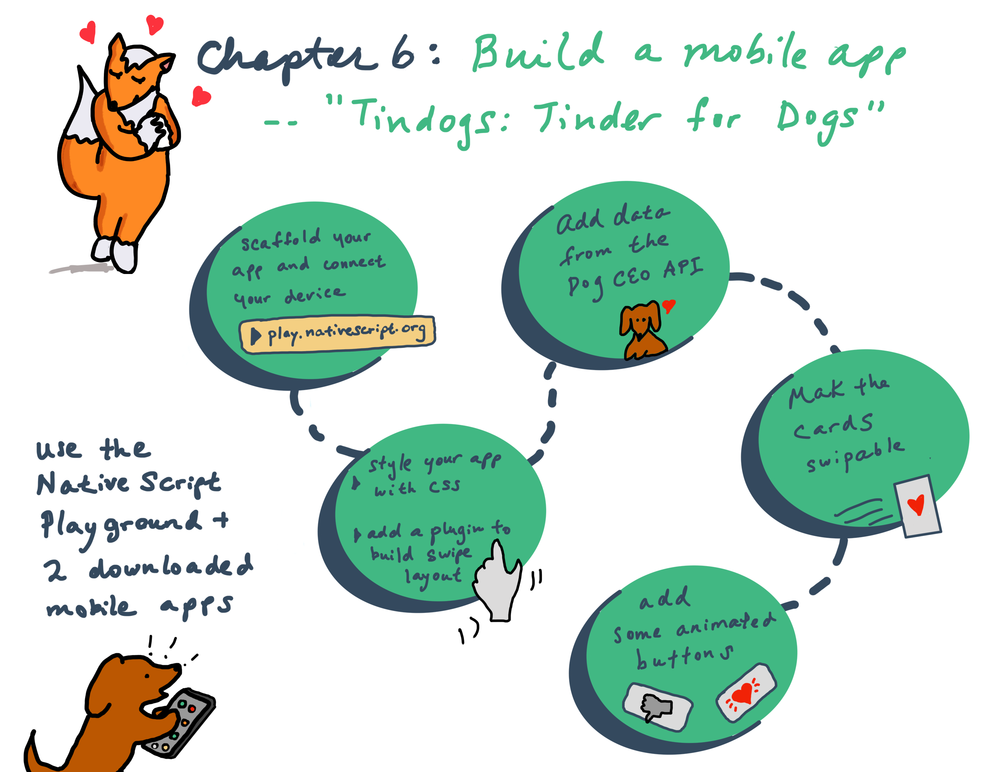
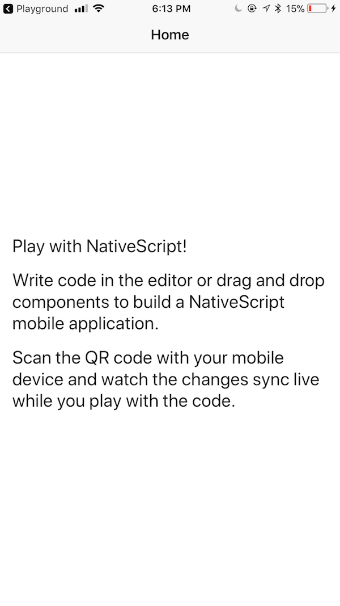
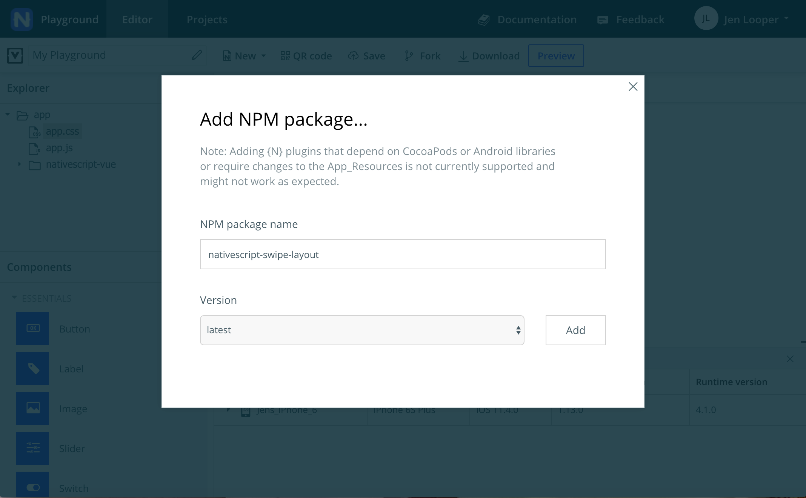
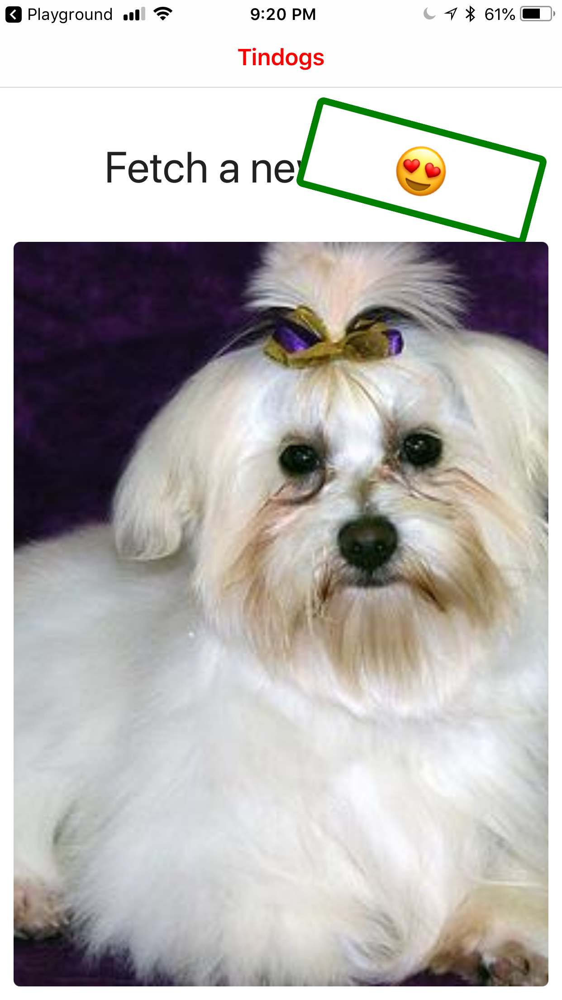

# 📱Mini Workshop 4:  Tinder風のモバイルアプリ「Tindogs」を作ろう!

| **プロジェクトのゴール**           | NativeScriptとVueを使ってカードスワイプスタイルのモバイルアプリを作る |
| ------------------------------- | ------------------------------------------------------------------------------------------------------------------------------------------------------------------------------------------------------------------------------------------------------------------------------------------------------------------------------------------------------------------------------------------------------------------------------------------------------------------------------------------------------------------------------------------------------------------------------------------------------------------------------------------------------------------------------------------------------------------------------------------------------------------------------------------------------------------------------------------------------------------- |
| **このワークショップで学ぶこと** | レイアウトやプラグインの管理を含む、VueとNativeScriptを使ってクロスプラットフォームのネイティブモバイルアプリを構築する方法  |
| **必要なツール** | Chromeのような最新のブラウザ。<br><br> [NativeScript Playground](http://play.nativescript.org) へのアクセス- Playgroundにアカウントを作成して、自分の作品のバージョンをそのままにしておくことを検討してください。<br><br>NativeScript PlaygroundとPreviewアプリがインストールされた携帯電話（iOSまたはAndroid）。<br><br>プレイグラウンド用の2つのNativeScriptコンパニオンアプリは、NativeScript ViewerとNativeScript Playgroundです。<br><br>Androidの場合: [NativeScript Playground](https://play.google.com/store/apps/details?id=org.nativescript.play) と [NativeScript Preview](https://play.google.com/store/apps/details?id=org.nativescript.preview)<br><br>iOSの場合: [NativeScript Playground](https://itunes.apple.com/us/app/nativescript-playground/id1263543946) と [NativeScript Preview](https://itunes.apple.com/us/app/nativescript-preview/id1264484702) |
| **かかる時間**     | 1時間 |
| **サンプルアプリを試したい場合**   | [Playgroundでこのアプリを開く](https://play.nativescript.org/?template=play-vue&id=zyoLbV&v=3)    |

## 今回構築するもの



## 手順

この章では、ペットの里親探し体験を作るためのウェブアプリの構築から、このテーマのバリエーションとしてのモバイルアプリの構築に移ります。Dog CEO APIを再び使用して、 ユーザーが一度に15匹の犬の画像のデッキを読み込んで、左右にスワイプして様々な犬を "いいね！"することができる "Tinder for Dogs" - "Tindogs" を作ろうとしています。楽しみで仕方がありません！では、さっそく始めてみましょう。

## NativeScript-Vue アプリをscaffoldしてデバイスを接続する

今回はNativeScript Playgroundで作業して、このアプリを構築していきます。[NativeScript Playground](http://play.nativescript.org) を開いて見てみましょう。最初の訪問時には、主要な機能が保存されている場所を示す「コーチマーク」がいくつか見えます。


「Play Now」をクリックして、メインエディタを開きます。QRコードが表示されますので、NativeScript Playgroundアプリでスキャンしてください。QRコードをスキャンすると、携帯電話が自動的に更新されます。これで、NativeScript-Vueアプリを足場にする準備ができました。

デフォルトでは、最初のPlaygroundアプリはAngularで作成されています。上部の「New」をクリックし、テンプレートとして「NS-Vue」を選択します。別のQRコードが表示されるので、そちらをスキャンしてください。スマホが更新され、基本的なアプリが表示されます。



## いくつかのスタイルを追加

ここでは、アプリのインターフェイスのスタイルを作成し、UIを構築します。アクションバー、タイトル、2つの隠しボタン、カードのスタックがあります。右にスワイプするか左にスワイプするかに応じて、これらのボタンは短く表示されたり消えたりします。

アプリのルートで app.css ファイルを開き、ファイルを以下のスタイルで上書きします。

```css
@import 'nativescript-theme-core/css/core.light.css';

.card {
	margin: 10;
	z-index: 0;
	border-radius: 5;
}

.action-bar {
	background-color: white;
	color: red;
}

.btn {
	z-index: 1;
	padding: 5;
	border-width: 5;
	border-radius: 5;
	background-color: white;
	text-align: center;
	font-size: 40px;
	opacity: 0;
}

.h1 {
	text-align: center;
	padding-top: 40;
}
.yes {
	color: green;
	border-color: green;
	transform: rotate(15deg);
}

.no {
	color: red;
	border-color: red;
	transform: rotate(-15deg);
}
```

このファイルの中身を見てみましょう。標準的なCSSのサブセットを使って、AndroidやiOSのモバイルアプリの様々な要素をスタイル化するためのCSSを書くことができます。z-indexとopacity（不透明度）の設定に注意してください。

今のところ、スタイリングはActionBarに色をつける以外には何もしていません。プラグインを追加してUIを構築する準備が必要です。

## カードレイアウトを作成するプラグインを追加する

今回はNativeScriptプラグインを使って、Dog CEO APIから取得する画像からスタッカブルカードのレイアウトを作成してみます。

::: tip 💡
[NativeScript Marketplace](http://market.nativescript.org)では、コードサンプルやテンプレートとともに、あらゆる種類のクールな検証済みプラグインやコミュニティ構築プラグインを見つけることができます。
:::

タイトル `Explorer` の横にある小さな `+` ボタンをクリックして、プラグインをプレイグラウンドにインポートします。モーダルで `nativescript-swipe-layout` を検索し、プラグインの最新バージョンをインポートします。



次に、プラグインを使用できるようにするためにインポートする必要があります。`app.js` ファイルの最初の行で `Vue` がインポートされているところで、プラグインをインポートしましょう。

```js
Vue.registerElement('SwipeLayout', () => require('./nativescript-swipe-layout').SwipeLayout);
Vue.config.silent = false;
```

::: tip 💡
デバッグ目的で `Vue.config.silent` を `false` に設定し、Playground インターフェースの下部にある Device Logs パネルでエラーを確認すると便利です。
:::

## データの追加

ユーザーがスワイプするための犬の画像を15個ランダムにDog CEO APIから取得してみましょう。`HelloWorld.vue` ファイルを開き、データ配列のプレースホルダとして `data` オブジェクトを追加し、`swipeLayoutAnimated` の値を `ON_EVENTS` にします。後者の値を設定することで、ユーザーは左右のスワイプのみを強制的に行うことができます (上や下にはスワイプしません)。

現在のデータブロックを置き換える:

```js
data() {
    return {
      dogArray: [],
      dogs: [],
      swipeLayoutAnimated: 'ON_EVENTS'
    }
  },
```

> 注意: ファイルの `<script>` 領域のコードがフォーマットされていない場合は、`cmd-Z` と数回タイプしてコードを再フォーマットしてみてください。

これでAPIを呼び出す準備ができました。まず、`<script>` タグのすぐ下に `http` モジュールをインポートします。

`const http = require("http");`

次に、`methods` ブロックを作成します。`data() {...},` ブロックの最後のカンマの後にAPIへの呼び出しを追加します。

```js
methods: {
    getMultiDogs() {
      http.request({
        url: "https://dog.ceo/api/breeds/image/random/15", method: "GET"
      }).then((response) => {
        this.dogArray = JSON.parse(response.content);
        for (let i = 0; i < 15; i++) {
          this.dogs.push(this.dogArray.message[i])
        }
        console.log(JSON.stringify(this.dogs))
      }).catch( (e) => {
        alert("error")
      });
    }
   //handle the swipes here
  },
```

このAPIコールを見てください。一度に多くのカードを読み込んでアプリの動作が遅くならないように、15枚のランダムな画像をAPIに要求しています。レスポンスを配列にパースし、それをループして犬の画像のURLの配列を作成します。デバイスログに出力されるようになるはずです。

次に、アプリの作成時にこの `getMultiDogs` メソッドを呼び出します。このブロックを `methods: {},` ブロックの最後のカンマの直後に追加します。

```js
created() {
    this.getMultiDogs();
},
```

::: tip 💡
注意してください。この `created()` ライフサイクルフックを `methods` の中で囲みたくなりますが、実際にはメソッドブロックの外側になければなりません。
:::

最後に、UIに画像を表示します。テンプレートブロック内の `<ScrollView...` タグを以下のマークアップに置き換えてください。

```html
<StackLayout>
	<GridLayout rows="*" columns="*">
		<SwipeLayout v-for="dog in dogs" :key="dog.id" row="0" col="0" :animationState="swipeLayoutAnimated">
			<image class="card" :src="dog" stretch="aspectFill"></image>
		</SwipeLayout>
	</GridLayout>
</StackLayout>
```

::: tip 💡
ウェブ用の開発とモバイル用の開発の最大の違いは、レイアウトです。NativeScript のレイアウトは、ネイティブのモバイルレイアウトを処理するために設計されており、ウェブ開発者に馴染みのある DOM 構築のようなテクニックはありません。NativeScript のレイアウトについての詳細は [こちら](https://www.nslayouts.com/)
:::

この頃になると、カードの中に犬が出てくるはずですが、カードがスワイプできません。そこを直しましょう。

## カードをスワイプ可能にする

ユーザーのジェスチャー、左右スワイプを管理するメソッドをいくつか追加する必要があります。

まず、メソッドブロックに2つの新しいメソッドを追加し、`getMultiDogs`メソッドの閉じ括弧の後にカンマを追加します。

```js
next() {
   this.dogs.pop();
},
swipeRightCallback(e) {
   this.next();
},
swipeLeftCallback(e) {
   this.next();
}
```

次に、スワイプ時にコールバックが呼び出されるように `<SwipeLayout` マークアップを編集します。

この行を：

`<SwipeLayout v-for="dog in dogs" :key="dog.id" row="0" col="0" :animationState="swipeLayoutAnimated">`

このように変更します。：

`<SwipeLayout v-for="dog in dogs" :key="dog.id" row="0" col="0" :animationState="swipeLayoutAnimated" @swipeLeft="swipeLeftCallback($event)" @swipeRight="swipeRightCallback($event)">`

とりあえず、この編集では、ユーザーがカードを廃棄する際に dogs 配列から要素を削除して、左右のスワイプジェスチャーのコールバックを追加します。これでカードは左右にスワイプするようになるはずです。

しかし、15回以上スワイプした場合はどうなるのでしょうか？古いデータが破棄された後、新しいデータセットのために再度APIを呼び出すために `next()` メソッドの呼び出しを追加することができます。`next()` を編集しましょう。：


```js
next() {
   this.dogs.pop();
   console.log(this.dogs.length);
   if (this.dogs.length == 0) {
      alert("Loading some more!");
      this.getMultiDogs();
   }
},
```

左右にスワイプしてみてください。15番までスワイプするとどうなりますか？デバイスログを見て、配列の長さを確認してみましょう。


## アニメーションボタンを追加する

あなたのアプリは15匹の犬をロードし、左右にスワイプすることができ、犬の配列が空のときにさらに15匹の犬をロードすることができます。

左にスワイプすると赤いボタンが点滅し、右にスワイプすると緑のボタンが点滅するようなNativeScriptのアニメーションを試してみましょう。

まず、上部の `<script>` タグの下でアニメーションモジュールをrequireします。：

`const Animation = require('ui/animation');`

そして、UIの上部、オープニングの `<StackLayout` タグの直下にセクションを追加します。

```html
<AbsoluteLayout>
	<GridLayout style="z-index:1" columns="*,*" width="100%" paddingTop="20">
		<label ref="no" col="0" text="🤔" class="btn no" />
		<label ref="yes" col="1" text="😍" class="btn yes" />
	</GridLayout>
	<label class="h1" width="100%" text="Fetch a new friend!" />
</AbsoluteLayout>
```

このマークアップでは、レイアウトの素敵な組み合わせを紹介しています。AbsoluteLayoutは、見えないボタンをアプリの上部に固定し、タイトルを重ねています。AbsoluteLayoutタグの中には、ボタンを水平に配置したGridLayoutがあります。

最後に、コールバックコードを以下の2つのメソッドに置き換えます。各ボタンのopacityを不可視から可視に素早く変更するためにアニメーションモジュールを使用していることに注意してください。

```js
swipeRightCallback(e) {
  this.$refs.yes.nativeView.animate({ opacity: 1 })
    .then(() => {
      this.$refs.yes.nativeView.animate({ opacity: 0 })
        .then(() => {
          this.next();
        })
    })
},
swipeLeftCallback(e) {
  this.$refs.no.nativeView.animate({ opacity: 1 })
    .then(() => {
      this.$refs.no.nativeView.animate({ opacity: 0 })
        .then(() => {
          this.next();
        })
    })
}
```

::: tip 💡
ネイティブビュー内でアニメーションさせる必要がある要素への参照である `$refs` を使用していることに注意してください。どの要素が参照されているかは、マークアップの中で `ref` を探すことで識別できます。`ref="no"` を探すことで、どの要素が参照されているかを特定できます。参照は、Web開発におけるdivの'id'のような役割を果たします。
:::

では、スワイプしてみてください。スワイプすると、赤と緑のラベルが表示されます。

最後の微調整は、ActionBarのタイトルを変更することです! アプリに名前をつけましょう。

**🎊モバイルアプリが完成しましたね！おめでとうございます！！！🎊**

# 最終結果


