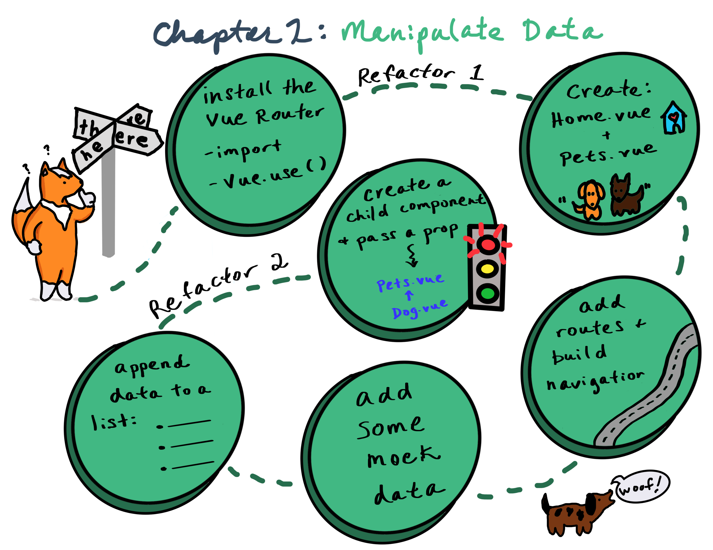

# 📋 Chapter 2: Build a Pet Gallery

| **Project&nbsp;Goal**           | Learn how to manipulate data in a web app                                                                                                                                                                                                                            |
| ------------------------------- | -------------------------------------------------------------------------------------------------------------------------------------------------------------------------------------------------------------------------------------------------------------------- |
| **What&nbsp;you’ll&nbsp;learn** | Using static data, you'll build a card interface to show many adoptable dogs                                                                                                                                                                                         |
| **Tools&nbsp;you’ll&nbsp;need** | A modern browser like Chrome. An account in CodeSandbox.io. If you get lost, import the starting point for this chapter [here](https://github.com/FrontEndFoxes/projects/tree/main/chapter-1-end). Instructions on how to do this are in [Appendix 1](appendix_1.md) |
| **Time needed to complete**     | 1 hour                                                                                                                                                                                                                                                               |

## What You'll Build



## Instructions

If you need to restart your project, clone [this repo](https://github.com/FrontEndFoxes/projects/tree/main/chapter-1-end) into Code Sandbox by clicking on the **Import from GitHub** link on the bottom left of the main page, and then pasting the repo's url into the fields. You can also continue with the project you've created in [chapter 1](ch1.md).

At this point, we have only a home page, but we want to add one more page to contain pet cards. Let's create a single-page application with a navigation bar listing "home" and "pets". Clicking on the "pets" page will bring us to the new page we're creating now and "home" will open the page we've created in [chapter 1](ch1.md).

::: tip 💡
"A single-page application (SPA) is a web application or web site that interacts with the user by dynamically rewriting the current page rather than loading entire new pages from a server" ([Wikipedia](https://en.wikipedia.org/wiki/Single-page_application))
:::

To create our SPA with Vue, we need to use the [vue-router](https://github.com/vuejs/vue-router). The vue-router is Vue's official router (the library that makes moving from page to page easy and efficient). It's specifically designed to work with SPAs, which have some special requirements like nested routes and passing data over the router. Add it to your app's dependencies (click the `Add Dependency` button and search for `vue-router`), and install it (like we did earlier with Vuetify). You can see it has been added in the `dependencies` object in our `package.json`.

## The Router

Open `main.js` file and import vue-router:

```js
import VueRouter from 'vue-router';
```

You should now have 4 import lines:

```js
import Vue from 'vue';
import App from './App.vue';
import vuetify from '@/plugins/vuetify';
import VueRouter from 'vue-router';
```

Now we need to use the plugin by calling the `Vue.use()` global method in our `main.js`:

```js
Vue.use(VueRouter);
```

Add this line before `new Vue(...)` to ensure that any new instance of Vue that we create will use vue-router. If you would add the line behind `new Vue(...)`, our app would not have vue-router available.

::: tip 💡
Stop and think about our app's architecture. In our application, the header and footer will be present on each page and the content between them will change. To accomplish this, the component matched by the route will be rendered inside a `<router-view>` tag which we will add later. Because the header and footer of our app should always be visible, we can keep them in `App.vue` and the content of specific pages will be moved into separate components. We need to move away from having all our app's parts in `App.vue`, so we need to do some refactoring.
:::

## Create the Home Page

Let's create a separate component for all the elements contained in `<div class="wrapper">`.

-   Go to the `views` folder in `src` (create it if it doesn't exist) and create a file called `Home.vue`.

-   Add a `<template></template>` tag to this new file

-   Go to the `App.vue` file. Copy the `<div class="wrapper">` and all elements inside it and paste it inside the `<template>` block in `Home.vue`. This is all the code between the `<header>` and `<footer>` tags. Delete that code from `App.vue`.

You will see that now your app looks a bit empty but no worries, we will add it later back in.

## Create a Pets Page

Now, let's create a `Pets.vue` page. In `src/views`, like you did for the Home.vue page, create a `Pets.vue` file. Add a layout that will use the Vuetify card styling:

```html
<template>
	<v-container grid-list-md fluid>
		<v-layout wrap>
			<v-flex xs12 sm4 md3>
				<v-card color="grey lighten-2">
					<v-img src="https://goo.gl/6CQNDo" height="170px"> </v-img>
					<v-card-title>
						<div>
							<h3>Looking for a dog?</h3>
						</div>
					</v-card-title>
				</v-card>
			</v-flex>
		</v-layout>
	</v-container>
</template>

<style scoped>
	p {
		margin: 0;
	}
</style>
```

## Add the Routes

Great, now we have separate components for our home and pets pages! You'll notice however that the content doesn't yet show up in the app. We have to make routes for these pages.

-   Let's go back to `main.js`. First, let's import our new components under the list of imports at the top:

```js
import Home from './views/Home';
import Pets from './views/Pets';
```

-   Now we can create routes. Each route is an object specifying a path and a component which will be rendered in this path. Let's add two routes: one is for our homepage and one for pets. Add this code under the `Vue.use...` lines:

```js
const routes = [
	{
		path: '/',
		component: Home,
	},
	{
		path: '/pets',
		component: Pets,
	},
];
```

-   Now we have to create a `VueRouter` instance and pass our routes object to it. Add this line below the `const routes` object you just pasted in:

```js
const router = new VueRouter({ routes });
```

-   Finally, we need to add the router to our Vue instance. To do this, just add a reference to `router` inside of the `new Vue` configuration object:

```js
new Vue({
	vuetify,
	router,
	render: (h) => h(App),
}).$mount('#app');
```

-   Now open App.vue. Replace the whole `<div class="wrapper">` chunk that you ripped out with a `<router-view></router-view>` tag, sandwiching it right between the header and footer. Your store just came back to life!

Test your progress. Add `/pets` at the end of the URL string in the address bar. Now you can see the Pets component instead of Home!

## Add Navigation

To make our navigation easier we will create a simple navigation bar using Vuetify, which we already implemented in [Chapter 1](ch1.md).

The toolbar component in Vuetify is called `v-toolbar`. Let's add it in `App.vue` right below the `h1` tag in our header:

```html
<v-toolbar>
	<v-toolbar-items>
		<v-btn to="/" text>Home</v-btn>
		<v-btn to="/pets" text>Pets</v-btn>
	</v-toolbar-items>
</v-toolbar>
```

You can see two buttons in this toolbar. Each of them has a `to` attribute: it's a router-link to a certain route. Now we can easily switch between pages - give it a try by clicking the buttons.

Ok, fine, but there are no pets, so let's add some!

## Build up some data

We're going to add some dummy data in a new folder called `data`. Create that folder in `src` and add a blank file called `dogs.js`. Paste in the following JSON object:

```js
export const Dogs = [
	{
		name: 'Max',
		breed: 'husky',
		img: 'https://images.dog.ceo/breeds/husky/n02110185_1469.jpg',
	},
	{
		name: 'Rusty',
		breed: 'shiba',
		img: 'https://images.dog.ceo/breeds/shiba/shiba-13.jpg',
	},
	{
		name: 'Rocco',
		breed: 'boxer',
		img: 'https://images.dog.ceo/breeds/boxer/n02108089_14112.jpg',
	},
	{
		name: 'Zoey',
		breed: 'beagle',
		img: 'https://images.dog.ceo/breeds/beagle/n02088364_11136.jpg',
	},
	{
		name: 'Duke',
		breed: 'doberman',
		img: 'https://images.dog.ceo/breeds/doberman/n02107142_4653.jpg',
	},
	{
		name: 'Lily',
		breed: 'malamute',
		img: 'https://images.dog.ceo/breeds/malamute/n02110063_1104.jpg',
	},
	{
		name: 'Winston',
		breed: 'pug',
		img: 'https://images.dog.ceo/breeds/pug/n02110958_15626.jpg',
	},
	{
		name: 'Angel',
		breed: 'samoyed',
		img: 'https://images.dog.ceo/breeds/samoyed/n02111889_4470.jpg',
	},
];
```

It exports one `const`, `Dogs`, containing all the data we need.

-   Let's import this data into our pets component. Go to the `Pets.vue` file and add the following `<script>` block under the `<template>` block. This tag imports the Dogs data:

```js
<script>import {Dogs} from "../data/dogs";</script>
```

Now we have to add this data to our component `data` property. Edit the `<script>` tag:

```js
<script>
  import { Dogs } from "../data/dogs";
  export default {
    data() {
      return {
        dogs: Dogs
      };
    }
   };
  </script>
```

This script ensures that the array `dogs` is a part of `Pets` component's state and can be used in our template. Next we will extend our template so we can show the data from this `dogs` array.

## Append the Data to a List

Now we want to make a list of dogs. The easiest way to do this is to loop over an array and append data to a list. Our `dogs` are an array, so it's ready to be appended. To render a list of items based on an array, Vue has a `v-for` directive. This will iterate through this array and render each item.

Let's add this directive to our `v-flex` element in `Pets.vue`:

```html
<v-flex xs12 sm4 md3 v-for="pet in dogs" :key="pet.breed">...</v-flex>
```

To properly loop and append, you need to provide a unique key attribute for each item. In our case, the dog's breed will be the key.

You can see now we have eight `v-card`s with the same text and image. Let's fix that!

Inside the `v-for` directive our _current_ dog will be called a `pet`.

::: tip 💡
Remember, we chose this name inside the directive; if we had written `v-for="dog in dogs"` each item will be called `dog`).
:::

Checking the `dogs.js` file we can see each dog has 3 properties: `name`, `breed` and `img`. Let's display the image inside the `v-img` component.

But if we simply replace `src` value with `pet.img`...

```html
<v-img src="pet.img" height="170px"></v-img>
```

We will have no pictures. Why? Because we're trying to pass a static value, some file called `pet.img` and there is no such file in this data. To bind attributes dynamically we need a `v-bind` directive or its shortcut `:`.

```html
<v-img :src="pet.img" height="170px"></v-img>
```

::: tip 💡
The `v-bind` directive dynamically binds one or more attributes, or a component prop to an expression. That little `:` makes all the difference!
:::

Now it works!

Now we have to display the dog's name. For text, Vue uses _"mustache" syntax_ - double curly braces like these: `{{` `}}`. The mustache tag will be replaced with the value of the binded property. Replace the text `Looking for a dog` inside the `<h3></h3>` tag and add the dog's name by using the curly braces:

```html
<h3>{{pet.name}}</h3>
```

The only thing left is the dog's breed. Let's add one more `<p></p>` tag right below the line with the `<h3></h3>` tag and display breed there:

```html
<p>{{pet.breed}}</p>
```

Everything works nicely but our template is getting a little bulky. We can refactor and trim it down. Let's create a `Dog` component and pass the current pet to it with a prop.

::: tip 💡
Props are custom attributes you can register on a component. When a value is passed to a prop attribute, it becomes a \_prop_erty on that component instance. In our case the `Dog` component will have a `dog` property, passed from its parent `Pets` component.
:::

## Refactor the template - create a Prop!

Create a new folder inside the `src` and name it `components`.

Inside the components folder we will create a new file and name it `Dog.vue`. Open this file and add `<template></template>` and `<script></script>` tags. Now our file looks this way:

```html
<template> </template>

<script></script>
```

Copy the whole `v-card` component from `Pets.vue` and paste it inside the template tag. You can delete it from `Pets.vue`.

As mentioned above, we will have a `dog` property in our `Dog` component. Let's add a `props` option to our component. First, we need to create an export statement inside our `script` tag (so later we will be able to import our `Dog` component inside the `Pets` one). Add this `<script>` block to `Dog.vue`:

```js
<script>export default {}</script>
```

Now we can add `props` option to this object and a prop `dog`:

```js
<script>
	export default {
	  props: {
	    dog: {
	      type: Object
	    }
	  }
	};
</script>
```

Here we are also specifying the type of our dog - it will be a JavaScript object.

In our template in `Dog.vue` we should replace `pet` with `dog`, because we don't have any `pet`s inside the `Dog` component, only a passed `dog` property. Now our template should look the following way:

```html
<template>
	<v-card color="grey lighten-2">
		<v-img :src="dog.img" height="170px"> </v-img>
		<v-card-title>
			<div>
				<h3>{{dog.name}}</h3>
				<p class="breed">{{dog.breed}}</p>
			</div>
		</v-card-title>
	</v-card>
</template>
```

Now let's move back to our `Pets.vue` component and make some changes. First of all we should import our newly created `Dog` component in to `Pets.vue`. Add this string after the `Dogs` import statement:

```js
import Dog from '../components/Dog.vue';
```

Now we have to 'explain' to the `Pets` component that it has a child component inside it. Vue uses a `components` option for this. Let's add a component option above the `data()` one:

```js
export default {
	components: {
		appDog: Dog,
	},
	data() {
		return {
			dogs: Dogs,
		};
	},
};
```

::: tip 💡
For each property in the components object, the key will be the name of the custom element, while the value will contain the options object for the component
:::

::: tip 💡
For the component name you can either use a camel-case (`appDog`) or kebab-case (`'app-dog'`). Keep in mind that a camel-case name will be 'translated' to kebab-case in HTML tag names. So we will use the HTML custom tag `<app-dog>` and it will render a `Dog` component
:::

In `Pets.vue`, place our custom tag in the space where you deleted the card earlier:

```html
<v-flex xs12 sm4 md3 v-for="pet in dogs" :key="pet.breed">
	<app-dog></app-dog>
</v-flex>
```

Now we have to pass a `dog` prop to our `Dog` component. It will be done with the familiar `v-bind` directive (remember, you can use its `:` shortcut). Edit the code you just added to `Pets.vue`:

```html
<v-flex xs12 sm4 md3 v-for="pet in dogs" :key="pet.breed">
	<app-dog :dog="pet"></app-dog>
</v-flex>
```

**You should now have a super card layout of dogs! Chapter 2 is completed!**

## Final result


