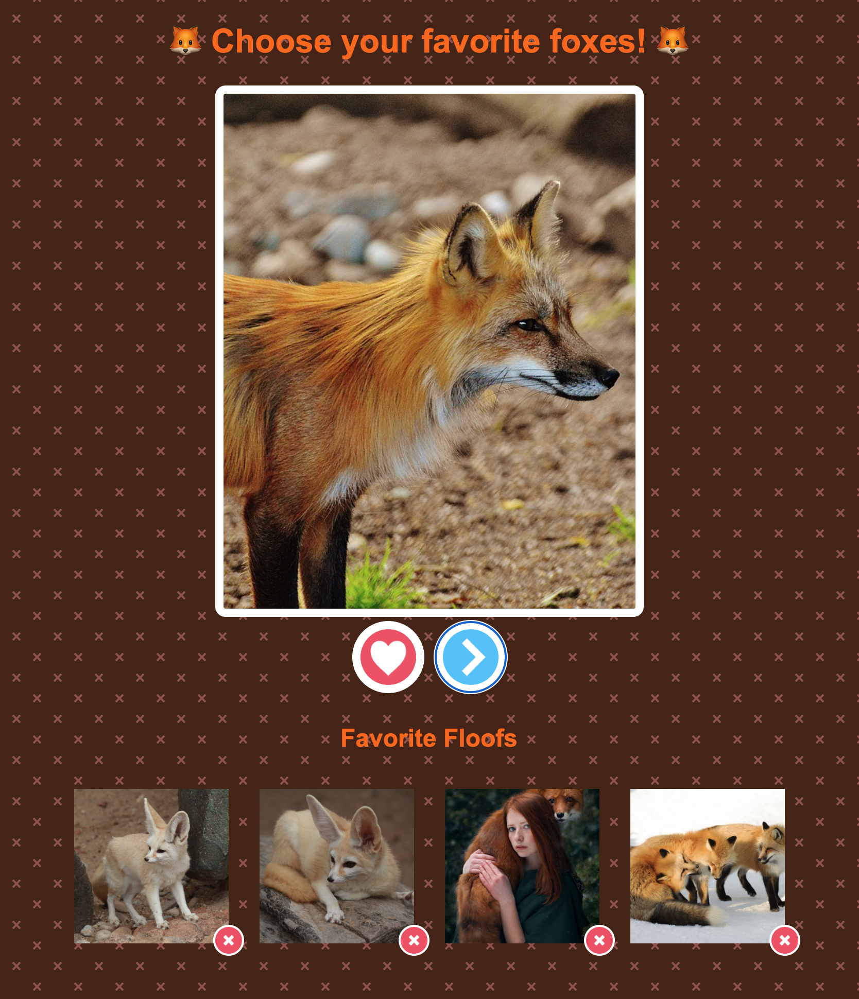

# 🖥️ 2: Build A Simple Fox Liking Web App with Grid Styling

| **Project&nbsp;Goal**           | Get started with Vue.js 3 basics and simple API calls using the Composition API                                                                                       |
| ------------------------------- | ----------------------------------------------------------------------------------------------------------------------------------------- |
| **What&nbsp;you’ll&nbsp;learn** | Setting up your Vue 3 app, components basics, performing simple REST API calls using fetch, and using the Composition API                                                  |
| **Tools you’ll need**           | A modern browser like Chrome. A [GitHub](https://github.com) account which can be used to login to [CodeSandbox](https://codesandbox.io). |
| **Time needed to complete**     | 1 hour + refactor time                                                                                                                                   |
| **Just want to try the app?**   | [CodeSandbox link](https://codesandbox.io/s/vue-3-composition-api-mini-2-45ycvd)                                                                    |

# Instructions 

## Scaffold your app

We'll start from scratch in [CodeSandbox](http://codesandbox.io). Create a CodeSandbox account and scaffold a starter Vue.js 3 template by clicking [here](https://codesandbox.io/s/vue).

We're going to build an application to load random fox images and store them to a favorites list:



Take a look at the code that was scaffolded by CodeSandbox for a basic Vue.js 3 app. The file `main.js` is open by default. This is the main starting point of a Vue.js app. Note that in this file you import Vue from its npm package: `import { createApp } from 'vue';`. CodeSandbox imports all the needed dependencies from npm to build the app. You can always check out the root `package.json` to find out which dependencies are needed.

`main.js` also initializes the app as a new Vue.js app and sets the div into which the app code will be injected.


```js
import { createApp } from 'vue'
import App from './App.vue'

createApp(App).mount('#app')
```

Open up `App.vue`. In this file, the 'home' component is built. It contains the three main parts of a Vue.js Single File Component (SFC): a template, a script block, and a style block.

Note the first div in the template block has the id of 'app' - this is the div where the app code will be injected. There's also a `<HelloWorld>` component included underneath the logo image. This is an example of an SFC being included into `App.vue`.

Open `components/HelloWorld.vue` and you'll find the source of the list of links that appears embedded in `App.vue`. This file also includes a script block with a `msg` variable and some more styles in a `<style>` block.

We're going to rip this sample app apart and recreate it! Let's get started.

## Add the Styles

Let's start in `App.vue`, since we don't have to make any changes to `main.js`. This is a Vue SFC, or 'Single File Component'. It has three 'blocks': a template block for HTML, a script block for JavaScript, and a style block for CSS. Add the following style block at the bottom of the file, replacing the current `<style>` block:


```css
<style>
body {
  margin: 0;
  color: rgb(255, 102, 0);
  font-family: arial;
  background: rgb(71, 36, 23);
  background-image: url("data:image/svg+xml,%3Csvg xmlns='http://www.w3.org/2000/svg' width='40' height='40' viewBox='0 0 40 40'%3E%3Cg fill-rule='evenodd'%3E%3Cg fill='%23ff9999' fill-opacity='0.4'%3E%3Cpath d='M0 38.59l2.83-2.83 1.41 1.41L1.41 40H0v-1.41zM0 1.4l2.83 2.83 1.41-1.41L1.41 0H0v1.41zM38.59 40l-2.83-2.83 1.41-1.41L40 38.59V40h-1.41zM40 1.41l-2.83 2.83-1.41-1.41L38.59 0H40v1.41zM20 18.6l2.83-2.83 1.41 1.41L21.41 20l2.83 2.83-1.41 1.41L20 21.41l-2.83 2.83-1.41-1.41L18.59 20l-2.83-2.83 1.41-1.41L20 18.59z'/%3E%3C/g%3E%3C/g%3E%3C/svg%3E");
}

.app {
  display: grid;
  grid-template-columns: 1fr 1fr;
  grid-template-rows: auto 500px 100px 1fr;
  grid-template-areas:
    "title title"
    "card card"
    "fav next"
    "favorites favorites";
}

.title {
  grid-area: title;
  font-size: 2em;
  text-align: center;
}

.card {
  grid-area: card;
  display: block;
  width: 100%;
  max-width: 400px;
  height: 500px;
  margin: auto;
  border-radius: 10px;
  border: 8px solid white;
  object-fit: cover;
  overflow: hidden;
  background-color: white;
}

button {
  width: 70px;
  height: 70px;
  margin: 20px 5px;
  border: 8px solid white;
  border-radius: 50%;
  text-align: center;
  font-weight: bold;
  color: transparent;
  cursor: pointer;
}

button:disabled {
  opacity: 0.5;
}

.next {
  grid-area: next;
}

.fav {
  grid-area: fav;
  justify-self: end;
}

.fav:hover,
.next:hover {
  opacity: 0.5;
}

h2 {
  text-align: center;
}

.favorites {
  grid-area: favorites;
  overflow-y: auto;
}

.favorites-list {
  display: flex;
  flex-wrap: wrap;
  align-items: center;
  justify-content: center;
  padding: 0;
  margin: 0;
  position: relative;
}

.favorites-item {
  position: relative;
  list-style: none;
  margin: 15px;
}

.favorites-img {
  width: 150px;
  height: 150px;
  object-fit: cover;
}

.remove {
  position: absolute;
  bottom: -8px;
  right: -15px;
  height: 30px;
  width: 30px;
  margin: 0;
  border: 2px solid white;
  background-image: url("data:image/svg+xml,%3Csvg xmlns='http://www.w3.org/2000/svg' width='25' height='25' viewBox='0 0 40 40'%3E%3Cline x1='10' y1='10' x2='30' y2='30' stroke='red' stroke-width='5'/%3E%3Cline x1='30' y1='10' x2='10' y2='30' stroke='red' stroke-width='5'/%3E%3C/svg%3E");
  background-repeat: no-repeat;
}
</style>
```

::: tip 💡
Notice we don't use `<scoped>` as part of the style block. The 'scoped' keyword ensures that your styles will remain valid only for the current SFC, but we're going to make these styles universal.
:::

> This style block uses some paths to external images hosted on GitHub, rather than to a relative path. This is because it's a bit time consuming to host images on CodeSandbox. Normally you'd just add an image on a relative path to images hosted in the app.

This stylesheet is an example of using CSS Grid and Flexbox in a basic responsive layout populated by cards. It also uses `grid-templates` in the `.app` styles, which are worth taking a minute to look at. This styling identifies 'grid template areas' and builds the page as a two column layout with the title, card, and favorites areas spanning the 'fav' and 'next' areas, where the two action buttons live. Take a minute to walk through the CSS and understand how it's built.

Adding the stylesheet didn't do much to our template except add colors to the text and the background pattern. Let's fix the template!

::: warning ☕️ Take a break! ☕️
Now's a great time to join a breakout room if you're joining us on Zoom!
:::

## Edit the HTML

In a Vue app, there is usually a 'public' folder where assets are kept that are _not_ bundled by the Webpack bundler that works behind the scenes to parse Single File Components (the ones with the `.vue` suffix). Find the public folder and edit the `index.html` file. There's not much to do but to change the page title to `Fox Lover`. To do so, we have to change the content of the `title` tag:

```html
<title>Fox Lover</title>
```

Notice the existence of the div with the id "app". Here's where the component content is injected during the build process.

Now, let's go to work in `App.vue`. Let's edit the template block. Overwrite the current template in `App.vue` with this markup:


```html
<template>
  <div class="app">
    <h1 class="title">🦊 Choose your favorite foxes! 🦊</h1>
    
    <button class="fav">Fave</button>
    <button class="next">Next</button>
  </div>
</template>
```

Save your changes, and your app should refresh (if it doesn't, use the manual refresh button in the app preview address bar). Now, you can see an h1 title, a card, and two buttons.

## Add some data

At this point, we need to start populating our UI with some data. The first thing we want to do is to display a fox image inside our card. Let's add a static link just to test how it looks. In `App.vue`'s template, change the `src` property of `img`:

```html

```

How cute! 🦊 

But the idea is to make this image dynamic, so it's time to create your first Vue variable. First, you have to add `setup()` to your Vue component. This function should return an object of our Vue variables. Let's create one in the `<script>` block. Overwrite the current `<script>` block in `App.vue`:

```js
<script>
import { ref } from 'vue';

export default {
    setup() {
      const currentFoxUrl = ref(null);

    return {
      currentFoxUrl
    };
  }
};
</script>
```

::: tip 💡
At this point you can remove the `HelloWorld.vue` file from the `components` folder as we won't need it. Right-click the file in CodeSandbox and click 'delete'.
:::

Now you have a variable called `currentFoxUrl` and its default value is null. We will use this variable to provide a url to a current fox to populate `img`. First, we will set the `currentFoxUrl` value by overwriting the data block we just added in `App.vue`:

```js
setup() {

const currentFoxUrl = ref("https://randomfox.ca/images/21.jpg");

return {
  currentFoxUrl
  };
}
```

Now, let's use this variable in our template. In Vue 3, we use the v-bind directive to bind a variable to an HTML attribute. In our case, we want to bind currentFoxUrl to the src attribute of the img tag. Replace the img tag in App.vue's template with this:

```html

```

::: tip 💡
The `v-bind` directive dynamically binds one or more attributes, or a component prop to an expression. That little `:` shortcut makes all the difference!
:::

You can also use the shorthand : for v-bind, like so:

```html

```

Now, the image source is dynamic and depends on the currentFoxUrl variable. If you change the value of currentFoxUrl in the setup function, the image will change accordingly.

Great! Now it's time to load some foxes from an API!

::: warning ☕️ Take a break! ☕️
Now's a great time to join a breakout room if you're joining us on Zoom!
:::

## Fetch data from an API

Now, let's make our app more dynamic by fetching a random fox image from an API every time we click the 'Next' button. We'll use the fetch function to make a GET request to https://randomfox.ca/floof/, which will return a random fox image URL.

::: note 📝 To perform API calls we will use a built-in library called [fetch](https://developer.mozilla.org/docs/Web/API/Fetch_API/Using_Fetch). It's a promise-based HTTP client that works both in the browser and in other node.js environments.
:::

First, let's create a loadFox function in the setup function in App.vue:

```js
const loadFox = async function () {
  const response = await fetch("https://randomfox.ca/floof/");
  const foxData = await response.json();
  currentFoxUrl.value = foxData.image;
};
```

Then, let's call this function when the 'Next' button is clicked. We can do this by adding a v-on:click directive (or @click for short) to the 'Next' button in App.vue's template:


```html
<button class="next" @click="loadFox">Next</button>
```

Now, every time you click the 'Next' button, a new random fox image will be loaded!

::: warning ☕️ Take a break! ☕️
Now's a great time to join a breakout room if you're joining us on Zoom!
:::

## Add to favorites

Next, let's add the functionality to add a fox to the favorites list when the 'Fave' button is clicked. First, let's create a favorites array in the setup function in App.vue:


```js
const favorites = ref([]);
```

Then, let's create an addFave function that adds the current fox URL to the favorites array:

```js
const addFave = function () {
  favorites.value.push(currentFoxUrl.value);
};
```

And let's call this function when the 'Fave' button is clicked:

<button class="fav" @click="addFave">Fave</button>

Now, every time you click the 'Fave' button, the current fox will be added to the favorites list!

## Display favorites

Finally, let's display the favorites list in our app. We can do this by using the v-for directive to loop over the favorites array and create an img tag for each favorite fox. Add this to App.vue's template:

```html
<section class="favorites">
  <h2>Favorite Floofs</h2>
  <ul class="favorites-list">
    <li v-for="(floof, index) in favorites" :key="floof" class="favorites-item">
      
    </li>
  </ul>
</section>
```

Now, every time you add a fox to the favorites list, it will be displayed in the 'Favorite Floofs' section!

## Displaying favorites 

You can see an empty card with a 'Delete' button right after the current fox view buttons. Now we need to find a way to show favorites inside these cards.

To render a list of items based on an array, Vue has a v-for directive, which will iterate through this array and render each item. Let's add this directive to our opening li element that will show the array of favorite cards in the new container you just added:

```html
<li v-for="(floof, index) in favorites" :key="floof" class="favorites-item">
```

Here `floof` is the reference to the _current array element_ and `index` is the _index of this element_ inside the array.

To properly loop over your array of favorite foxes and append another one, you need to provide a unique key attribute for each item. In our case, the floof reference will be the key.

One thing left to do is to bind floof (which will be the image link) to the src property of the image element in the cards you're building:

```html

```

::: warning ☕️ Take a break! ☕️
Now's a great time to join a breakout room if you're joining us on Zoom!
:::

## Adding Foxes to Favorites

We will create a new method called `addFave`. It will add the value of `currentFoxUrl` to the `favorites` array (JavaScript has a `push` array method for this purpose). Let's place it after the `loadFox` one _(don't miss the comma!)_

```js
const addFave = function () {
  favorites.value.push(currentFoxUrl.value);
};
```

And of course we need to bind it to the 'Like' button in the top card:

```html
<button @click="addFave" class="fav">Fave</button>
```

Now try to click on the 'favorite' button! You can see how our gallery is filling with the fox images 🖼️

There is one issue: now we can add one image many times. To prevent this we should check if the `currentFoxUrl` is already inside the `favorites` array and if it is, we will disable the 'favorite' button. Instead of placing this complex logic inside the template, we will create a _computed_ property.

::: tip 💡
Computed properties can be used to do quick calculations of properties that are displayed in the view. These calculations will be cached and will only update when their dependencies are changed.
:::

Let's add `computed` right after the `data` function (don't forget the comma after the close of `data`) and create a property named `isAlreadyInFavorites` in it:

```js
import { computed } from 'vue';

const isAlreadyInFavorites = computed(() => {
  return favorites.value.indexOf(currentFoxUrl.value) > -1;
});
```

Any computed property should be a function returning the result of calculations. Let's check the index of `currentFoxUrl` inside the `favorites` array. If it is greater than -1 (in other words if the array contains such an element), the function will return `true`, otherwise it will return `false`:

```js
computed: {
	isAlreadyInFavorites() {
	  return this.favorites.indexOf(this.currentFoxUrl) > -1;
	}
}
```

Now we can add a dynamic `disabled` attribute to the 'Fave' button in the top card and set it equal to `isAlreadyInFavorites`.

```html
<button @click="addFave" :disabled="isAlreadyInFavorites" class="fav">Fave</button>
```

Try to add a fox to your favorites list. Now you can see that the 'fave' image is greyed-out and you cannot click it again.

## Removing Foxes from Favorites

What if you stopped liking one of the fox images? In this unlikely event, you will need a way to remove it from the `favorites` array. We need one more method for this, so let's add it after the `addFave` (add a comma after `addFave` closing bracket):

```js
removeFave() {}
const removeFave = function (index) {
  
}
```

Of course we should specify somehow what fox we want to remove from the array. Fortunately, we have the `index` parameter. Let's pass it to our method and remove the element with the given index from the `favorites` array:

```js
const removeFave = function (index) {
  favorites.value.splice(index, 1);
}
```

::: tip 💡
Here the splice() method changes the contents of an array by removing existing elements. The first argument is the index of the element we want to start with and the second argument is the number of elements we want to remove.
:::

Now we have to bind this new method to the 'Delete' button with a click handler:

```html
<button @click="removeFave(index)" class="remove">Remove</button>
```
> Note, you may have noticed the error has gone away, because we finally are making use of `index` - passing it to the method on button click.

Try to add and remove some foxes from favorites. IT WORKS!

**🎊Congratulations, you've finished the base project!🎊**

## Push your work to a repository on your GitHub account

**Step 1**: In CodeSandbox, click the GitHub icon in the sidebar, and grant permissions if necessary.

**Step 2**: Enter a name for your repository.

**Step 3**: Click `create repository`.

## Refactor 1: Creating a Fox Component

At this point we want to abstract a single fox card from the favorites grid into a separate component to learn how parent and child components communicate.

We have a `components` folder but for now it's empty. Let's create a new file here and name it `Fox.vue`.

Open this file and add `<template></template>` and `<script></script>` tags. Now our file looks this way:

```html
<template> </template>

<script></script>
```

Now copy the image and delete button area that contains the favorite foxes from `App.vue` and paste it inside the template block. You can delete it from `App.vue`. Paste it into the template in `Fox.vue` with a surrounding `<span>`:

```html
 <span>
  
  <button @click="$emit('remove', index)" class="remove">Remove</button>
</span>
```

> Note, you need to add this span tag as in Vue 2 you need to surround all template html with at least one surrounding tag.

We now need a way to pass the fox image we want to view from the parent to the child. To do so, Vue uses `props`.

::: tip 💡
Props are custom attributes you can register on a component. When a value is passed to a prop attribute, it becomes a \_prop_erty on that component instance. In our case the `Fox` component will have a `fox` property, passed from its parent `App` component. 

✨Remember!✨ Props down, events up!
:::

Let's add a `props` option to our `Fox.vue` component. First, we need to create an export statement inside our `script` tag (so later we will be able to import our `Fox` component inside the `App` one). Add this code block to `Fox.vue`:

```js
<script>export default {}</script>
```

Now we can add a `props` option to this object and a prop `fox`:

```js
<script>
  export default {
    props: {
      fox: {
        type: String
      }
    }
  };
</script>
```

Here we are also specifying the type of our fox - it will be a string containing the fox image URL.

Now let's move back to our `App.vue` component and make some changes. First of all we should import our newly created `Fox` component into `App.vue`. Add this string before the `export default` statement in the `<script>` block:

```js
import Fox from './components/Fox';
```

Now we have to 'explain' to the `App` component that it has a child component inside it. Vue uses a `components` option for this. Let's add a component option above the `data()` one:

```js
export default {
  components: {
    Fox
  },
  setup() {
    //
  },
```

::: tip 💡
For each property in the components object, the key will be the name of the custom element, while the value will contain the options object for the component
:::

::: tip 💡
For the component name you can either use a camel-case (`appFox`) or kebab-case (`app-fox`). Keep in mind that a camel-case name will be 'translated' to kebab-case in HTML tag names. So we will use the HTML custom tag `<app-fox>` and it will render a `Fox` component
:::

In `App.vue`, place the custom tag in the space where you deleted the card earlier:

```html
	<Fox v-for="(floof, index) in favorites" :key="floof" :fox="floof" :index="index" @remove="removeFave"></Fox>
```

We have to pass a `fox` prop to our `Fox` component. It will be done with the familiar `v-bind` directive (remember, you can use its `:` shortcut). Edit the code you just added to `App.vue`:

```html
<ul class="favorites-list">
  <li
    v-for="(floof, index) in favorites"
      :key="floof"
      class="favorites-item"
  >
<Fox :fox="floof" :index="index" @remove="removeFave"></Fox>  
</li>
</ul>
```

Now if you try to add a fox to Favorites you will see the foxes in the grid again! But we have one issue: deleting a fox will cause a bunch of errors in console. The reason is we don't have a `removeFave` method inside the `Fox.vue` and it knows nothing about `index` as well.

Instead of using the method, we will add an _event emitter_ to the `delete` button inside the Fox component.

```html
<button @click="$emit('remove', index)" class="remove">Remove</button>
```

By using `$emit`, we are sending a message to our parent component (in this case it's `App.vue`): 'Hi, something is happening here! Please read this message and react to it'.

Now when the `Fox` component emits the `remove` event (i.e. on the 'Delete' button click), its parent `App` component will call the `removeFave` method (which removes a certain fox from the favorites array).

**🎊You've finished Refactor 1!🎊**

## Refactor 2: Add Animations

Now let's make our application more appealing by adding some animation effects to it.

::: tip 💡
Vue provides a `transition` wrapper component, allowing you to add entering/leaving transitions for any element or component in the following contexts:

-   Conditional rendering (using `v-if`)
-   Conditional display (using `v-show`)
-   Dynamic components
-   Component root nodes
:::

Let's try to animate the image of the current fox. First, we need to add a `v-if` directive to it to provide the proper context for the future transition. In `App.vue`, edit the main fox's card:

```html

```

But now `currentFoxUrl` will always return `true`! Let's set it to an empty string in the loadFox() method so that every time we click the 'Next' button, so before the next image is loaded, `currentFoxUrl` will return `false`:

```js
loadFox: async function () {
  this.currentFoxUrl = "";
  const response = await fetch("https://randomfox.ca/floof/");
  const foxData = await response.json();
  this.currentFoxUrl = foxData.image;
},
```

Now you can observe this ugly effect: the image disappears every time the user clicks 'Next'. We will fix it with the fade animation effect. Let's wrap the image in a `<transition>` tag and provide it with a name attribute `fade`.

```html
<transition name="fade">
  
</transition>

```

This will give us a bunch of CSS classes starting from `fade-`. There will be `enter`/`leave` which is the position that the animation starts with on the first frame, `enter-active`/`leave-active` while the animation is running - this is the one you’d place the animation properties themselves on, and `enter-to`/`leave-to`, which specifies where the element should be on the last frame.

Now that we have our hooks, we can create the transition using them. Edit the CSS in `App.vue` by adding the following classes:

```css
.fade-enter-active,
.fade-leave-active {
	transition: opacity 1s ease;
}
.fade-enter,
.fade-leave-to {
	opacity: 0;
}
```

The `.fade-enter-active` and `.fade-leave-active` classes will be where we apply the actual transition. This isn't anything Vue-specific - just normal CSS. The `ease` property specifies a transition effect with a slow start, then fast, then ending slowly.

Now you can see that the fox picture has a nice fade effect when you click 'next'!

Let's also add some effects to our favorite fox grid. To animate the list rendered with `v-for`, Vue uses the `transition-group` tag.

::: tip 💡
Unlike `<transition>`, `transition-group` renders an actual element: a `<span>` by default. You can change the element that’s rendered with the tag attribute.
Elements inside are _always_ required to have a unique key attribute.
:::

In `App.vue`, surround the ul element surrounding the `<app-fox>` nested component with `transition-group` and provide it with a proper tag attribute and class:

```html
<transition-group
  class="favorites-listwrap favorites-list"
  name="slide"
  tag="ul"
>
<li
  v-for="(floof, index) in favorites"
  :key="floof"
  class="favorites-item">
  <app-fox :fox="floof" @remove="removeFave(index)"></app-fox>
</li>
</transition-group>
```

With the `tag`, `transition-group` will render as a `ul` component now. The class `wrap` is needed to wrap the grid elements to the next row (it replaces the `wrap` attribute of `ul`). We also gave our new transition a name, `slide`.

Now we can use CSS classes to describe the slide transition - add these classes to the CSS in `App.vue`:

```css
.slide-enter-active {
	transition: all 0.3s ease;
}
.slide-enter,
.slide-leave-to {
	transform: translateX(10px);
	opacity: 0;
}
```

Great! We have a nice animation when we add a new fox to the grid. But there are no effects on delete. There is a `-move` class, which is added when items are changing positions. Like the other classes, its prefix will match the value of a provided `name` attribute (`slide` in our case). So we need to add some more styles:

```css
.slide-leave-active {
	position: absolute;
  transition: all 0.3s ease;
}

.slide-move {
	transition: transform 0.5s;
}
```

::: tip 💡
The leave transition works only when the position is set to absolute. But this will break our grid layout. To fix this, we need to add a position: relative to the parent container.
:::

Add the following styling to the favorites-list class:

```css
.favorites-list {
  position: relative;
  /* other styles... */
}
```

Now our list has a move animation after deleting its element!

**🎊You've finished Refactor 2!🎊**

## Authors

Made with ❤️ by Jen Looper with CSS from Jo Franchetti, from the original Mini 1 by Natalia Tepluhina, updated by Jen Looper
