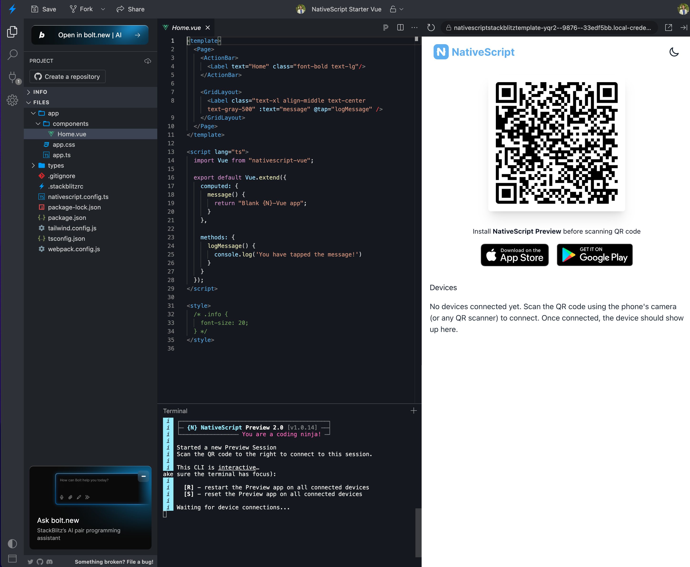
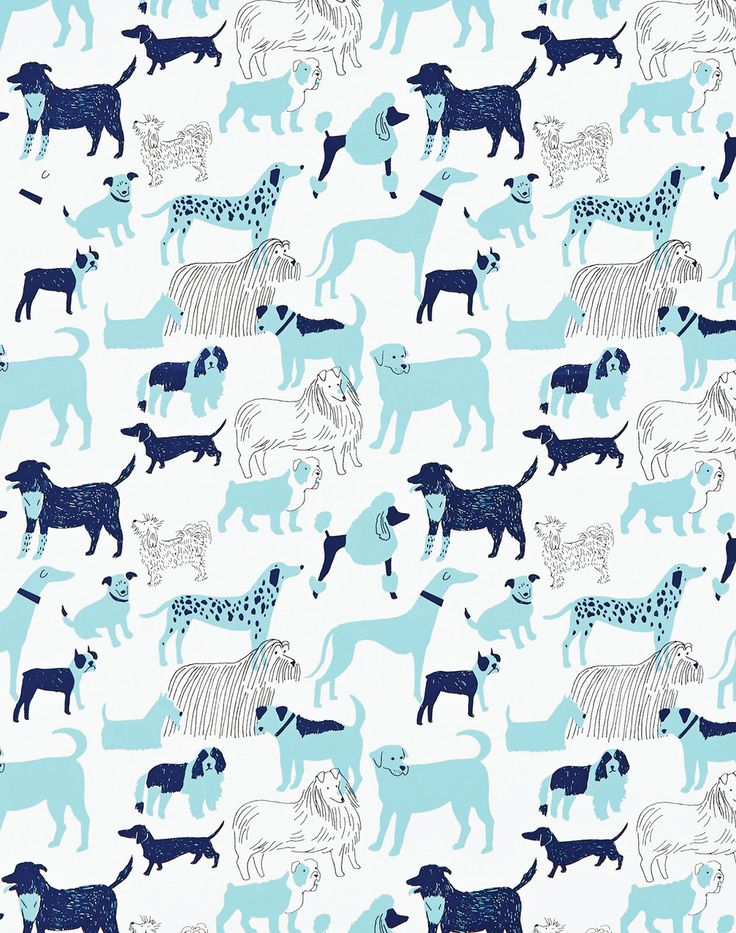
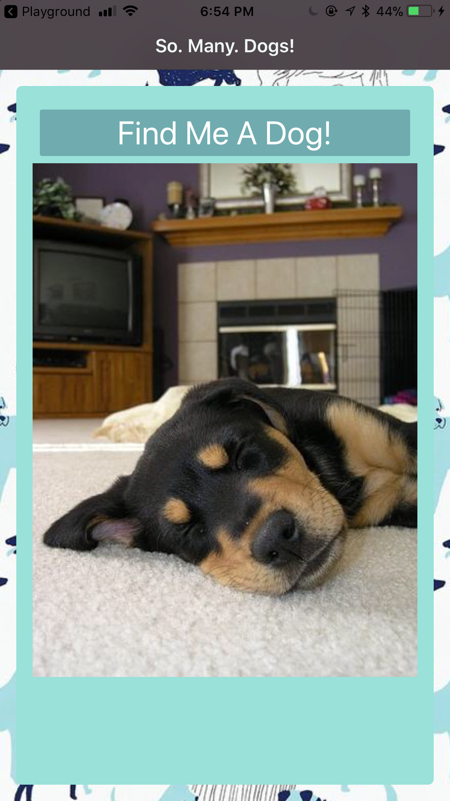
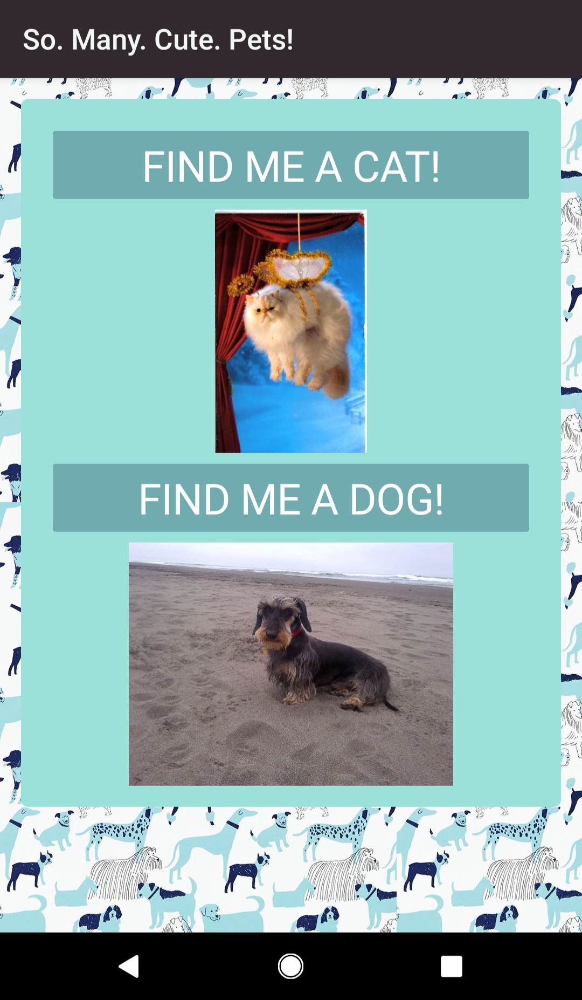

# 📱 3: Build A Simple Pet Display Mobile App

| **Project Goal**                | Build a NativeScript-Vue mobile app to display random pets                                                                                                                                                                                                                                                                                                                                                                                                                                                                                                                                                                                                                                                                                                                                                                                                          |
| ------------------------------- | ------------------------------------------------------------------------------------------------------------------------------------------------------------------------------------------------------------------------------------------------------------------------------------------------------------------------------------------------------------------------------------------------------------------------------------------------------------------------------------------------------------------------------------------------------------------------------------------------------------------------------------------------------------------------------------------------------------------------------------------------------------------------------------------------------------------------------------------------------------------- |
| **What you'll learn**           | How to build a mobile app with NativeScript and Vue.js, how to make external API calls and have data display in the app.                                                                                                                                                                                                                                                                                                                                                                                                                                                                                                                                                                                                                                                                                                                                            |
| **Tools&nbsp;you'll&nbsp;need** | A modern browser like Chrome.<br><br>Access to [Stackblitz](https://stackblitz.com) - consider creating an account in the Playground to keep the versions of your work intact.<br><br>A mobile phone (iOS or Android) with the NativeScript Playground and Preview apps installed.<br><br>The two NativeScript companion apps for the playground are the NativeScript Viewer and NativeScript Playground.<br><br>On Android: [NativeScript Playground](https://play.google.com/store/apps/details?id=org.nativescript.play) and [NativeScript Preview](https://play.google.com/store/apps/details?id=org.nativescript.preview).<br><br>On iOS: [NativeScript Playground](https://itunes.apple.com/us/app/nativescript-playground/id1263543946) and [NativeScript Preview](https://itunes.apple.com/us/app/nativescript-preview/id1264484702) |
| **Time needed to complete**     | 20 minutes                                                                                                                                                                                                                                                                                                                                                                                                                                                                                                                                                                                                                                                                                                                                                                                                                                                          |
| **Just want to try the app?**   | [Open this link in the Playground App](https://stackblitz.com/edit/nativescript-pets-workshop?file=package.json)                                                                                                                                                                                                                                                                                                                                                                                                                                                                                                                                                                                                                                                                                                                                                              |
# Instructions

## Scaffold your app

Open [Stackblitz](https://stackblitz.com), sign in, and take a look around. Create a new project by clicking the + New Project button. You'll see a popup with a lot of templates available.

Click the 'Mobile & VR' tab in the popup and you'll see several options for creating a NativeScript app. Choose 'Vue'. This is how you scaffold your first NativeScript-Vue app!



Using the NativeScript Playground app on your phone, scan the QR code to start the process of launching it on your device as it builds in Stackblitz. The code is built in Stackblitz and 'flashed' onto your connected device.

## Add some Styles

Now we're going to style the app's interface and build its UI. It's going to have an ActionBar, a card, and a button.

We're going to add an image to a new `/assets` folder for the app's background. Click the '+' button in the top panel and create a new folder called assets in the app folder, at the same level as your components folder. Download the file below to your local computer. Click the '+' button again and then 'upload resources' to browse and add this file (`bg.jpg`) in that folder. Make sure to save your file.

> Note, if you see a circle icon in the tab of the code you're working on, that means it hasn't been saved, so be sure to save your work using ctrl-s or the save icon on the top left.



Next, open the app.css file in the app root. Overwrite the file with these styles:

```css
Page {
	background-image: url('~/assets/bg.jpg');
}

.action-bar {
	background-color: #32292f;
	color: #f0f7f4;
	font-size: 20px;
}
.btn {
	background-color: #70abaf;
	color: white;
	padding: 10px;
	margin: 20px;
	font-size: 30px;
	border-radius: 5px;
}
.card {
	vertical-align: top;
	margin: 15;
	padding: 15;
	border-radius: 5;
	background-color: #99e1d9;
}

.placeholder {
	height: 100%;
}
```

As your app refreshes, you'll see that the UI shows some promise, but looks a little strange. Let's fix the UI.

## Fix the UI

Let's fix the ActionBar: In `app/components/Home.vue`, delete everything between the `<Page>` tags except the ActionBar. Add a title to the ActionBar, something like this: `<ActionBar title="So. Many. Dogs!" class="action-bar" />`.

Next, add a StackLayout to replace the ScrollView that used to be there. Under the ActionBar, and above the closing `</Page>` tag, add a layout with a button:

```xml
    <StackLayout class="card">
        <Button class="btn" @tap="getADog">Find Me A Dog!</Button>
    </StackLayout>
```

Now, you should see a nice looking green card with a darker green button.

::: tip 💡
NativeScript layouts differ from the html you write on the web. You're using NativeScript XML markup, which translates to native UI like GridLayouts and StackLayouts.
:::

## Add Some Data

At this point, we need to start populating our UI with some data. To make external http calls, we need to leverage the http module, so add this import at the top of the script section in Home.vue:

```js
import { Http } from '@nativescript/core';
```

Then, using NativeScript-Vue's syntax, we'll set up our component with data and methods. Replace the script section with:

```js
<script lang="ts">
import Vue from 'nativescript-vue';
import { Http } from '@nativescript/core';

export default Vue.extend({
  data() {
    return {
      dogImage: {}
    }
  },

  methods: {
    getADog() {
      Http.getJSON('https://dog.ceo/api/breeds/image/random')
        .then((response) => {
          this.dogImage = response;
          console.log(this.dogImage.message);
        })
        .catch((e) => {
          alert("error");
        });
    }
  }
});
</script>
```

Finally, create a space for the image to populate. Under the Button tag and above the last closing `</StackLayout>` tag, add this block:

```xml
 <StackLayout class="placeholder">
      <Image :src="dogImage.message" />
 </StackLayout>
```

::: tip 💡
Note, if at any time your app stops refreshing on your device, try rescanning the QR code by pressing the "Preview" button. Watch for errors in the console of the Playground.
:::

The entire code of your Home.vue file should look like this:

```js
<template>
	<Page class="page">
		<ActionBar title="So. Many. Dogs!" class="action-bar" />
		<StackLayout class="card">
			<Button class="btn" @tap="getADog">Find Me A Dog!</Button>
			<StackLayout class="placeholder">
				<Image :src="dogImage.message" />
			</StackLayout>
		</StackLayout>
	</Page>
</template>

<script lang="ts">
import Vue from 'nativescript-vue';
import { Http } from '@nativescript/core';

export default Vue.extend({
  data() {
    return {
      dogImage: {}
    }
  },

  methods: {
    getADog() {
      Http.getJSON('https://dog.ceo/api/breeds/image/random')
        .then((response) => {
          this.dogImage = response;
          console.log(this.dogImage.message);
        })
        .catch((e) => {
          alert("error");
        });
    }
  }
});
</script>
```

The final app looks like this:



It's really interesting to build Vue.js apps for mobile devices in Stackblitz. Now that you know how, what else can you build?

**🎊Congratulations, you've finished the base project!🎊**

## Supplement 1: Adding a Cat to the App

Suppose you want to also be able to load cute cat photos with your dog photos. This will require another API request. The cat API requires a key which you can request at [the CatAPI](https://thecatapi.com/). They will email your new api key to you. Make a note of it when you receive the key via email.

## Edit the UI

Update the ActionBar to indicate we have more than dogs on the app.

`<ActionBar title="So. Many. Cute. Pets!" class="action-bar" />`

Update the placeholder size in the `app.css` file so that we can fit more than one placeholder on the page:

```js
    .placeholder {
        height: 30%;
    }
```

## Call Some Cats

Next, add a method called `getACat`. Using NativeScript-Vue's syntax, we'll update our script section to include the cat functionality:

```js
<script lang="ts">
import Vue from 'nativescript-vue';
import { Http } from '@nativescript/core';

export default Vue.extend({
  data() {
    return {
      dogImage: {},
      catImage: {}
    }
  },

  methods: {
    getADog() {
      Http.getJSON('https://dog.ceo/api/breeds/image/random')
        .then((response) => {
          this.dogImage = response;
          console.log(this.dogImage.message);
        })
        .catch((e) => {
          alert("error");
        });
    },

    getACat() {
      Http.getJSON('https://api.thecatapi.com/v1/images/search')
        .then((response) => {
          this.catImage = response[0];
          console.log(this.catImage.url);
        })
        .catch((e) => {
          alert("error");
        });
    }
  }
});
</script>
```

## Edit the UI

Finally, we need to add a button to load the cat within a `StackLayout` placeholder. Place this in between `<StackLayout class="card">` and `</StackLayout>` at the same level as the button and placeholder for the `dogImage`:

```xml
    <Button class="btn" @tap="getACat">Find Me A Cat!</Button>
    <StackLayout class="placeholder">
        <Image :src="catImage.url" />
    </StackLayout>
```

Click the `Preview` button in the NativeScript Playground and you will see the new `Find Me A Cat!` button and when you click it, you should see a very cute cat!

It should look like this:




## Authors

Made with ❤️ by Jen Looper and Emily Stamey for Front-End Foxes, Inc.
