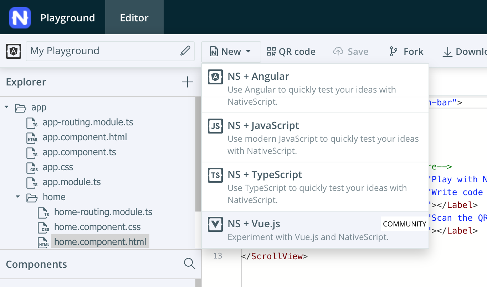

# Mini Workshop 2: 📱 Build A Simple Pet Display Mobile App

| **Project Goal**                | Build a NativeScript-Vue mobile app to display random pets                                                                                                                                                                                                                                                                                                                                                                                                                                                                                                                                                                                                                                                                                                                                                                                                          |
| ------------------------------- | ------------------------------------------------------------------------------------------------------------------------------------------------------------------------------------------------------------------------------------------------------------------------------------------------------------------------------------------------------------------------------------------------------------------------------------------------------------------------------------------------------------------------------------------------------------------------------------------------------------------------------------------------------------------------------------------------------------------------------------------------------------------------------------------------------------------------------------------------------------------- |
| **What you’ll learn**           | How to build a mobile app with NativeScript and Vue.js, how to make external API calls and have data display in the app.                                                                                                                                                                                                                                                                                                                                                                                                                                                                                                                                                                                                                                                                                                                                            |
| **Tools&nbsp;you’ll&nbsp;need** | A modern browser like Chrome.<br><br>Access to the [NativeScript Playground](http://play.nativescript.org) - consider creating an account in the Playground to keep the versions of your work intact.<br><br>A mobile phone (iOS or Android) with the NativeScript Playground and Preview apps installed.<br><br>The two NativeScript companion apps for the playground are the NativeScript Viewer and NativeScript Playground.<br><br>On Android: [NativeScript Playground](https://play.google.com/store/apps/details?id=org.nativescript.play) and [NativeScript Preview](https://play.google.com/store/apps/details?id=org.nativescript.preview).<br><br>On iOS: [NativeScript Playground](https://itunes.apple.com/us/app/nativescript-playground/id1263543946) and [NativeScript Preview](https://itunes.apple.com/us/app/nativescript-preview/id1264484702) |
| **Time needed to complete**     | 20 minutes                                                                                                                                                                                                                                                                                                                                                                                                                                                                                                                                                                                                                                                                                                                                                                                                                                                          |
| **Just want to try the app?**   | [Open this link in the Playground App](https://play.nativescript.org/?template=play-vue&id=c3o4tl&v=2)                                                                                                                                                                                                                                                                                                                                                                                                                                                                                                                                                                                                                                                                                                                                                              |

# Instructions

## Scaffold your app

Open the [NativeScript Playground](http://play.nativescript.org) and take a look around. On your first visit, you'll see several 'coach marks' showing where key functionality is kept.



Here is the main editor with a few files provided for an app. By default, the first playground app is created using Angular. Click 'new' at the top and choose the 'NS + Vue.js' template. This is how you scaffold your first NativeScript-Vue app!

When you click the `QR Code` button, a QR code will appear - scan that with the NativeScript Playground app on your phone. This allows your phone to refresh automatically as you code. You'll see your phone refresh and a basic app appear:


## Add some Styles

Now we're going to style the app's interface and build its UI. It's going to have an ActionBar, a card, and a button.

We're going to add an image to a new `/images` folder for the app's background. Click the '+' button in the top panel and create a new folder called images. Download the file below to your local computer. Click the '+' button again and then 'upload resources' to browse and add this file (`bg.jpg`) in that folder. Make sure to save your file.


Next, open the app.css file in the app root. Overwrite the file with these styles:

```css
Page {
	background-image: url('~/images/bg.jpg');
}

.action-bar {
	background-color: #32292f;
	color: #f0f7f4;
	font-size: 20px;
}
.btn {
	background-color: #70abaf;
	color: white;
	padding: 10px;
	margin: 20px;
	font-size: 30px;
	border-radius: 5px;
}
.card {
	vertical-align: top;
	margin: 15;
	padding: 15;
	border-radius: 5;
	background-color: #99e1d9;
}

.placeholder {
	height: 100%;
}
```

As your app refreshes, you'll see that the UI shows some promise, but looks a little strange. Let's fix the UI.

## Fix the UI

Let's fix the ActionBar: In `app/components/HelloWorld.vue`, delete everything between the `<Page>` tags except the ActionBar. Add a title to the ActionBar, something like this: `<ActionBar title="So. Many. Dogs!" class="action-bar" />`.

Next, add a StackLayout to replace the ScrollView that used to be there. Under the ActionBar, and above the closing `</Page>` tag, add a layout with a button:

```xml
    <StackLayout class="card">
        <Button class="btn" @tap="getADog">Find Me A Dog!</Button>
    </StackLayout>
```

Now, you should see a nice looking green card with a darker green button.

::: tip 💡
NativeScript layouts differ from the html you write on the web. You're using NativeScript XML markup, which translates to native UI like GridLayouts and StackLayouts.
:::

## Add Some Data

At this point, we need to start populating our UI with some data. To make external http calls, we need to leverage the http module, so add this line right under the `<script>` tag in HelloWorld.vue (above `export default`):

`const http = require("http");`

Then, edit the `data` block, adding a placeholder for a dog image that will be populated shortly by data from the Dog CEO API.

```js
data() {
    return {
      dogImage: {}
    }
  },
```

Finally, create a space for the image to populate. Under the Button tag and above the last closing `</StackLayout> tag, add this block:

```xml
 <StackLayout class="placeholder">
      <Image :src="dogImage.message" />
 </StackLayout>
```

::: tip 💡
Note, if at any time your app stops refreshing on your device, try rescanning the QR code by pressing the "Preview" button. Watch for errors in the console of the Playground.
:::

## Make the Call

The last thing we have to do is add a method to call the Dog CEO API so we can populate our card with data when we press the button. We're going to query this API for random data.

Add a `methods` section under the final comma of the `data` block:

```js
methods: {
    getADog() {
      http.request({ url: "https://dog.ceo/api/breeds/image/random", method: "GET" }).then((response) => {
        this.dogImage = JSON.parse(response.content);
        console.log(this.dogImage.message);
      }, (e) => {
        alert("error")
      });
    }

  }
```

Try pressing the button and seeing if dogs appear. Cute, right? Check the console to see if the dog image urls are being logged, if you encounter any difficulty.

The entire code of your HelloWorld.vue file should look like this:

```js
<template>
	<Page class="page">
		<ActionBar title="So. Many. Dogs!" class="action-bar" />
		<StackLayout class="card">
			<Button class="btn" @tap="getADog">Find Me A Dog!</Button>
			<StackLayout class="placeholder">
				<Image :src="dogImage.message" />
			</StackLayout>
		</StackLayout>
	</Page>
</template>

<script>

const http = require("http");

  export default {

  data() {
    return {
      dogImage: {}
    }
  },
  methods: {
    getADog() {
      http.request({ url: "https://dog.ceo/api/breeds/image/random", method: "GET" }).then((response) => {
        this.dogImage = JSON.parse(response.content)
        console.log(this.dogImage.message)
      }, (e) => {
        alert("error")
      });
    }
  }
}

</script>
```

The final app looks like this:


It's really interesting to build Vue.js apps for mobile devices in the NativeScript playground. Now that you know how, what else can you build?

**🎊Congratulations, you've finished the base project!🎊**

## Supplement 1: Adding a Cat to the App

Suppose you want to also be able to load cute cat photos with your dog photos. This will require another API request. The cat API requires a key which you can request at [the CatAPI](https://thecatapi.com/). They will email your new api key to you. Make a note of it when you receive the key via email.

## Edit the UI

Update the ActionBar to indicate we have more than dogs on the app.

`<ActionBar title="So. Many. Cute. Pets!" class="action-bar" />`

Update the placeholder size in the `app.css` file so that we can fit more than one placeholder on the page:

```js
    .placeholder {
        height: 30%;
    }
```

## Call Some Cats

Next, add a method called `getACat`. It will look like the `getADog` method. But the Cat API requires an api key, so after we pass the url and the method, we will pass a limit of 1 and a header with the key. After making the request, the `getACat` method will update a variable called `catImage` and log the `catImage.url` that is returned by the request.

Add this method above the `getADog` method, adding your own API key for the Cat API:

```js
        methods: {
            getACat() {
                http.request({
                    url: "https://api.thecatapi.com/v1/images/search",
                    method: "GET",
                    limit: 1,
                    header: {
                        key: "xxxxxxxx-xxxx-xxxx-xxxx-xxxxxxxxxxxx"
                    }
                }).then(
                    response => {
                        this.catImage = JSON.parse(response.content)[0];
                        console.log(this.catImage.url);
                    },
                    e => {
                        alert("error");
                    }
                );
            },
            getADog() {
            ...
            }
        }
```

Now you need to update the image that will be added to the placeholder.

In the `data()` part of the script, we returned the `dogImage`, and now we need to return the `catImage`. Add `catImage` above `dogImage` in the data block:

```js
    data() {
        return {
                catImage: {},
                dogImage: {}
            };
        },
```

::: tip 💡
Don't forget the comma that we use to separate the two methods (`getADog` and `getACat`) and the two return variables (`dogImage` and `catImage`).
:::

## Edit the UI

Finally, we need to add a button to load the cat within a `StackLayout` placeholder. Place this in between `<StackLayout class="card">` and `</StackLayout>` at the same level as the button and placeholder for the `dogImage`:

```xml
    <Button class="btn" @tap="getACat">Find Me A Cat!</Button>
    <StackLayout class="placeholder">
        <Image :src="catImage.url" />
    </StackLayout>
```

Click the `Preview` button in the NativeScript Playground and you will see the new `Find Me A Cat!` button and when you click it, you should see a very cute cat!

It should look like this:


::: tip 💡
If you are having any trouble loading the images from the cat api, you can get more information in the `Device Logs` at the bottom of the Playground screen. To do this, you need to set `Config.silent = false` in `app.js`. By default, in `app.js` you should see the lines below commented out. Uncomment the second line to get more verbose output.

    // Uncommment the following to see NativeScript-Vue output logs
    Vue.config.silent = false;

:::

## Author

Made with ❤️ by Jen Looper and Emily Stamey
