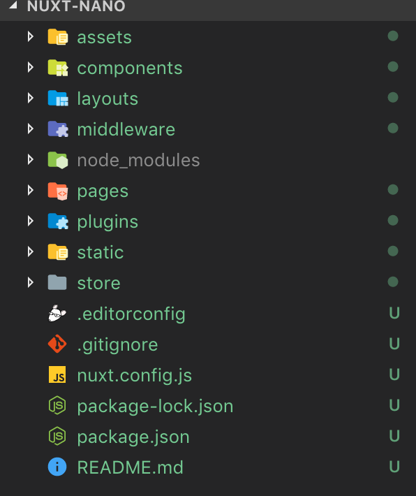

# 🔨 5: Scaffold a Nuxt App and Explore Its Architecture (Advanced)

| **Project Goal**            | Scaffold a Nuxt app and explore its architecture                                                                       |
| --------------------------- | ---------------------------------------------------------------------------------------------------------------------- |
| **What you’ll learn**       | You will learn how to set up a Nuxt application and how to understand its architecture to build your own applications. |
| **Tools you’ll need**       | A modern browser like Chrome or Firefox. A text editor of your choice. Access to a terminal.                           |
| **Time needed to complete** | 30 minutes                                                                                                             |

# Nuxt

In very simple terms, _Nuxt.js_ is a framework that allows us to create Vue.js applications with preset configurations for _SPAs_ and _SSR_ ([Server Side Rendered](https://medium.freecodecamp.org/what-exactly-is-client-side-rendering-and-hows-it-different-from-server-side-rendering-bd5c786b340d)) apps. In this nano you will learn how to set up a _Nuxt_ application in your local development environment. You'll also get a first glance at its structure and how to add your own pages and components.

## Scaffolding Your App

Our first step is to scaffold our Nuxt app. For this task we will be using the [`create-nuxt-app`](https://github.com/nuxt/create-nuxt-app) tool that Nuxt.js provides for us.

::: tip 💡
We will be using `npm` and `npx` commands in this nano, if you don't already have Node and NPM installed in your computer, head over to [https://nodejs.org](https://nodejs.org) and download and install the package first.

If you have a preference for `yarn` or would like to try it out, head to [https://yarnpkg.com](https://yarnpkg.com/en/) for installation instructions.
:::

Fire up your terminal of choice, and run the following command:
`npx create-nuxt-app nuxt-nano`

The argument after `create-nuxt-app`, `nuxt-nano`, will be the name of our folder.

The tool will create for you a bunch of settings you can configure, so let's take a look.

-   **Project name** This simply sets the name of our project, and is your choice.
-   **Project description** A short description for your project.
-   **Use a custom server framework** If you choose one of these, Nuxt will use it for server-side code. You can choose `none` for now, as this is beyond the scope of this nano.
-   **Use a custom UI framework** If you choose one here, it will be installed and plugged in to your project automagically! Let's however choose `none` for this project.
-   **Choose rendering mode** `Universal` will use both SSR and client side rendering, so this is great for SEO tracking. `SPA` is the typical single page app with client side rendering. We pick `Universal` in this case.
-   **Use axios module** Adds the popular HTTP library Axios to your project. Select `no`.
-   **Use eslint** Adds eslinting to your project. We're going to go with `no` for this.
-   **Use prettier** This adds Prettier, a library that formats your code, to your project, but we're going to also say `no`.
-   **Author name** Time to sign your name!
-   **Choose a package manager** This allows you to use either _npm_ or _yarn_ as your package manager, we're using npm for this nano - but feel free to choose yarn if that's your preference.


Once you're done selecting all your options, `create-nuxt-app` will wrap it up by installing the required libraries and creating the folders and files, and will end by welcoming you to your new app with some useful commands!


## Exploring the structure

Fire up your text editor of choice (VSCode is a good choice), and open up the `nuxt-nano` folder that the CLI _(Command Line Interface)_ just created for you.

You should see this structure on your file explorer:



Let's take a closer look to the folders:

-   **assets** This is a folder for placing images, css, and just about any media assets that you will need for your project.
-   **components** In here, you can place components like your `Header.vue` or your `FoxyButton.vue`.
-   **layouts** Layouts are `.vue` files that are used to provide a general structure for your page. For example, you may place a structure that includes your Header, Footer and a spot for your dynamic content. More on this later.
-   **middleware** Middleware are custom functions that allow us to plug-in functionality before rendering a page; it acts directly on the http _request_. Middleware is a HUGE subject worthy of its own workshop, but if you want to delve deeper into it, check out the [official docs](https://nuxtjs.org/guide/routing#middleware).
-   **node_modules** This holds your app's dependencies.
-   **pages** This is where we will put our actual pages and content. More on this later!
-   **static** This folder is used for placing assets that will never change, like the `favicon` or the `robots.txt`. Everything you put in here will be mapped to `/` so, if you make a folder inside called `stuff` with a file `secret.txt` you will access it through `<url>/stuff/secret.txt`.
-   **store** This folder is for placing your `store` files in case you're using **Vuex**. It's empty by default, but if you want to _activate_ it and use Vuex, add an index.js file and code away!

## Pages in Depth

The pages folder is one of the most important folders in a _Nuxt_ app since it holds both our views and also our routes!

If you open it on your text editor, you will see that inside there is an `index.vue` file with some basic HTML/CSS content inside of it. Let's go ahead and run the project.

Open up your terminal and `cd nuxt-nano` into your app's folder. Once you're inside, go ahead and `npm run dev` or `yarn dev` to start up the compile process and start _serving_ the content into your browser.

The terminal will show you in what url/port it's going to serve your app. Usually it'll be [http://localhost:3000]. Go ahead and open the URL in your browser.


::: tip 💡
If at any point you need to stop the server, you can `control + c` to quit it.
:::

The folder structure in _Nuxt_ is important for determining your app's pages because it will be exactly mimicked as a route on your application. For example, go ahead and create an `about.vue` file with some dummy content.

```js
<template>
	<h1>The About page</h1>
</template>
```

If you now head on your browser to `http://localhost:3000/about`, TADA~ The route has been automatically created and served from your Nuxt application.

There is another way to set up your routes, which provides for a "cleaner" stucture. It requires that instead of a component, you create a folder for each route with an `index.vue` file inside for each route. (Think of single HTML files in a folder structure).

Create a `contact` folder with an `index.vue` file inside with dummy content.

```js
<template>
	<h1>The Contact page</h1>
</template>
```

Now go ahead and navigate to `http://localhost:3000/contact`

### Dynamic Routes

If you ever need to create a dynamic route, for example to pass data over the URL, there is a special syntax you need to use.

Say for example that you have a blog and want to have a route that allows you to fetch a post by its id. This would look something like `http://localhost:3000/posts/123` where `123` is the post id.

Creating a folder and an `index.vue` file for each post is less than ideal, so there is a special way we can define this.

Under `pages`, create a folder `posts`, inside a folder named `_id` and inside, you guessed it, an `index.vue` file.

Now paste this code inside:

```js
<template>
    <h1>Viewing post with ID: {{ $route.params.id }} </h1>
</template>
```

Check out `http://localhost:3000/posts/123` in your browser, and you will see **123** displayed as the post ID for that page. If you look closely at the code, you will notice that you are retrieving the ID paramter through `$route.params`.

The actual **NAME** of this param is taken from the name of the folder that contains it, so in this case we named it `_id` and our param is named `id`!

## Layouts in Depth

Layouts are a way to define a "global container" for your views. This is easily understood by example, so let's dive right in.

Go into the `layouts` folder and open up `default.vue`.

You notice the `<nuxt></nuxt>` element? This is where your views are actually being loaded. Place an _h1_ tag above it like so:

```js
<template>
	<div>
		<h1>Hello from default.vue</h1>
		<nuxt />
	</div>
</template>
```

Now, navigate back to your browser and open up `http://localhost:3000` or any of the routes you have created on this nano.

The template is now serving an `h1` tag in all your routes! This example is obviously not ideal, but a great use case if setting up your `nav` and `footer` here.

If you ever want to have another template (for example one that doesn't have a navigation, or an entirely different layout), you can go ahead and create a new file inside the `layouts` folder.

Every _top level_ file inside this folder will be a new layout. So for example, create an `example.vue` file and set it up.

```js
<template>
	<div>
		<h1>Hello from Vue Vixens!</h1>
		<nuxt />
	</div>
</template>
```

Now, we need to tell our `page` to use this layout. Open `index.vue` inside the `pages` folder and add a `layout` param to the script.

```js
<script>
export default {
  layout: 'example'
  // Other code
}
</script>
```

Go ahead and take a look at your home route now!

## Conclusion and Challenge

Nuxt is a framework with a ton of possibilities and intricacies. This nano barely scratches the surface but is a quick way to get you started developing SSR applications.

Your challenge, if you're up to it, is to create a completely new `layout` and add some more pages that include two levels or more of nested dynamic paths params!

## Badge

Congratulations! You have earned a badge!


## Author

Made with ❤️ by Marina Mosti
