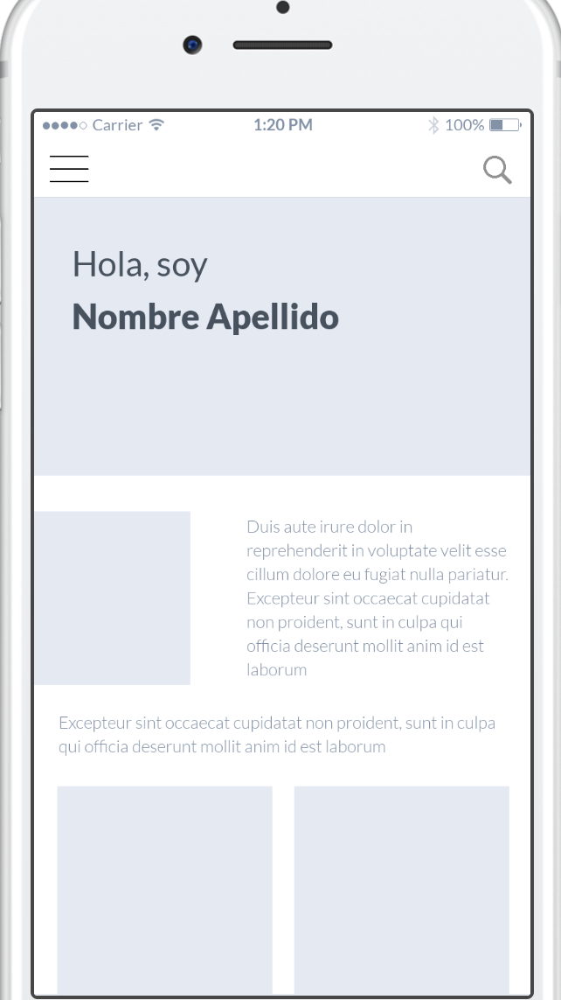

# 🙅 Website Activity 1: First create your own design

| **Project Goal**            | Create your personal site using Vue and others tools                                                                                                                                   |
| --------------------------- | ------------------------------------------------------------------------------------------------------------------------------------------------------------------------------------------------ |
| **What you’ll learn**       | Create a site from Zero to Hero with Vue. You will understand the base of Vue with this tutorial and at the end you will have your personal project
| **Tools you’ll need**       | A modern browser like Chrome. Access to [Vue Developer tools](https://chrome.google.com/webstore/detail/vuejs-devtools/nhdogjmejiglipccpnnnanhbledajbpd?hl=en) extension for Chrome.
| **Time needed to complete** | The time that you need ❤️

# Build your personal site using Vue and others tools

In this activity we will create an example of a standard webiste step by step. We will follow these steps:

0. Create the **design** of your site
1. Start to **build your personal site** with Vue
2. Understanding Vue **components**, dynamic **routes** and **Vuex**
3. Use **firebase** to save our information in the cloud
4. Include **nuxt** on your project
5. **Testing** with Jest & Cypress
6. Get better your **performance**

# Create the design of your site

First, you need to know a little bit of design theory.

## Design

**Design**: It's a way to communicate **something** with a visual part.

**Something**: It's the **objective** for that you want to create.

In this case, it's communicate your professional side. Create a platform to show your experience, skills, projects... All about you. 🙅

For this, you can use several resources to create it:

- **Visual resources**: fotography, ilustrations, icons, colors...
- **Typography**: You can pick the typo that you think can related with you
- **Composition**: You need to organize the elements of your site in a grid.

## UX / UI

**UX** User experience. The interactivity that user has with the website.

**UI** User interface. The product.

# Design step by step

## Research

You need time to think about the things that you want to show to your users. You need time to think ideas, get inspiration.

[beingadev](https://beingadev.rocks/)

[superrb](https://www.superrb.com)

[agauchedelalune](https://www.agauchedelalune.com/)

[superfriend](https://www.superfriend.ly)

[emmawedekind](https://github.com/emmawedekind/design-inspiration)

The most important point here. It's that you need see another personal pages to get inspiration and help you to create your website.

## Sketch

With all these ideas you can create a **sketch** of your website. Just take a pencil and put your schema in a paper.

You have here our sketchs for the website that we want to create. Feel free to create one better for your site.

**Home**

**Blog / Post / Project**

## Wireframe

When you decide the schema, it's time to create your **wireframe** and put in a digital tool and think about the interactivity of your application and the organization of your page. For these step you can use: 

### **InVision** (Mac)

You should create an account and download the application for you computer.

[Invision App](https://www.invisionapp.com/studio)

You have here our sketch file, that you can import in invision and modify like you want.

[Invision Sketch](https://drive.google.com/file/d/1xILIiSZ_-V3jzj4Ds8VYkpqg4WIxD6QG/view)

### **Marvel** (Windows, Linux)

You should create an account and create a new project.

[Marvel App](https://marvelapp.com)

You have here our sketch file, that you can see and take like an example.

[Marvel Sketch](https://marvelapp.com/b0di9ha/screen/53367601)

## Mockup

Now, it's time to decide the *look and feel* of your application, the **mockup**. The color, the typo, the texts... You have a lot of places to search resources. Here we put our recommendations:

- To pick the **colors** of your website, this wheel can help you [Color Wheel Adobe](https://color.adobe.com/es/create/color-wheel/) You can extract the hexadecimal value to your CSS.

- To pick the **typography** of your website, this tools can help you to find [Google Fonts](https://fonts.google.com/) [AlternaType](https://alternatype.net/) You can find with and without serif and can extract the style for your HTML.

::: tip 💡
A typo **with serif** are used to long text: books, newspapers...

A typo **without serif** are used to short text, visual and stetic things.
:::

- To pick **images** for your site, you can use: [Unsplah](https://unsplash.com/) [Freepik](https://www.freepik.com/)

- To pick **icons** for your site you can use: [Flaticon](https://www.flaticon.com/) [IconFinder](https://www.iconfinder.com/)

- To pick **emojis** you can use: [EmojiCopy](https://www.emojicopy.com/)

## Prototype

At the end you will have a **prototype** of your application with all the material to develop your site.

## Author

Made with ❤️ by [Cristina Ponce](https://twitter.com/cristinagrim)