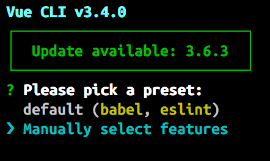
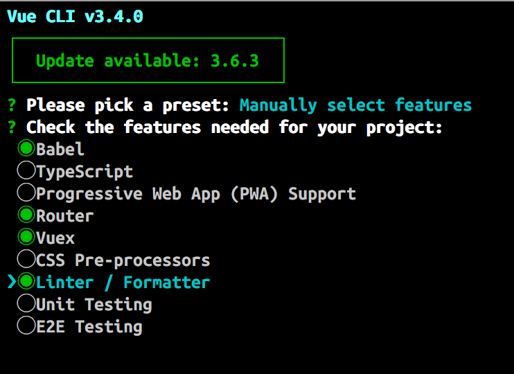
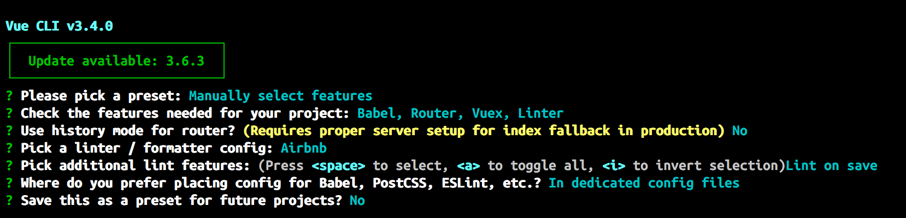
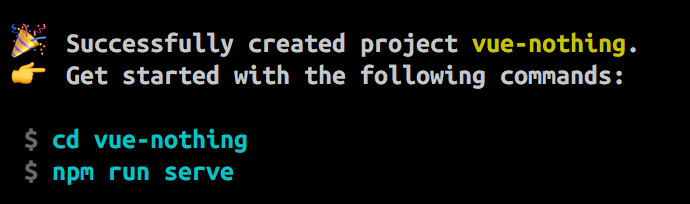

# 🙅 Website Activity 2: Start to build your personal site with Vue

| **Project Goal**            | Create your personal site using Vue and others tools                                                                                                                                   |
| --------------------------- | ------------------------------------------------------------------------------------------------------------------------------------------------------------------------------------------------ |
| **What you’ll learn**       | Create a site from Zero to Hero with Vue. You will understand the base of Vue with this tutorial and at the end you will have your personal project
| **Tools you’ll need**       | A modern browser like Chrome. Access to [Vue Developer tools](https://chrome.google.com/webstore/detail/vuejs-devtools/nhdogjmejiglipccpnnnanhbledajbpd?hl=en) extension for Chrome.
| **Time needed to complete** | 2 hours

# Build your personal site using Vue and others tools

In this activity we will create an example of a standard webiste step by step. We will follow these steps:

0. Create the **design** of your site
1. Start to **build your personal site** with Vue
2. Understanding Vue **components**, dynamic **routes** and **Vuex**
3. Use **firebase** to save our information in the cloud
4. Include **nuxt** on your project
5. **Testing** with Jest & Cypress
6. Get better your **performance**

# Start to build your personal site with Vue

## Prepare your computer

1. Install **Node and npm**. Go to [Node Webiste](https://nodejs.org/es/download/) and download the install program and follow steps.
2. Install **vue cli dependency**. Put in your terminal and ```npm i -g @vue-cli```
3. Install some editor **[visual studio code](https://code.visualstudio.com/Download)**, **[sublime](https://www.sublimetext.com/3)** or **[atom](https://atom.io/)**.
4. Install some **recommended extensions**:

- [Vue Developer tools](https://chrome.google.com/webstore/detail/vuejs-devtools/nhdogjmejiglipccpnnnanhbledajbpd?hl=en)
- [Vetur](https://vuejs.github.io/vetur/)

Now, you can create the **project** with your terminal and start to coding.

```
vue create vue-personal-site
```

When you put it in your terminal you will find several steps to follow:






## Create your main components

For that you need to organize your project first:

- Create files that are **pages** inside of a new folder: ```/pages```
- Create files that are **layouts** inside of a new folder: ```/layouts```
- Create files that are **components** inside of a new folder: ```/components```

Pages:

You just need to create one per route on your application. In that moment, you just need one for Home route.

1. Home

Layouts:

The layouts will be your group of elements like a template to follow. In that moment, you just need one because you just have one layout.

1. Main

Components:

For now, your components should be all the element that you can split in your page.

1. Menu
2. Header
3. Footer

### Examples of component / layout / page

PAY ATTENTION: Inside of your components should have the following:

- One tag ```<template></template>``` for your HTML.
- One tag ```<script></script>``` for your Javascript.
- One tag ```<style></style>``` for your CSS.

```
<template>
  <main>
    <h2>Main</h2>
  </main>
</template>

<script>
export default {
  name: 'Main'
}
</script>

<style scoped>
  main {
    margin: 20px;
    padding: 20px;
  }
</style>
```

- Inside or your tag ```<template></template>``` should be one tag container of everything. If you don't do that you will get an error.

- Inside or your tag ```<script></script>``` the most important thing is that you have the `export default {}` and the name attribute ```name: 'Main'```.

- If you want to styling your component use ```<style></style>``` You can use ```scoped``` attribute when your want to wrap these styles inside of the component. If you want to apply these style in general, don't put this attribute.

## Architecture of your project

Until now, your project grow a little bit and it should has this sctructure.

```
src/
  assets/
  components/
    TheFooter.vue
    TheHeader.vue
    TheMenu.vue
  layouts/
    Main.vue
  pages/
    Home.vue
  App.vue
```

### Components:

And your components should look like:

  **TheFooter.vue**

  ```
    <template>
      <footer>
        <h2>Footer</h2>
      </footer>
    </template>

    <script>
    export default {
      name: 'Footer',
    }
    </script>

    <style scoped>
      footer {
        background-color: #000000;
        color: #ffffff;
        margin: 0;
        padding: 40px;
      }
    </style>

  ```

  **TheHeader.vue**

  ```
    <template>
      <header>
        <h1>Hello, I am Cristina</h1>
        <p>Frontend Developer</p>
      </header>
    </template>

    <script>
    export default {
      name: 'Header'
    }
    </script>

    <style scoped>
      header {
        border: 10px solid #ffffff;
        padding: 20px;
        margin: 20px;
        text-align: left;
      }
    </style>
  ```

  **TheMenu.vue**

  ```
    <template>
      <nav>
        <div>M</div>
        <div>X</div>
      </nav>
    </template>

    <script>
    export default {
      name: 'TheMenu'
    }
    </script>

    <style scoped>
      nav {
        display: flex;
        justify-content: space-between;
        align-items: center;
        margin: 20px;
      }
    </style>
  ```

### Layouts:

  **Main.vue**

    ```
      <template>
        <main>
          <h2>Main</h2>
        </main>
      </template>

      <script>
      export default {
        name: 'Main'
      }
      </script>

      <style scoped>
        main {
          margin: 20px;
          padding: 20px;
        }
      </style>
    ```

### Pages:

  Now, in your page component ```Home.vue``` you need to import your components in JS and use it in your template (HTML). Like you can see here:

  **Home.vue**

    ```
    <template>
      <div>
        <the-menu />
        <the-header />
        <Main />
        <the-footer />
      </div>
    </template>

    <script>
    import TheMenu from '@/components/TheMenu.vue'
    import TheHeader from '@/components/TheHeader.vue'
    import TheFooter from '@/components/TheFooter.vue'
    import Main from '@/layouts/Main.vue'

    export default {
      name: 'Home',
      components: {
        TheMenu,
        TheHeader,
        TheFooter,
        Main
      }
    }
    </script>
    ```

### App:

  In your app component you just need to include the router-view.

  **App.vue**

  ```
    <template>
      <div id="app">
        <router-view/>
      </div>
    </template>

    <style>
    body {
      font-family: 'Avenir', Helvetica, Arial, sans-serif;
      background-color: #fd5e60;
      color: #ffffff;
      margin: 0;
    }
    </style>
  ```

  To be continue...

## Author

Made with ❤️ by [Cristina Ponce](https://twitter.com/cristinagrim)