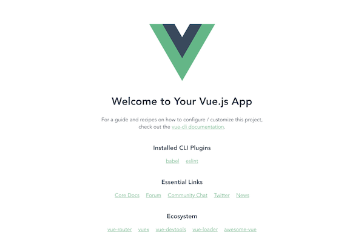
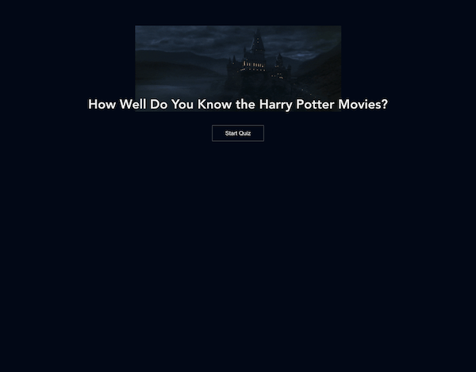

# 🎩 6: Build a Harry Potter Movie Quiz

| **Project Goal**            | Build a little Harry Potter Movie Quiz                                                                                                                                   |
| --------------------------- | ------------------------------------------------------------------------------------------------------------------------------------------------------------------------------------------------ |
| **What you’ll learn**       | Basics about Vue components, how data binding is done in Vue, and how to perform simple REST API calls                                                                                             |
| **Tools you’ll need**       | Modern browser like chrome and access to [CodeSandbox](https://codesandbox.io)
| **Time needed to complete** | 1.5 to 3+ hours (don't stress) |
| **Just want to try the app?** | [Code Sandbox link](https://codesandbox.io/s/ws-harry-potter-quiz-55ygd)

# Acknowledgment

The workshop idea is inspired by [Dmytro Barylo](https://www.linkedin.com/in/dmytrobarylo/) from Ukraine who made the [Harry Potter Movie Quiz](https://madewithvuejs.com/harry-potter-movies-quiz). We would like to take this opportunity to thank Dmytro Barylo for the great idea on which basis we actually developed this workshop.


# Instructions

## Step 1: Setting up the Vue App with CodeSandbox

Create a new sandbox Vue project by going to CodeSandbox and clicking on the “Create Sandbox” box.
The options for which kind of sandbox you want to have will appear.


There, choose Vue as the basis for your sandbox. The instant IDE will then set up a base Vue project for you.


Once the IDE finished the setup, it opens your project in the editor.

On the left side, you'll see all generated files in the navigation bar and dependencies the project has so far.
Don’t worry about the dependencies, we are going to explain them later on.

On the right side to the navigation bar, you'll find the editor. Here you can code and see all your changes instantly in the preview to the right.

If you see the project boilerplate, it'll have content so far. It contains a lot of references provided by Vue.js itself to get help.


The `main.js` is the entrypoint for the application start.

```javascript
new Vue({
  render: h => h(App)
}).$mount("#app");
````

Here you can see that a Vue project is initialized and a Vue instance is generated by invoking the Vue constructor, `new Vue({/* options go here */})` and with `$mount([elementOrSelector])` the Vue instance is mounted to the `#app` element.

Every Vue application, no matter how big or small, starts with the root Vue instance.

For more information check out:
- [https://codingexplained.com/coding/front-end/vue-js/mounting-templates-dynamically](https://codingexplained.com/coding/front-end/vue-js/mounting-templates-dynamically)
- [https://vuejs.org/v2/guide/instance.html](https://vuejs.org/v2/guide/instance.html)

In the first lines of the `main.js` you can find some imports.
The first one imports the Vue module and the second one is the very first component we will use - it is the App component.

```javascript
import Vue from "vue";
import App from "./App.vue";
```

The App.vue actually contains the ID-Selector `#app` which we'll use to mount the Vue application.

```javascript
<template>
  <div id="app">
    
    <HelloWorld msg="Hello Vue in CodeSandbox!" />
  </div>
</template>
```

### Achievement

At the end of step 1, your application should look similar to the following:




## Step 2: Create the first own Vue component "Quiz.vue"

Now we are going to write our first own component in Vue. All components are also called Vue instances.

Our Vue project actually provides a folder structure which is almost valid for many JS frameworks.
In the components folder all vue components are stored. There you can also find the **HelloWorld.vue** component which contains all the helping text.

Let's create a quiz component **Quiz.vue** inside the components folder.


The file will be empty so far.

Normally Vue components contain:
- A template
- A script
- A style section

The smallest Vue component looks like this:

```html
<template>
  <div></div>
</template>

<script>export default {};</script>

<style></style>
```

This doesn’t provide any meaningful output, but let's put some text within the `<div>` containers, and see when we are using it what it will output on the screen.

```html
<template>
  <div>Quiz</div>
</template>
```

Now, we'll include a brand new component in the App.vue.
Remove the `<HelloWorld />` component, and add the Quiz component instead.

To use our Quiz component some steps are needed. First we have to import the component within the script section.

```javascript
import Quiz from "./components/Quiz.vue";
```

After that, the Quiz component has to be registered within the App.vue, which is done by adding the imported Quiz to the App components options.

```javascript
components: {
    Quiz
}
```

This above is the easiest way to do that. It will map your component Quiz to the component element `<Quiz />`.
But is also possible to register the component with more settings. E.g. With a custom name or key property for the component.

```javascript
components: {
    'quiz': Quiz
}
```

The last thing to do is to add the component element `<quiz />` in the template.

```html
<template>
  <div id="app">
    <quiz/>
  </div>
</template>
```

Before the Quiz starts, we need a welcome view displayed to the user.
In the **Quiz.vue** template section we'll remove the previous content, and place a picture, a title and a link via HTML, which finally will start the quiz.

```html
<div>
    
    <h1 class="quiz-heading">How Well Do You Know the Harry Potter Movies?</h1>
    <button class="quiz-button">Start Quiz</button>
</div>
```

For more styling you can use the style section and write your CSS.

Within the App.vue we already set some general CSS styling, like having a dark background and defining the main text color:

```html
/* App.vue */
<style>
* {
  box-sizing: border-box;
}
html {
  height: 100%;
}
body {
  height: 100%;
  background: #020815; /* Black */
  color: #eee; /* Gray */
}

#app {
  font-family: "Avenir", Helvetica, Arial, sans-serif;
  -webkit-font-smoothing: antialiased;
  -moz-osx-font-smoothing: grayscale;
  text-align: center;
  margin-top: 60px;
}
</style>
```

For the **Quiz.vue** we can make some simple stylings like the following.

```html
/* Quiz.vue */
<style>
.quiz-heading {
  margin: -40px 0 30px;
  font-size: 30px;
  text-shadow: 1px 1px 2px #020815;
  line-height: 1.2;
}

.quiz-button {
  color: #eee; /* Gray */
  text-decoration: none;
  cursor: pointer;
  display: inline-block;
  padding: 10px 30px;
  border: 1px solid rgba(238, 238, 238, 0.3);
  background: none;
  transition: border-color 0.5s;
}
.quiz-button:hover {
  border-color: #eee; /* Gray */
}
</style>
```

When you click on the button "Start Quiz" to start the quiz, nothing happens.
In order to make something happen when the link is clicked, we need to bind an action to the button.
This can be achieved by adding the shorthand event modifier `@click` to the button inside **Quiz.vue's** `<template>` section.

```javascript
<button class="quiz-button" @click="initQuizStage">Start Quiz</button>
```

You can read more about Vue Modifiers here: [https://vuejs.org/v2/guide/events.html#Event-Modifiers](https://vuejs.org/v2/guide/events.html#Event-Modifiers)

And read about Vue Shorthands here: [https://vuejs.org/v2/guide/syntax.html#Shorthands](https://vuejs.org/v2/guide/syntax.html#Shorthands)

This shorthand event modifier contains `initQuizStage` as a value, which is expected to be a method for Vue.
Such method will be called when a user clicks the button.
Therefore we are going to define a method with the same name in the script's section of our component:

```javascript
// Quiz.vue
<script>
  export default {
    methods: {
      initQuizStage() {
        console.log("Start the quiz....");
      }
    }
  };
</script>
```

This method only prints “Start the quiz…” to the console. Before moving on and implementing the `initQuizStage` we need more data. We need the movie titles of all Harry Potter movies. But also the data for quiz questions.

Next, we're going to provide all movie titles for our Quiz component.
Providing data to child components can be done with so-called props in Vue.
Props are custom attributes you can register on a component to be able to pass data to them from a parent component. A value can be passed to a prop attribute, which becomes a property on that component instance.

You can read more about Vue Props here: [https://vuejs.org/v2/guide/components.html#Passing-Data-to-Child-Components-with-Props](https://vuejs.org/v2/guide/components.html#Passing-Data-to-Child-Components-with-Props)

In the App.vue let's extend the quiz element with a props attribute called “movies” and provide it with movies' data, which you get from the `data()` method. With the colon in front of the prop name, you are telling Vue that the value inside the brackets is not just a string but a variable, which in this case is an array.

```html
<!-- App.vue -->
<template>
  <div id="app">
    <quiz :movies="movies"/>
  </div>
</template>
```

```javascript
/* App.vue */
<script>
  export default {
    // ...
    data() {
      return {
        movies: [
          "Harry Potter and the Philosopher's Stone",
          "Harry Potter and the Chamber of Secrets",
          "Harry Potter and the Prisoner of Azkaban",
          "Harry Potter and the Goblet of Fire",
          "Harry Potter and the Order of the Phoenix",
          "Harry Potter and the Half-Blood Prince",
          "Harry Potter and the Deathly Hallows - Part 1",
          "Harry Potter and the Deathly Hallows - Part 2",
        ]
      };
    }
  }
  // ...
```

If you provide a prop to a component, the receiving component has to define that property on the other side before you can use it. This is done by introducing the prop in the `props: {}` section inside **Quiz.vue**:

```html
<!-- Quiz.vue -->
<script>
  export default {
    props: {
      movies: {
        type: Array,
        required: true
      }
    },
  // ...
</script>
```

To see if it works, we can use a simple list and iterate over the entries of movies.

```html
<!-- Quiz.vue -->
<ul>
    <li v-for="movie in movies" :key="movie">{{ movie }}</li>
</ul>
```

With the `v-for` directive we can tell vue to iterate over the values in movies and to repeat the `<li>` element with each value provided during each iteration.

You can read more about Vue Directives here: [https://vuejs.org/v2/guide/syntax.html#Directives](https://vuejs.org/v2/guide/syntax.html#Directives)


:::v-pre
The `{{ movie }}` is the most basic form of data binding called text interpolation using the “Mustache” syntax (double curly braces). The mustache tag will be replaced with movie names, which are saved in the property movies (which we defined earlier). It will also be updated whenever the component's movies property changes.
:::

You can read more about Vue Text Interpolation here: [https://vuejs.org/v2/guide/syntax.html#Interpolations](https://vuejs.org/v2/guide/syntax.html#Interpolations)

Let’s ensure that the part with the printed movies list is only shown when `initQuizStage` is clicked.
This can be achieved by using the `stage` computed property and with the `v-if` directive in the template.
The `v-if` directive validates the expression of its content. When it is true, the component is rendered and shown, if false, it is not rendered.

You can read more about Vue Computed Properties here: [https://vuejs.org/v2/guide/computed.html#Computed-Properties](https://vuejs.org/v2/guide/computed.html#Computed-Properties)

```html
<!-- Quiz.vue -->
<template>
  <ul class="quiz-choices" v-if="stage==='quiz'">
<template>
```

```javascript
/* Quiz.vue  */
<script>
  export default {
    props: {
      movies: {
        type: Array,
        required: true
      }
    },
    data() {
      return {
        currentQuestionNumber: 0
      };
    },
    computed: {
      // ....
      stage() {
          return this.currentQuestionNumber === 0 ? 'welcome' : 'quiz';

          /*
            FYI: We're using a ternary operator in JS.
            The above code is equal to this:
            if (this.currentQuestionNumber === 0) {
              'welcome'
            } else {
              'quiz'
            }

            Learn about ternary operators here:
            https://developer.mozilla.org/en-US/docs/Web/JavaScript/Reference/Operators/Conditional_Operator
          */
      }
    },
    methods: {
      initQuizStage() {
        this.currentQuestionNumber = 1;
    }
  };
</script>
```

Also let's ensure that the “Start Quiz” button disappears when the Quiz is started.
We can again use the `stage` property for it.

```html
<button class="quiz-button" v-if="stage==='welcome'" @click="initQuizStage">Start Quiz</button>
```

### Achievement

At the end of step 2, your application should look like that:


## Step 3: Using the Quiz data

Besides the movie data, we also need the quiz data with the movie clip and the choices of which movie it is.
We'll get this data from a JSON (Javascript Object Notation) file.
JSON is the description of an object in a more human readable way. It is mainly used to transfer information between systems.

You can read more about JSON here:
- [https://en.wikipedia.org/wiki/JSON](https://en.wikipedia.org/wiki/JSON)
- [https://developer.mozilla.org/en-US/docs/Web/JavaScript/Reference/Global_Objects/JSON](https://developer.mozilla.org/en-US/docs/Web/JavaScript/Reference/Global_Objects/JSON)

The JSON contains a list (an array) of questions. Each question contains 4 different numbers, which matches to the movies we are going to provide as labels to the buttons of answer choices. It also contains the correct answer and furthermore the movie scene as link to the giphy image, which has to be guessed.


```json
{
  "questions": [
    {
      "correct": 3,
      "answers": [2, 3, 4, 5],
      "img": "https://media1.giphy.com/media/26BRzozg4TCBXv6QU/giphy.gif"
    },
    {
      "correct": 7,
      "answers": [6, 5, 7, 8],
      "img": "https://media2.giphy.com/media/Th8FaGYsmPMwU/giphy.gif"
    },
    {...}
  ]
}
```

To learn more about data primitives, like string, numbers and arrays, which are useful to understand the JSON structure better, we warmly recommend Lydia Hallie. She has written a very good explanation about it: [https://www.theavocoder.com/complete-javascript/2018/12/18/primitive-data-types](https://www.theavocoder.com/complete-javascript/2018/12/18/primitive-data-types)

To load the questions we're going to provide the Quiz component with the `questions-url` props from where the questions can be loaded. We'll use this to fetch the data from there.
The fetching magic will happen with the `mounted()` method of our Quiz component. The `mounted()` method is a lifecycle hook, which is called after the instance has been mounted.

You can read more about Vue Mounted here: [https://vuejs.org/v2/api/#mounted](https://vuejs.org/v2/api/#mounted)

```html
<!-- App.vue -->
<quiz :movies="movies" questions-url="https://api.jsonbin.io/b/5e3f0514f47af813bad11ac5"/>
```

```javascript
// Quiz.vue
props: {
    movies: {
      type: Array,
      required: true
    },
    questionsUrl: {
      type: String,
      required: true,
    }
},
data() {
    return {
      questions: [],
      currentQuestionNumber: 0
    };
  },

// ...
async mounted() {
    const res = await fetch(this.questionsUrl);
    this.questions = (await res.json()).questions;
    console.log(this.questions);
},
```

You can read more about Vue Async Components here: [https://vuejs.org/v2/guide/components-dynamic-async.html#Async-Components](https://vuejs.org/v2/guide/components-dynamic-async.html#Async-Components)

Now we're able to use these loaded questions to enhance the `initQuizStage` and use this data to provide the first question to the user.

We'll start replacing the image we used so far in the Quiz component to be changed dynamically in terms of the question we're showing. To do so some steps are needed.

First, we need to know which question is in which order. We'll store the information within the `currentQuestionNumber` instance property. Then, we have to provide the according image, which we can do by using a computed property.

A computed property in Vue is an instance property as well, but the main advantage it's that it can be built by different properties together. Vue will watch for changes inside dependent properties, and if they change, the computed property will be evaluated again. On the other hand, it'll be kept cached and only the cached value is provided.

You can read more about Vue Computed Caching here: [https://vuejs.org/v2/guide/computed.html#Computed-Caching-vs-Methods](https://vuejs.org/v2/guide/computed.html#Computed-Caching-vs-Methods)

```html
<!-- Quiz.vue -->
<template>
    <div>
    
    ...
```

```javascript
/* Quiz.vue */
<script>
  export default {
    // ...
    computed: {
      image() {
        return this.currentQuestionNumber
          ? this.questions[this.currentQuestionNumber].img
          : "https://media0.giphy.com/media/Bh3YfliwBZNwk/giphy.gif?cid=3640f6095c852266776c6f746fb2fc67";
      }
    },
  // ...
```

We're going to do something similar for the title, because with the start of the script we want to change the title from “How Well Do You Know the Harry Potter Movies?” to “Which movie is this?”.

```javascript
// Quiz.vue
computed: {
    title() {
      return this.currentQuestionNumber
        ? "Which movie is this?"
        : "How Well Do You Know the Harry Potter Movies?";

      /*
        FYI: We're using a ternary operator in JS.
        The above code is equal to this:
        if (this.currentQuestionNumber) {
          "Which movie is this?"
        } else {
          "How Well Do You Know the Harry Potter Movies?"
        }

        Learn about ternary operators here:
        - https://developer.mozilla.org/en-US/docs/Web/JavaScript/Reference/Operators/Conditional_Operator
      */
    }
},
```

At last, let's add the title via text interpolation (Mustache syntax) into our template inside **Quiz.vue**.

You can read more about Vue Text Interpolation here: [https://vuejs.org/v2/guide/syntax.html#Interpolations](https://vuejs.org/v2/guide/syntax.html#Interpolations)

```html
  <h1 class="quiz-heading">{{ title }}</h1>
```

### Achievement

At the end of step 3, your application should look like that:

**Welcome Screen:**



**After clicking on the start button:**


## Step 4: Displaying possible movie options to user

So far we have displayed the list with answers, including all the movies that exist.
But what we want is to provide some suggestions to the user and let them guess which one of these answers is the correct one.

To achieve this, we'll use some buttons. Once one of them is clicked, it turns green if the answer is correct or red if the answer is incorrect.

_Here in step 4, we are changing from presenting all available movies to only a list of 4, where the user can make her choice, by clicking on it.
When in step 5, we will include the evaluation when the user clicks on a button if the answer was correct or wrong._

We also need to change the data used to iterate and employ the data of the current question. We're going to use again a computed property, which returns the possible answers from the current question.

```html
<!--Quiz.vue -->
<ul class="quiz-choices" v-if="stage==='quiz'">
      <li v-for="answerNumber in answers" :key="answerNumber">
            <button class="quiz-button">{{ movies[answerNumber] }}</button>
      </li>
</ul>
```

```javascript
// Quiz.vue
answers() {
      return this.currentQuestionNumber
            ? this.questions[this.currentQuestionNumber - 1].answers
            : [];

      /*
        Learn about ternary operators here:
        - https://developer.mozilla.org/en-US/docs/Web/JavaScript/Reference/Operators/Conditional_Operator
      */
}
```

### Achievement

At the end of step 4, after starting the Quiz, your screen should contain the first question and the options to choose:

**After clicking on the start button:**


## Step 5: Evaluate the option which was clicked

Now that we offered the user all possible quiz answers, we need to add a click event listener to the options buttons and evaluate if the correct choice was made by the user.

Define two more methods to evaluate the choice and handle the answer.

```html
<!-- Quiz.vue --->
<button
  @click="handleAnswer(answerNumber)"
  class="quiz-button"
  :class="{
    'correct': isCorrectAnswer(answerNumber) && currentUserAnswer === answerNumber,
    'wrong': !isCorrectAnswer(answerNumber) && currentUserAnswer === answerNumber
  }">
  {{ movies[answerNumber - 1] }}
</button>
```

```javascript
// Quiz.vue
data() {
  return {
    // ...
    currentUserAnswer: null
}
// ...
methods: {
// ...
  isCorrectAnswer(answerNumber) {
    return (
      this.currentUserAnswer &&
      answerNumber === this.questions[this.currentQuestionNumber - 1].correct
    );
  },
  handleAnswer(answerNumber) {
    this.currentUserAnswer = answerNumber;
  }
// ...
}
```

Don't forget to enhance the button style for the incorrect and correct answer. Otherwise you won't see any changes in the browser.

```css
.quiz-button.wrong {
  background-color: red;
}
.quiz-button.correct {
  background-color: green;
}
```

### Achievement

At the end of step 5, you can click on the button. It when turns its background colour into green or red whether your answer was correct or not.

**Correct answer:**


**Wrong answer:**


## Step 6: Proceed with next question

After evaluating the answer we'll show the result to the user for a short time and then follow up with the next question.

To wait for a second after the evaluation, we'll need to create a `setTimeout` function indicating the amount of waiting in milliseconds. E.g. 1 second = 1000 milliseconds.

And to display the next question we'll need to increase the `currentQuestionNumber` by one.

Because Vue recognizes changes in the component's data, these additions will update all dependencies, and the values in the component will be updated by showing the next question to the user.

Additionally, we should store the given answer in an array, which we'll use to calculate the user's score at the end of the quiz. To do this, add another variable inside data, which will hold all given answers.

```javascript
data() {
  return {
    ...
    userAnswers: []
  }
}
```

```javascript
<!-- Quiz.vue --->
handleAnswer(answerNumber) {
    this.currentUserAnswer = answerNumber;
    this.userAnswers.push(answerNumber);

    setTimeout(() => {
        this.nextQuestion();
    }, 1000);

    /*
      Learn about setTimeout functions here:
      - https://developer.mozilla.org/en-US/docs/Web/API/WindowOrWorkerGlobalScope/setTimeout
    */
},
nextQuestion() {
    this.currentUserAnswer = null;
    ++this.currentQuestionNumber;

    /*
    FYI: We're increating a variable by one with an unary operator:
    ++this.currentQuestionNumber;

    The above line of code is equal to this:

    this.currentQuestionNumber = this.currentQuestionNumber + 1;

    or

    this.currentQuestionNumber += 1;

    Learn about expressions and operators here:
    - https://developer.mozilla.org/en-US/docs/Web/JavaScript/Guide/Expressions_and_Operators
    */
}
```

### Achievement

At the end of step 6, a user can answer all questions. Every time she makes a choice, the application forwards to the next question after a short time.


## Step 7: Introducing usage of store and saving data in local storage

Maybe you've realized that every time you're making changes in your code or you do a refresh in the preview, the state has gone away and you have to start the quiz from the beginning.

Currently, we're not storing our data, so we can’t load information about the current question for the user to answer, or what answers the user has given so far.

To change this and improve saving our data, we're going to use the local Storage and state management in Vue.
This will help us to mutate (change) data and state in our app.

State management becomes really useful for larger apps.
Apps can often grow in complexity, due to multiple pieces of state scattered across many components and interactions between them. State management serves as a centralized store for all the components in an app, with rules ensuring that the state can only be mutated (changed) in a predictable fashion. The convention is that components are never allowed to directly mutate (change) state that belongs to the store, but should instead dispatch events that notify the store to perform actions.

We're going to use a lightweight implementation of state management in Vue.js, which is done with observables.
This is a function that returns a reactive instance of a given object.

You can read more about Vue Observables here: [https://vuejs.org/v2/api/#Vue-observable](https://vuejs.org/v2/api/#Vue-observable)

The following is the data we want to handle via the store:
- questions
- currentQuestion
  - img
  - correct
  - answers
- userAnswers
- ...

First, we're defining the store with Vue observables which expects an object with all properties we want to observe.

Create a directory "store" and inside it, a file called "index.js" with the following content:

```javascript
// store/index.js
import Vue from "vue";


export const store = Vue.observable({
  questions: [],
  stage: null,
  title: null,
  currentQuestion: {
    img: null,
    correct: null,
    answers: []
  },
  currentQuestionNumber: null,
  userAnswers: []
});
```

For changing our values in the store we have to use a defined way for it, and do it over a set of methods, which are defined within the mutation property.

Therefore, we have to define further each property inside the store as a set method if we want to mutate those values.
We'll also store the data in the `localStorage` of the browser.

You can read more about window local storage here: [https://developer.mozilla.org/en-US/docs/Web/API/Web_Storage_API/Local_storage](https://developer.mozilla.org/en-US/docs/Web/API/Web_Storage_API/Local_storage)

```javascript
// store/index.js
// ...
export const mutations = {
  setStage(stage) {
    store.stage = stage;
    localStorage.stage = stage;
  },
  setQuestions(questions) {
    store.questions = questions;
  },
  setTitle(title) {
    store.title = title;
  },
  setCurrentQuestion(questionNumber) {
    store.currentQuestionNumber = questionNumber;
    store.currentQuestion = { ...store.questions[questionNumber - 1] };
    localStorage.currentQuestionNumber = questionNumber;
  },
  addUserAnswer(userAnswer) {
    store.userAnswers.push(userAnswer);
    localStorage.userAnswers = JSON.stringify(store.userAnswers);
  },
  setUserAnswers(userAnswers) {
    store.userAnswers = userAnswers;
    localStorage.userAnswers = JSON.stringify(store.userAnswers);
  },
  resetUserAnswers() {
    store.userAnswers = [];
    localStorage.userAnswers = JSON.stringify([]);
  }
};
```

As we're using a store now, it makes sense to move the fetching of data away from the Quiz component to the store.

Fetching the data is an action, and it's defined within the action object of the store. Also in this action, we're handling the loading of stored data from the localStorage.

```javascript
// store/index.js
// ...
export const actions = {
  async fetchData(url) {
    let res = await fetch(url);
    res = await res.json();
    mutations.setQuestions(res.questions);
    mutations.setStage(localStorage.stage || "welcome");

    const number = Number(localStorage.currentQuestionNumber) || null;
    mutations.setCurrentQuestion(number);

    const answers = localStorage.userAnswers
      ? JSON.parse(localStorage.userAnswers)
      : [];

    mutations.setUserAnswers(answers);
  }
};
```

Now that we defined our store, we need to use it from the components side.

First, replace the contents of the mounted function in the **Quiz.vue** with the action `fetchData()` from the store.

Secondly, extract the initialization of the quiz stage depending on which one is active.

Although we're going to store data, we have to do some additional work for the initialization at the beginning, and maybe if we want to play the quiz again from the beginning.

So write two additional methods: `initWelcomeStage()` and `initQuizStage()`.
Later on we'll need a third one for the score stage.

```html
<!-- Quiz.vue -->
<!-- ... --->
<script>
import { mutations, store, actions } from "../store";
async mounted() {
    await actions.fetchData(this.questionsUrl);
     if (store.stage === "welcome") {
      this.initWelcomeStage();
    } else if (store.stage === "quiz") {
      this.initQuizStage();
    }
}
// ...
</script>
```

After this, we want to use all data from the store.
Therefore, we have to add the computed properties for `image()`, `title()` and `answers()`.

You can read more about Vue computed properties here: [https://vuejs.org/v2/guide/computed.html#Basic-Example](https://vuejs.org/v2/guide/computed.html#Basic-Example)

```javascript
// Quiz.vue
import { store, actions } from "../store";
// ...
computed: {
    image() {
      return store.stage === "quiz"
        ? store.currentQuestion.img
        : "https://media0.giphy.com/media/Bh3YfliwBZNwk/giphy.gif?cid=3640f6095c852266776c6f746fb2fc67";
    },
    title() {
      return store.title;
    },
    answers() {
      return store.currentQuestion.answers ?
        store.currentQuestion.answers
        : [];
    },
  },
```

Within the template where we check if the welcome stage has to be shown or the quiz started with the questions, we're using the `stage` for evaluation. But the `stage` is now part of the store, and before looking up `stage` in the store we would have to check if the store has initialized. To avoid this, we're introducing another computed property `stage` to help not being forced to check if the store can be used so far.

```javascript
// Quiz.vue
computed: {
  // ...
  stage() {
      return store.stage;
  }
  // ...
}
```

```html
<!-- Quiz.vue -->
<button class="quiz-button" v-if="stage === 'welcome'" @click="initQuizStage">Start Quiz</button>
<ul class="quiz-choices" v-else-if="stage === 'quiz'">...</ul>
```

If the user makes a choice, we have to change some values in the store to continue with the next question, and to save all answers the user gave us until this point.

We'll need to do this in a defined way and use mutation methods from the store.

We also have to import the mutations from the store.

```javascript
// Quiz.vue
import { store, actions, mutations } from "../store";
  methods: {
    initWelcomeStage() {
      mutations.setStage("welcome");
      mutations.resetUserAnswers();
      mutations.setCurrentQuestion(null);
      mutations.setTitle("How Well Do You Know the Harry Potter Movies?");
    },
    initQuizStage() {
      mutations.setStage("quiz");
      mutations.setCurrentQuestion(+store.currentQuestionNumber || 1);
      mutations.setTitle("Which movie is this?");
    },
    isCorrectAnswer(answerNumber) {
      return this.currentUserAnswer && answerNumber === store.currentQuestion.correct;
    },
    handleAnswer(answerNumber) {
      this.currentUserAnswer = answerNumber;
      mutations.addUserAnswer(answerNumber);

      setTimeout(() => {
        this.nextQuestion();
      }, 1000);
    },
    nextQuestion() {
      this.currentUserAnswer = null;
      mutations.setCurrentQuestion(store.currentQuestionNumber + 1);
    }
  }
    //...
```

**Hint:**
In CodeSandbox we're running into a problem when using `localStorage`. This is because of the iframes needed by CodeSandbox. To get our QuizApp running again, we need to open the view in a new browser window.

### Achievement

At the end of step 7, a user can refresh the page and the question, that was asked last time and has not yet been answered by the user will be loaded.


## Step 8: Create the score view

When all questions are answered and the user arrives at the end of the quiz, we want to show them their score.

We have already text prepared, which is displayed to the user with their score achieved.

We're enhancing the App.vue with the `resultsInfo` data which is provided to the **Quiz.vue** as property.

```html
<!-- App.vue -->
<quiz
      :movies="movies"
      :resultsInfo="resultsInfo"
      questions-url="https://api.jsonbin.io/b/5cdd1762dbffad51f8aa85a5"
/>
```

```javascript
// App.vue
data() {
  return {
    // ...
    resultsInfo: {
      0: {
        text: "Practice, practice, practice! <br>You'll be a clever as Dumbledore in no time!",
        img: "https://media0.giphy.com/media/720g7C1jz13wI/giphy.gif?cid=3640f6095c869951776a4a7a5110b5dc"
      },
      1: {
        text: "You still have to practice!",
        img: "https://media0.giphy.com/media/720g7C1jz13wI/giphy.gif?cid=3640f6095c869951776a4a7a5110b5dc"
      },
      2: {
        text: "Not too shabby! <br>Have a Harry Potter movie marathon and then try again!",
        img: "https://media2.giphy.com/media/UeeJAeey9GJjO/giphy.gif?cid=3640f6095c869e703631634241b759c1"
      },
      3: {
        text: "Very good! <br>Have another go and you'll be getting full marks!",
        img: "https://media.giphy.com/media/TGLLaCKWwxUVq/giphy.gif"
      },
      4: {
        text: "TOP MARKS! Nice work! <br>You have some serious wizard wisdom!",
        img: "https://media.giphy.com/media/9H279yb0blggo/giphy.gif"
      }
    }
  }
};
```

From the `quiz stage` we have to switch to the `result stage`. To do this, we'll define a method for it.

We have to consider when a refresh by the user is done and the application needs to initialize again when the component is mounted.

You can read more about Vue Mounted here: [https://vuejs.org/v2/api/#mounted](https://vuejs.org/v2/api/#mounted)

```javascript
  // ...
  async mounted() {
    await actions.fetchData(this.questionsUrl);
    if (store.stage === "result") {
      this.initResultStage();
    } else if (store.stage === "quiz") {
      this.initQuizStage();
    } else {
      this.initWelcomeStage();
    }
  },
  computed: {
    // ...
    result() {
      const correctAnswers = this.correctAnswers();
      const resultInfo = this.resultsInfo[Math.floor(correctAnswers / 5)];
      const result = {
        title: `Your Score: ${correctAnswers} out of ${
          store.questions.length
        }`,
        ...resultInfo
      };

      return result;
    }
    // ...
  }
  methods: {
    // ...
    initResultStage() {
      mutations.setStage("result");
      mutations.setTitle(this.result.title);
    }
    // ...
  }
  // ...
```

When switching to the next question, we additionally have to check if the user has arrived at the end of the quiz. If so, we have to change the stage.

```javascript
// ...
handleAnswer(answerNumber) {
  // ...
  setTimeout(() => {
      if (store.currentQuestionNumber < store.questions.length) {
        this.nextQuestion();
      } else {
        this.initResultStage();
      }
  }, 1000);
  // ...
}
```

In the **Quiz.vue** we have to define the new property for our user's result.

```javascript

// Quiz.vue
props: {
  // ....
  resultsInfo: {
    type: Object,
    required: true
  }
},
```

First, we're going to calculate the correct answers the user gave.

```javascript
// Quiz.vue
correctAnswers() {
  let count = 0;
  store.questions.forEach((q, i) => {
    if (q.correct === store.userAnswers[i]) {
      count++;
    }
  });
  return count;
},
```

Now we have to evaluate which result info has to be shown to the user.
Add the detailed result text in an extra element and a button to restart the quiz, only shown if the user is on the result's page.

```html
<p v-if="this.stage === 'result'" v-html="this.result.text"/>
<button class="wellcome-button" v-if="stage === 'result'" @click="initWelcomeStage">Start again</button>
```

Maybe you also don't want to keep the last quiz question's image.
If not, enhance the `image()` computed property and check if the stage is result.

```javascript
// ...
image() {
  switch (store.stage) {
    case "result":
      return this.result.img;
    case "quiz":
      return store.currentQuestion.img;
    default:
      return "https://media0.giphy.com/media/Bh3YfliwBZNwk/giphy.gif?cid=3640f6095c852266776c6f746fb2fc67";
  }
}
// ...
```

### Achievement

That's it!

You've completed your very first Harry Potter movie quiz app with Vue.js!

**Well done :)**


## Author

Made with ❤️ by Mary Vokicic with support from Ilithya and Steffanie Stoppel
